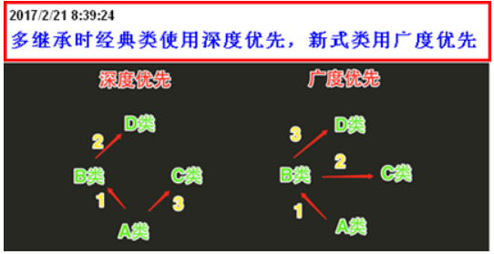
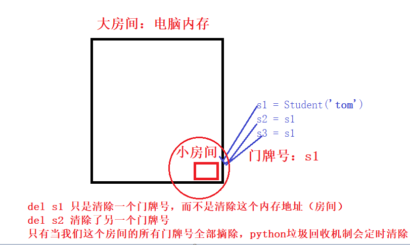

## 01.面向对象

https://www.cnblogs.com/xiaonq/p/7880547.html#i7

### 1.1 什么是面向对象？（What）

- 使用模板的思想，将世界完事万物使用对象来表示一个类型

### 1.2 封装、继承、多态？特性

- 封装
  - 对类中属性和方法进行一种封装，隐藏了实现细节
- 继承
  - 子类继承父类后，就具有了父类的所有属性和方法，先继承，后重写
  - 新式类深度优先、经典类广度优先
- 多态
  - 一种接口，多种表现形式
  - 中国人、和美国人都能讲话，调用中国人的类讲中文，调用美国人将英文

### 1.3 新式类&经典类

- pythn3无论新式类还是经典类都是用 广度优先
- python2中，新式类：广度优先，经典类：深度优先

 </img>

```python
class D:
    def talk(self):
        print('D')

class B(D):
    pass
    # def talk(self):
    #     print('B')

class C(D):
    pass
    def talk(self):
        print('C')

class A(B,C):
    pass
    # def talk(self):
    #     print('A')

a = A()
a.talk()
```

### 1.4 静态方法、类方法、属性方法

- 静态方法
  - 特点：名义上归类管理，实际上不能访问类或者变量中的任意属性或者方法
  - 作用：让我们代码清晰，更好管理
  - **调用方式:** 既可以被类直接调用，也可以通过实例调用

```python
class Dog(object):
    def __init__(self,name):
        self.name = name
        
    @staticmethod
    def eat():
        print("I am a static method")
        
d = Dog("ChenRonghua")
d.eat()                       # 方法1：使用实例调用
Dog.eat()                     # 方法2：使用类直接调用
```

- 类方法
  - 作用**：无需实例化直接被类调用  
  - 特性:** 类方法只能访问类变量，不能访问实例变量
  - 类方法使用场景：** 当我们还未创建实例，但是需要调用类中的方法
  - 调用方式:** 既可以被类直接调用，也可以通过实例调用

```javascript
class Dog(object):
    name = '类变量'                  #在这里如果不定义类变量仅定义实例变量依然报错
    def __init__(self,name):
        self.name = '实例变量'
        self.name = name
    @classmethod
    def eat(self,food):
        print("%s is eating %s"%(self.name,food))
Dog.eat('baozi')                   #方法1：使用类直接调用
d = Dog("ChenRonghua")          
d.eat("包子")                     #方法2：使用实例d调用
```

- 属性方法
  - 属性方法把一个方法变成一个属性，隐藏了实现细节,调用时不必加括号直接d.eat即可调用self.eat()方法

```javascript
class Dog(object):
    def __init__(self, name):
        self.name = name

    @property
    def eat(self):
        print(" %s is eating" % self.name)
d = Dog("ChenRonghua")
d.eat()
# 调用会出以下错误， 说NoneType is not callable, 因为eat此时已经变成一个静态属性了， 
# 不是方法了， 想调用已经不需要加()号了，直接d.eat就可以了
```

### 1.5 魔法方法

- \__new__
  - 产生一个实例
- \__init__
  - 产生一个对象
- \__del__
  -  析构方法，删除无用的内存对象（当程序结束会自动自行析构方法）
-   </img>

### 1.6 反射

- hasattr: 判断当前类是否有这个方法

```python
class Dog(object):
    def eat(self,food):
        print("eat method!!!")
d = Dog()

#hasattr判断对象d是否有eat方法，有返回True，没有返回False
print(hasattr(d,'eat'))     #True
print(hasattr(d,'cat'))     #False
```

- getattr: 通过字符串反射出这个方法的内存地址

```python
class Dog(object):
    def eat(self):
        print("eat method!!!")
d = Dog()

if hasattr(d,'eat'):          # hasattr判断实例是否有eat方法
    func = getattr(d, 'eat')  # getattr获取实例d的eat方法内存地址
    func()                    # 执行实例d的eat方法
#运行结果：  eat method!!!
```

- setattr：将当前类添加一个方法
- delatrr: 删除实例属性

### 1.7 单例模式

- 单例模式：永远用一个对象得实例，避免新建太多实例浪费资源
- 实质：使用__new__方法新建类对象时先判断是否已经建立过，如果建过就使用已有的对象
- 使用场景：如果每个对象内部封装的值都相同就可以用单例模式

```python
class Foo(object):
   instance = None
   def __init__(self):
      self.name = 'alex'

   def __new__(cls, *args, **kwargs):
      if Foo.instance:
         return Foo.instance
      else:
         Foo.instance = object.__new__(cls,*args,**kwargs)
         return Foo.instance

obj1 = Foo()       # obj1和obj2获取的就是__new__方法返回的内容
obj2 = Foo()
print(obj1,obj2)   # 运行结果： <__main__.Foo object at 0x00D3B450>    <__main__.Foo object at 0x00D3B450>

# 运行结果说明：
# 这可以看到我们新建的两个Foo()对象内存地址相同，说明使用的•同一个类，没有重复建立类
```

