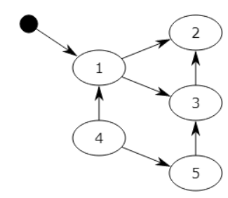

## 01.python垃圾回收机制

```javascript
class Student(object):
    def __del__(self):                # 作用：清除无用的实例对内存的暂用
        print('__del__')

s1 = Student()
s2 = s1
del s2
del s1

import time
time.sleep(1000)
```

### 1.1 引计数

- 原理
     - 当一个对象的引用被创建或者复制时，对象的引用计数加1；当一个对象的引用被销毁时，对象的引用计数减1.
     - 当对象的引用计数减少为0时，就意味着对象已经再没有被使用了，可以将其内存释放掉。
- 优点
     - 引用计数有一个很大的优点，即实时性，任何内存，一旦没有指向它的引用，就会被立即回收，而其他的垃圾收集技术必须在某种特殊条件下才能进行无效内存的回收。
- 缺点
     - 引用计数机制所带来的维护引用计数的额外操作与Python运行中所进行的内存分配和释放，引用赋值的次数是成正比的，
     - 显然比其它那些垃圾收集技术所带来的额外操作只是与待回收的内存数量有关的效率要低。
     - 同时，因为对象之间相互引用，每个对象的引用都不会为0，所以这些对象所占用的内存始终都不会被释放掉。

### 1.2 标记－清除

- 它分为两个阶段：第一阶段是标记阶段，GC会把所有的活动对象打上标记，第二阶段是把那些没有标记的对象非活动对象进行回收。
- 对象之间通过引用（指针）连在一起，构成一个有向图
- 从根对象（root object）出发，沿着有向边遍历对象，可达的（reachable）对象标记为活动对象，不可达的对象就是要被清除的非活动对象。
- 根对象就是全局变量、调用栈、寄存器。



- 在上图中，可以从程序变量直接访问块1，并且可以间接访问块2和3,程序无法访问块4和5
- 第一步将标记块1，并记住块2和3以供稍后处理。
- 第二步将标记块2，第三步将标记块3，但不记得块2，因为它已被标记。
- 扫描阶段将忽略块1，2和3，因为它们已被标记，但会回收块4和5。

### 1.3 分代回收

- 分代回收是建立在标记清除技术基础之上的，是一种以空间换时间的操作方式。
- Python将内存分为了3“代”，分别为年轻代（第0代）、中年代（第1代）、老年代（第2代）
- 他们对应的是3个链表，它们的**垃圾收集频率与对象的存活时间的增大而减小**。
- 新创建的对象都会分配在年轻代，年轻代链表的总数达到上限时，Python垃圾收集机制就会被触发
- 把那些可以被回收的对象回收掉，而那些不会回收的对象就会被移到中年代去，依此类推
- 老年代中的对象是存活时间最久的对象，甚至是存活于整个系统的生命周期内。