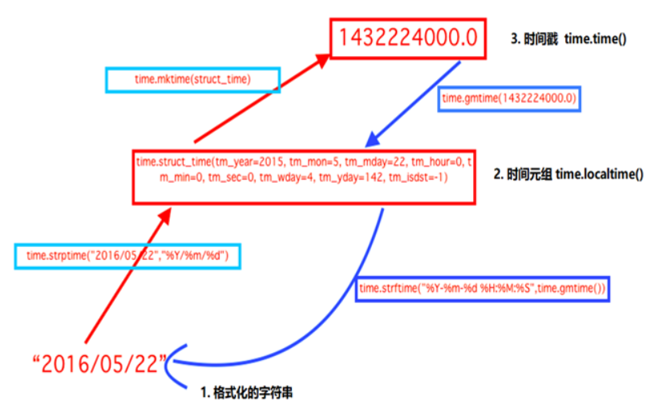

## 01.time模块

### 1.1 time模块三种格式

| 模块                        | 结果                           | 说明         |
| --------------------------- | ------------------------------ | ------------ |
| `time.time()`               | 1613221384.608557              | 1.时间戳     |
| `time.strftime('%Y-%m-%d')` | 2021-02-13                     | 2.格式化时间 |
| `time.localtime()`          | time.struct_time(tm_year=2021… | 3.时间元祖   |

 </img>


### 1.2 time()模块时间格式转换

```python
import time
print(time.time())                             # 时间戳：1511166937.2178104
print(time.strftime('%Y-%m-%d'))                   # 格式化的字符串: 2017-11-20
print(time.localtime())                         # 结构化时间(元组): (tm_year=2017, tm_mon=11...)
print(time.gmtime())                           # 将时间转换成utc格式的元组格式： (tm_year=2017, tm_mon=11...)

#1. 将结构化时间转换成时间戳： 1511167004.0
print(time.mktime(time.localtime()))

#2. 将格字符串时间转换成结构化时间 元组： (tm_year=2017, tm_mon=11...)
print(time.strptime('2014-11-11', '%Y-%m-%d'))

#3. 结构化时间(元组) 转换成  字符串时间  ：2017-11-20
print(time.strftime('%Y-%m-%d', time.localtime()))  # 默认当前时间

#4. 将结构化时间(元组) 转换成英文字符串时间 : Mon Nov 20 16:51:28 2017
print(time.asctime(time.localtime()))

#5. 将时间戳转成 英文字符串时间 : Mon Nov 20 16:51:28 2017
print(time.ctime(time.time()))
```

## 02.datetime

### 2.1 datetime获取时间

```python
import datetime
#1、datetime.datetime获取当前时间
print(datetime.datetime.now())
#2、获取三天后的时间
print(datetime.datetime.now()+datetime.timedelta(+3))
#3、获取三天前的时间
print(datetime.datetime.now()+datetime.timedelta(-3))
#4、获取三个小时后的时间
print(datetime.datetime.now()+datetime.timedelta(hours=3))
#5、获取三分钟以前的时间
print(datetime.datetime.now()+datetime.timedelta(minutes = -3))

import datetime
print(datetime.datetime.now())                                   #2017-08-18 11:25:52.618873
print(datetime.datetime.now().date())                              #2017-08-18
print(datetime.datetime.now().strftime("%Y-%m-%d %H-%M-%S"))              #2017-08-18 11-25-52
```

### 2.2 datetime时间转换

```python
#1、datetime对象与str转化
# datetime.datetime.now().strftime("%Y-%m-%d %H:%M:%S")
'2018-03-09 10:08:50'

# datetime.datetime.strptime('2016-02-22',"%Y-%m-%d")
datetime.datetime(2016, 2, 22, 0, 0)

#2、datetime对象转时间元组
# datetime.datetime.now().timetuple()
time.struct_time(tm_year=2018, tm_mon=3, tm_mday=9,

#3、时间戳转换成datetime对象
# datetime.datetime.fromtimestamp(1520561646.8906238)
datetime.datetime(2018, 3, 9, 10, 14, 6, 890624)
```

## 03.时间模块使用

### 3.1 本地时间与utc时间相互转换

```python
# -*- coding: utf-8 -*-
import time
import datetime

def utc2local(utc_st):
    ''' 作用：将UTC时间装换成本地时间
    :param utc_st: 传入的是utc时间(datatime对象)
    :return:  返回的是本地时间 datetime 对象
    '''
    now_stamp = time.time()
    local_time = datetime.datetime.fromtimestamp(now_stamp)
    utc_time = datetime.datetime.utcfromtimestamp(now_stamp)
    offset = local_time - utc_time
    local_st = utc_st + offset
    return local_st

def local2utc(local_st):
    ''' 作用：将本地时间转换成UTC时间
    :param local_st: 传入的是本地时间(datatime对象)
    :return: 返回的是utc时间 datetime 对象
    '''
    time_struct = time.mktime(local_st.timetuple())
    utc_st = datetime.datetime.utcfromtimestamp(time_struct)
    return utc_st

utc_time = datetime.datetime.utcfromtimestamp(time.time())
# utc_time = datetime.datetime(2018, 5, 6, 5, 57, 9, 511870)        # 比北京时间晚了8个小时
local_time = datetime.datetime.now()
# local_time = datetime.datetime(2018, 5, 6, 13, 59, 27, 120771)    # 北京本地时间

utc_to_local = utc2local(utc_time)
local_to_utc = local2utc(local_time)
print utc_to_local       # 2018-05-06 14:02:30.650270     已经转换成了北京本地时间
print local_to_utc       # 2018-05-06 06:02:30            转换成北京当地时间
```

### 3.2 django的timezone时间与本地时间转换

```python
from django.utils import timezone
from datetime import datetime

utc_time = timezone.now()
local_time = datetime.now()

#1、utc时间装换成本地时间
utc_to_local = timezone.localtime(timezone.now())

#2、本地时间装utc时间
local_to_utc = timezone.make_aware(datetime.now(), timezone.get_current_timezone())
```

### 3.3 Python计算两个日期之间天数

````python
import datetime
d1 = datetime.datetime(2018,10,31)       # 第一个日期
d2 = datetime.datetime(2019,2,2)         # 第二个日期
interval = d2 - d1                   # 两日期差距
print(interval.days)                 # 具体的天数
````

