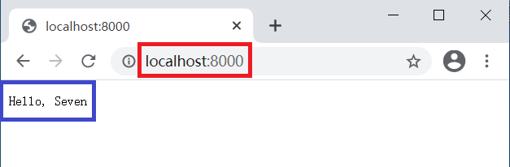
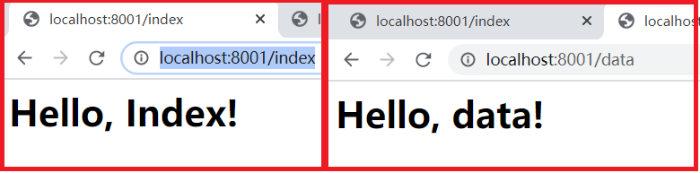
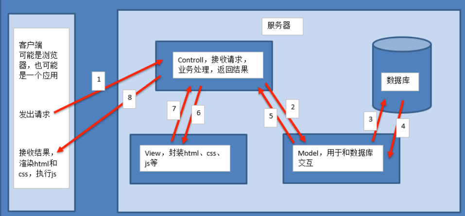
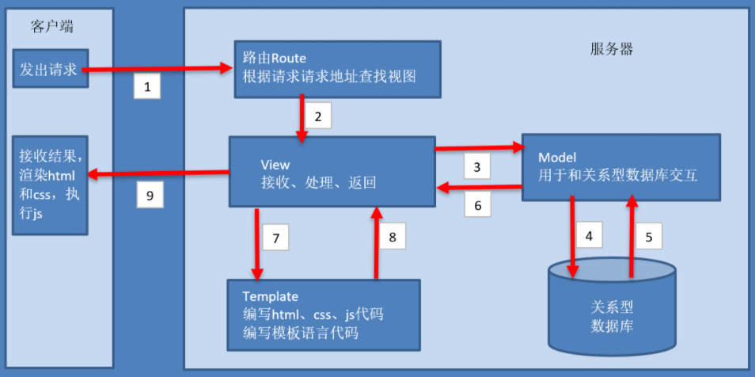

## 01.Web框架本质--socket

### 1.1 web框架本质

- 对于所有的Web应用，本质上其实就是一个socket服务端，用户的浏览器其实就是一个socket客户端。

- 真实web框架一般会分为两部分：服务器程序和应用程序。　　
     - 1）服务器程序：负责对socket服务器进行封装，并在请求到来时，对请求的各种数据进行整理
     - 2）应用程序：负责具体的逻辑处理

### 1.2 socket创建web服务

```python
import socket

def handle_request(client):
    buf = client.recv(1024)
    client.send("HTTP/1.1 200 OK\r\n\r\n".encode('utf-8'))      # 伪造浏览器请求头
    client.send("Hello, Seven".encode('utf-8'))                  # 返回数据到客户端浏览器

def main():
    sock = socket.socket(socket.AF_INET, socket.SOCK_STREAM)
    sock.bind(('localhost', 8000))
    sock.listen(5)
    while True:
        connection, address = sock.accept()
        handle_request(connection)
        connection.close()

if __name__ == '__main__':
    main()
```

 </img>

### 1.3 自定义Web框架

- `说明：` 通过python标准库提供的wsgiref模块开发一个自己的Web框架

```python
from wsgiref.simple_server import make_server

def handle_index():
    return ['<h1>Hello, Index!</h1>'.encode('utf-8'),]
def handle_data():
    return ['<h1>Hello, data!</h1>'.encode('utf-8'),]

URl_DICT = {
    "/index":handle_index,
    "/data":handle_data,
}

#1 environ客户端发来的所有数据
#2 start_response封装要返回给用户的数据，响应头状态
#3 return返回的是正真用户在浏览器中看到的内容（Hello, web!）
def RunServer(environ, start_response):
    start_response('200 OK', [('Content-Type', 'text/html')])
    current_url = environ['PATH_INFO']                           #用户访问的url目录：/index 或 /data
    func = None
    if current_url in URl_DICT:
        func = URl_DICT[current_url]
        return func()
    else:
        return ['<h1>404</h1>'.encode('utf-8'),]

if __name__ == '__main__':
    httpd = make_server('', 8001, RunServer)
    print("Serving HTTP on port 8001...")
    httpd.serve_forever()
```

 </img>

## 02.django框架介绍

### 1.1 django、tornado、flask比较

- **Django:** 1个重武器，包含了web开发中常用的功能、组件的框架；（ORM、Session、Form、Admin、分页、中间件、信号、缓存....）；

- **Flask:** 封装功能不及Django完善，性能不及Tornado，但是Flask的第三方开源组件比丰富；
- **Tornado:** 最大特性就是异步非阻塞、原生支持WebSocket协议；
- `以 京东、淘宝、楼下小卖部 比喻`
     - `django就像京东`，服务齐全，有自营商品，有自己的仓库，有自己的快递，一条龙服务，你懂的
     - `flask就像是淘宝`，自己没有商品，没有仓库，没有快递，但是你可以选择三方的（韵达，中通等）
     - `tornado就像是门口小卖部`，一个特点，快，不用等，但是东西很少，没有三方组件，需要自己动手写

- `使用参考`
     - 1）小型web应用设计的功能点不多，使用Flask比较合适；
     - 2）大型web应用设计的功能点比较多，使用的组件也会比较多，使用Django（自带功能多不用去找插件）；
     - 3）如果追求性能可以考虑Tornado；

### 1.2 MVC模式

```python
# 目的: 了解什么是MVC, MTV
# 思考: 为什么要用设计模式
# 分工、解耦，让不同的代码块之间降低耦合，增强代码的可扩展性和可移植性，实现向后兼容**。
```

- M全拼为Model，主要封装对数据库层的访问，对数据库中的数据进行增、删、改、查操作。
- V全拼为View，用于封装结果，生成页面展示的html内容。
- C全拼为Controller，用于接收请求，处理业务逻辑，与Model和View交互，返回结果。

 </img>

### 1.3 MVT(Django设计模式)

- M全拼为Model，与MVC中的M功能相同，负责和数据库交互，进行数据处理。
- V全拼为View，与MVC中的C功能相同，接收请求，进行业务处理，返回应答。
- T全拼为Template，与MVC中的V功能相同，负责封装构造要返回的html(`或者是json数据`)。

 </img>


