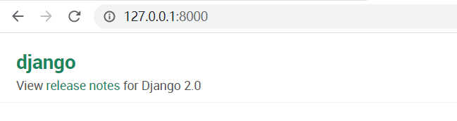
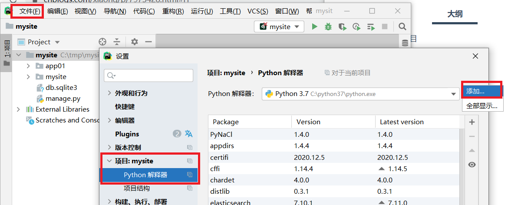
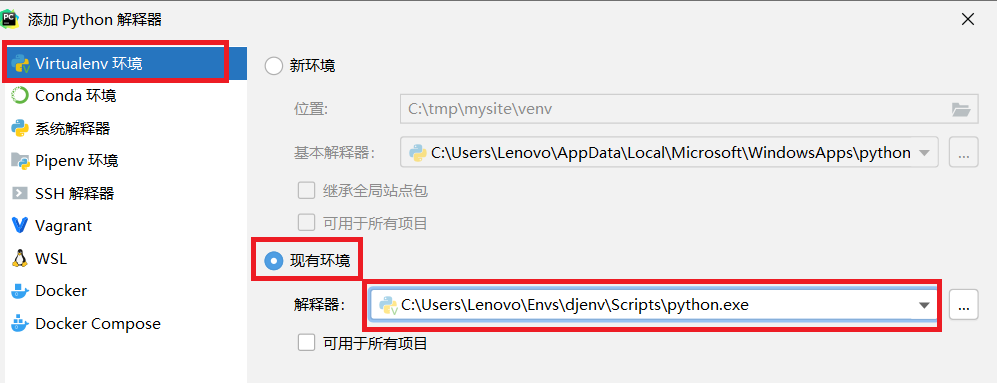

## 01.创建django项目

### 1.1 创建django项目

```python
(djenv) c:\tmp>workon djenv                         ## 进入虚拟环境
(djenv) c:\tmp>django-admin startproject mysite           ## 创建django项目
(djenv) c:\tmp>cd mysite                           ## 进入项目目录
D:\mysite>  python manage.py runserver 127.0.0.1:8000       ## 运行mysite项目
## 浏览器访问：http://127.0.0.1:8000/
```

 </img>


### 1.3 工程目录说明

```python
C:.
│  db.sqlite3                ## sqlite数据库文件（settings.py中默认连接的数据库）
│  manage.py                ## 项目管理脚本
│
└─mysite
    │  settings.py           ## 是项目的整体配置文件
    │  urls.py              ## 总路由
    │  wsgi.py              ## 是项目与WSGI兼容的Web服务器入口
    │  __init__.py
```

### 1.4 运行开发服务器

- 在开发阶段，为了能够快速预览到开发的效果
- django提供了一个纯python编写的轻量级web服务器，仅在开发阶段使用。
- 可以不写IP和端口，默认IP是127.0.0.1，默认端口为8000

```python
python manage.py runserver ip:端口
或：
python manage.py runserver
```

### 1.5 配置setting.py

#### 1.5.1 配置模板路径

```python
TEMPLATES = [
    {
       'DIRS': [os.path.join(BASE_DIR,'templates')],
    },
]
```

#### 1.5.2 配置静态目录

```python
#像ccs和js这些静态文件如果想要使用必须在这里配置路径
STATICFILES_DIRS = (
    os.path.join(BASE_DIR,'static'),
)
```

#### 1.5.3 注释CSRF

```python
MIDDLEWARE = [
    ## 'django.middleware.csrf.CsrfViewMiddleware',
]
```

#### 1.5.4 修改时区

```python
## LANGUAGE_CODE = 'en-us'
LANGUAGE_CODE = 'zh-hans'

## TIME_ZONE = 'UTC'
TIME_ZONE = 'Asia/Shanghai'
```

## 02.创建子应用三部曲

### 2.1 创建子应用

```python
(djenv) c:\tmp\mysite>  python manage.py startapp app01
```

```python
C:.
│  db.sqlite3               ## sqlite数据库文件（settings.py中默认连接的数据库）
│  manage.py               ## 项目管理脚本
│
├─app01 （子应用目录）
│  │  admin.py            ## 配置django admin后台
│  │  apps.py
│  │  models.py            ## 配置django表，负责和数据库交互，进行数据处理
│  │  tests.py
│  │  views.py             ## 接收请求，进行业务处理，返回应答
│  │  __init__.py
│  │
│  └─migrations
│          __init__.py
│
└─mysite
    │  settings.py           ## 是项目的整体配置文件
    │  urls.py              ## 总路由
    │  wsgi.py              ## 是项目与WSGI兼容的Web服务器入口
    │  __init__.py
```

### 2.2 注册子应用

```python
INSTALLED_APPS = [
    'app01.apps.App01Config',
]
```

### 2.3 配置主路由

- `mysite\urls.py`

```python
from django.contrib import admin
from django.urls import path, include

urlpatterns = [
    path('admin/', admin.site.urls),
    # 配置路由分发
    path('app01/', include(('app01.urls', 'app01'), namespace='app01')),
]
```

### 2.4 添加子路由

- `app01/urls.py`

```python
from django.urls import path, re_path
from app01 import views

urlpatterns = [
    re_path(r'index1/$', views.index1, name='index1'),
]
```

### 2.5 创建视图

- `app01/views.py`

```python
from django.shortcuts import render, HttpResponse

def index1(request):
    return HttpResponse("Hello World")
```

## 03.PyCharm打开项目

### 3.1 添加虚拟环境

- 文件 –》 设置 –》项目:mysite –》 python解释器

 </img>

### 3.2 添加解释器

 </img>

## 04.配置跨域

```python
1. 安装包
pip install django-cors-headers 

2. 注册应用
INSTALLED_APPS = [
    ...
    'corsheaders',   # 添加 django-cors-headers 使其可以进行 cors 跨域
]
3. 添加中间件
MIDDLEWARE = [
    # 放在中间件第一个
    'corsheaders.middleware.CorsMiddleware',
    ...
]
4. 设置
# CORS跨域请求白名单设置
CORS_ORIGIN_WHITELIST = (
    'http://127.0.0.1:8080',
    'http://localhost:8080',
)
CORS_ALLOW_CREDENTIALS = True  # 允许携带cookie
```

