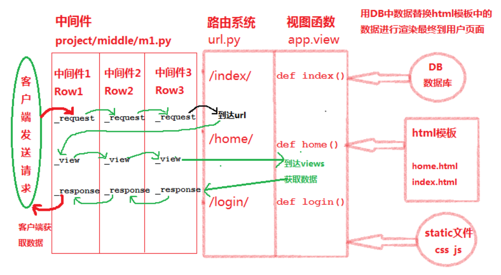

## 01.初识中间件

### 1.1 什么是中间件

- Django中间件是修改 Django request 或者 response 对象的钩子
- 可以理解为是介于 HttpRequest 与 HttpResponse 处理之间的一道处理过程。

- Django中间件作用：
     -  修改请求，即传送到 view 中的 HttpRequest 对象。
     -  修改响应，即 view 返回的 HttpResponse 对象。

### 1.2 中间件处理过程

- 1、首先客户端发起请求，会将请求交给settings.py中排在最前面的中间件

- 2、前面中间件收到请求会调用类中的process_request方法处理，然后交给下一个中间件的process_request函数

- 3、到达最后一个中间件的process_request函数处理后会到达url路由系统

- 4、然后从路由系统直接跳转到第一个中间件的process_view函数，依次向后面中间的process_view传递
     - 最后到达views.py处理函数，获取网页中的数据
- 5、获取的数据会交给最后一个中间件的process_response方法处理，然后依次向前面的中间件process_response
     - 方法提交请求的内容，最后由最前面的中间件将请求数据返回到客户端
- 6、在任一中间件的process_request和process_view方法中有返回值就会直接返回给process_response

### 1.3 生命周期图解

- 1、首先会交给中间件，中间件处理后交给路由系统

- 2、路由系统
     -  1：Django程序会到urls.py文件中找到对应请求的处理函数（视图函数）

- 3、视图函数
     - 1：视图函数会找到对应的html模板文件
     - 2：然后到数据库中取得数据替换html模板中的内容
     - 3：使用static中的js和css文件结合对html渲染
     - 4：最后Django将最终渲染后的html文件返回给中间件
- 4、中间件再调用process_response方法处理，最后交给用户

 </img>

## 02.中间件使用

### 2.1 创建存放中间件的文件夹

- 1) 在工程目录下创建任意目录，这里创建路径为： `/project/middle/m1.py`

### 2.2 settings.py中注册中间件

```
MIDDLEWARE = [
    'middle.m1.Row1',
    'middle.m1.Row2',
    'middle.m1.Row3',
]
```

### 2.3 写处理函数test

- 在views.py文件中写处理函数test

```
def test(request):
    # int('fds')    #当views函数出现异常，中间件中的process_exception执行
    print('没带钱|')
    return HttpResponse('ok')
```

### 2.4 定义中间件

- 在/project/middle/m1.py文件中定义中间件

```python
from django.utils.deprecation import MiddlewareMixin

class Row1(MiddlewareMixin):
    def process_request(self,request):
        print('process_request_1')

    def process_view(self,request, view_func, view_func_args, view_func_kwargs):
        #view_func_args:   url中传递的非字典的值会用这个变量接收
        #view_func_kwargs: url中传递的字典会传递到这个变量接收（如：nid=1）
        print('process_view_1')

    def process_response(self,request, response):    #response就是拿到的返回信息
        print('response_1')
        return response

    def process_exception(self, request, exception):
        '''只有当views函数中异常这个函数才会执行'''
        if isinstance(exception, ValueError):
            return HttpResponse('>>出现异常了')

        
class Row2(MiddlewareMixin):
    def process_request(self,request):
        print('process_request_2')
        #1 如果在Row2中的process_request中有返回值，那么就不会到达Row3
        #2 Row2直接将返回值交给自己的process_response再交给Row1的process_response
        #3 最后客户端页面显示的就是‘走’请求没机会到达views函数，不会打印‘没带钱’
        # return HttpResponse('走')

    def process_view(self,request, view_func, view_func_args, view_func_kwargs):
        print('process_view_2')

    def process_response(self,request, response):
        print('response_2')
        return response

    
class Row3(MiddlewareMixin):
    def process_request(self,request):
        print('process_request_3')

    def process_view(self,request, view_func, view_func_args, view_func_kwargs):
        print('process_view_3')

    def process_response(self,request, response):
        print('response_3')
        return response
```