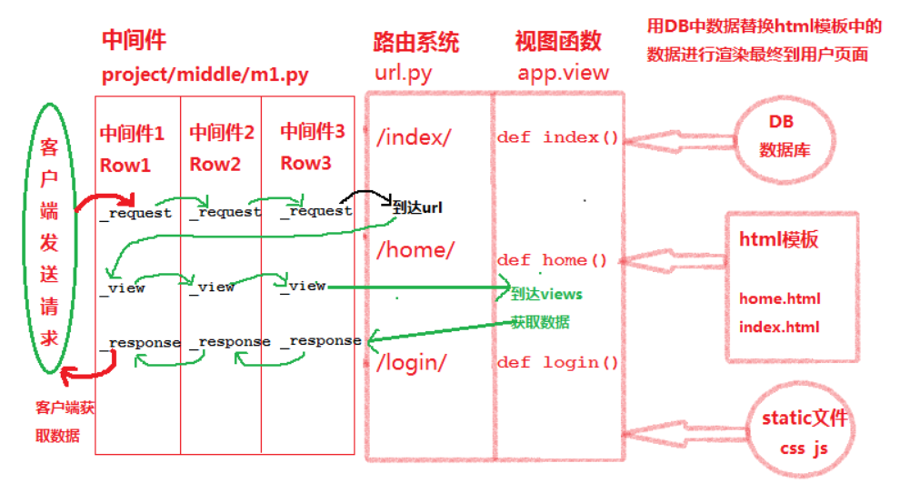
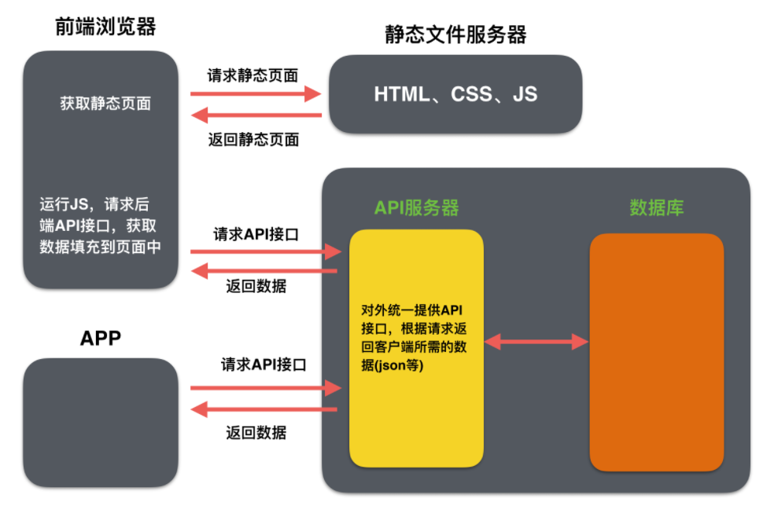

## 01.Web项目开发两种模式

### 1.1 前后端不分离

- 前端看到的效果都是由后端控制的
- 后端通过渲染之后给前端返回完整的html页面，前端与后端的耦合度很高

 </img>

### 1.2 前后端分离

- 后端仅返回前端所需的数据，至于数据怎么进行展示
- 由前端自己进行控制，前端与后端的耦合度很低

 </img>

### 1.3 开发模式对比

- `前后端不分离`：完整的页面是在后端生成的，后端给前端返回完整的页面，前端只是进行展示。
- `前后端分离`：完整的页面是在前端生成的，后端只给前端返回所需的数据，前端将数据填充在页面上。

- `优缺点比较：`
     - 前后端不分离适合于纯网页的应用，前后端分离可以对接不同类型的客户端。

| 开发模式     | 优点                     | 缺点                    |
| ------------ | ------------------------ | ----------------------- |
| 前后端不分离 | 利于SEO(搜索引擎优化)    | 仅适合于纯网页的应用    |
| 前后端分离   | 可以对接不同类型的客户端 | 不利于SEO(搜索引擎优化) |