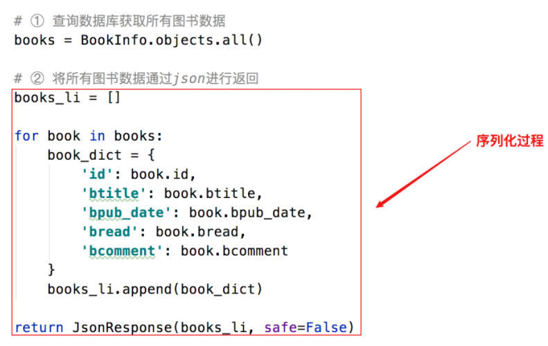
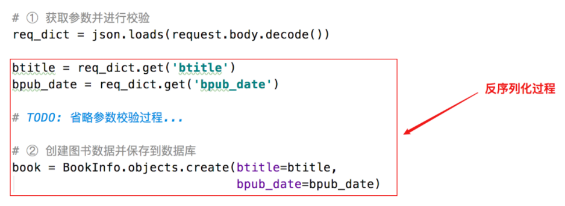

## 01.DRF核心任务

### 1.1 DRF核心任务

- 序列化：将对象转换为字典或者json的过程。
- 反序列化：将字典或json转换保存到对象中的过程。
- RestAPI核心工作：
     - 将数据库中的数据序列化为前端所需的格式，并进行返回。
     - 将前端传递的数据反序列化保存为模型类对象，并保存到数据库。

- 在开发REST API接口时，视图中主要做了三件事：
     -  ① 将请求的数据（如：JSON格式）转换为模型类对象
     -  ② 操作数据库
     -  ③ 将模型类对象转换为响应的数据（如：JSON格式）

### 1.2 序列化

- **广义的概念**：将一种数据转换为另外一种格式的过程。

- **本课程特指**：`将对象转换为字典或json的过程`。

 </img>

### 1.3 反序列化

- **广义的概念**：和序列化相反的转换过程。

- **本课程特指**：将字典或json转换为对象的过程。

 </img>

## 02.Django REST framework 简介

### 2.1 作用

- **Django REST framework可以帮助我们大大提高REST API的开发速度。**

- 在序列化与反序列化时，虽然操作的数据可能不同，但是过程是相似的，这部分操作DRF框架进行了封装。
- 在开发REST API的视图时，虽然每个视图操作的数据可能不同
- 但增、删、改、查的基本流程是一样的，这部分代码DRF框架也进行了封装。
     - **增**：校验请求数据 → 反序列化-将数据保存到对象中 → 保存数据到数据库 → 将保存的对象序列化返回
     - **删**：判断要删除的数据是否存在 → 执行数据库删除 → 返回响应
     - **改**：判断要修改的数据是否存在 → 校验请求的数据 → 反序列化-将数据保存到对象中 → 保存数据到数据库 → 将保存的对象序列化返回
     - **查(1个或多个)**：查询数据库 → 将数据序列化返回

### 2.2 特点

- **提供了定义序列化器的方法，使用序列化器可以进行数据的序列化和反序列化**
- **提供了丰富的类视图、Mixin扩展类、子类视图、视图集，简化视图代码的编写**
- 多种身份认证和权限控制方式的支持
- 内置了限流系统
- 直观的API web界面
- 可扩展性，插件丰富

**参考资料**：[DRF框架官方文档](http://www.django-rest-framework.org/)

**`总结`**：

- 作用：快速开发RestAPI接口。
- 特点：进行了大量封装，提高API开发速度。
- 核心功能：序列化器和视图。