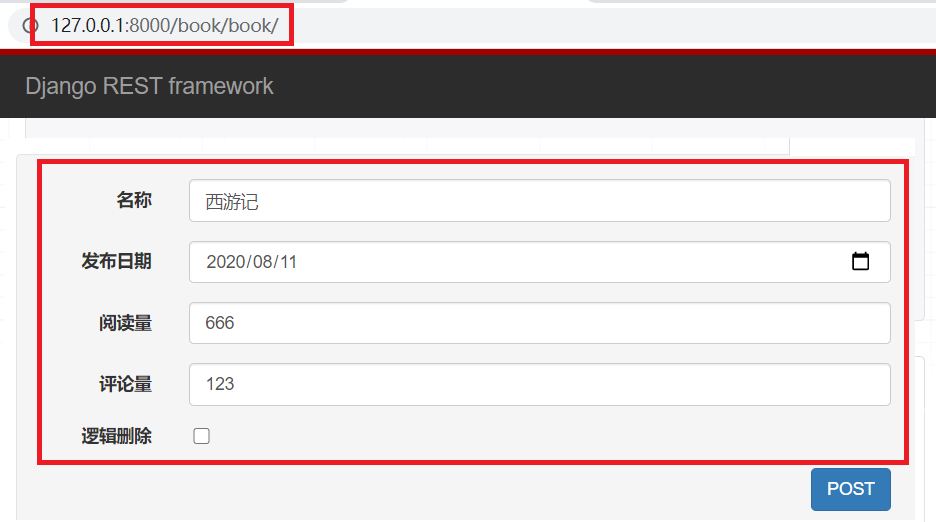
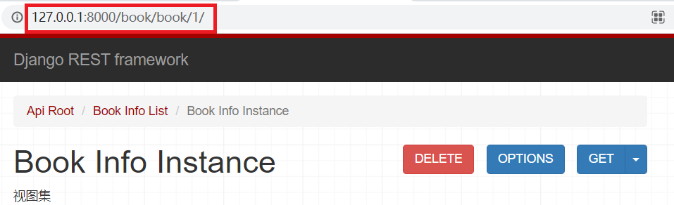

## 01.安装djangorestframework

- DRF框架依赖于Django，`需要先安装Django环境，再安装djangorestframework`

```python
pip install djangorestframework==3.11.0        # 安装djangorestframework
pip install django-filter==2.3.0             # 安装过滤器
```

- 创建django环境

```python
# ① 创建一个名为django2.2的虚拟环境
mkvirtualenv -p python django2.2

# ② 进入django2.2虚拟环境
workon django2.2

# ③ 安装Django环境
pip install Django==2.2.5
```

## 02.DRF配置

### 2.1 创建一个测试项目

```python
(django2.2) C:\Users\Lenovo>  cd C:\tmp
(django2.2) C:\tmp>  django-admin startproject drf_demo
(django2.2) C:\tmp\drf_demo>  python manage.py startapp book
```

### 2.2 DRF应用注册

- setting.py中注册djangorestframework

```python
INSTALLED_APPS = [
    'rest_framework',             # 注册 djangorestframework
    'book.apps.BookConfig',         # 注册刚刚创建的APP：book
]
```

### 2.3 路由分发

- `drf_demo/urls.py`

```python
from django.contrib import admin
from django.urls import path,include

urlpatterns = [
    path('admin/', admin.site.urls),
    path('book/', include(('book.urls', 'book'), namespace='book')),
]
```

### 2.4 定义模型

```python
from django.db import models

#定义图书模型类BookInfo
class BookInfo(models.Model):
    btitle = models.CharField(max_length=20, verbose_name='名称')
    bpub_date = models.DateField(verbose_name='发布日期')
    bread = models.IntegerField(default=0, verbose_name='阅读量')
    bcomment = models.IntegerField(default=0, verbose_name='评论量')
    is_delete = models.BooleanField(default=False, verbose_name='逻辑删除')

    class Meta:
        db_table = 'tb_books'  # 指明数据库表名
        verbose_name = '图书'  # 在admin站点中显示的名称
        verbose_name_plural = verbose_name  # 显示的复数名称

    def __str__(self):
        """定义每个数据对象的显示信息"""
        return self.btitle
```

- 创建表

```python
(django2.2) C:\tmp\drf_demo>   python manage.py makemigrations
(django2.2) C:\tmp\drf_demo>   python manage.py migrate
```

## 03.DRF框架功能演示

### 3.1 步骤1：创建序列化器类

- 在 `book` 应用中新建 `serializers.py` 用于保存所要创建的序列化器类。

```python
from rest_framework import serializers
from book.models import BookInfo

class BookInfoSerializer(serializers.ModelSerializer):
    """图书序列化器类"""
    class Meta:
        model = BookInfo
        fields = '__all__'
```

**小知识**：

- model：指定该序列化器类所对应的模型类
- fields：指定依据模型类的哪些字段生成对应序列化器类的字段，__all__代表所有

### 3.2 步骤2：编写视图

- `book/views.py`

```python
from rest_framework.viewsets import ModelViewSet
from book.serializers import BookInfoSerializer
from book.models import BookInfo

class BookInfoViewSet(ModelViewSet):
    """视图集"""
    queryset = BookInfo.objects.all()
    serializer_class = BookInfoSerializer
```

**小知识**：

- queryset：指定视图在进行数据查询时所使用的查询集
- serializer_class：指定视图在进行序列化或反序列化时所使用的序列化器类

### 3.3 步骤3：定义路由

- `book/urls.py`

```python
from django.urls import re_path
from book import views

urlpatterns = [

]

# 路由Router
from rest_framework.routers import DefaultRouter

router = DefaultRouter()
router.register('books', views.BookInfoViewSet, basename='books')
urlpatterns += router.urls
```

- **小知识：什么是路由Router？**

- **答：动态生成视图集中的处理方法的url配置项。**

### 3.4 步骤四：测试接口

#### 4.1 测试获取所有图书接口

```javascript
http://127.0.0.1:8000/book/book/
```

- 返回结果

```python
{
    "code": 0,
    "msg": "success",
    "books": [
        {
            "id": 1,
            "btitle": "西游记",
            "bpub_date": "2020-08-11",
            "bread": 1234,
            "bcomment": 779
        },
        {
            "id": 2,
            "btitle": "红楼梦",
            "bpub_date": "2020-09-19",
            "bread": 123,
            "bcomment": 5555
        },
        {
            "id": 3,
            "btitle": "水浒传",
            "bpub_date": "2020-02-12",
            "bread": 100,
            "bcomment": 0
        }
    ]
}
```

#### 4.2 测试创建图书接口

 </img>

#### 4.3 测试修改图书接口

```javascript
http://127.0.0.1:8000/book/book/1/
```

 </img>

#### 4.4 测试删除数据接口

```javascript
http://127.0.0.1:8000/book/book/1/
```


