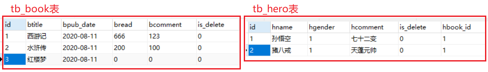

## 01.Serializer介绍

- Serializer三个作用

- 第一：序列化
- 第二:  反序列化
- 第三：数据校验

### 1.1 定义Serializer

```python
# -*- coding: utf-8 -*-
from rest_framework import serializers
from book.models import BookInfo


class APIViewBookInfoSerializer(serializers.Serializer):
    """图书数据序列化器"""
    id = serializers.IntegerField(label='ID', read_only=True)       # 主键序列化
    # 第一：普通字段序列化
    btitle = serializers.CharField(label='名称', max_length=20)
    bpub_date = serializers.DateField(label='发布日期')
    bread = serializers.IntegerField(label='阅读量', required=False)
    bcomment = serializers.IntegerField(label='评论量', required=False)
    # 第二：一对多字段序列化
    heroinfo_set = serializers.PrimaryKeyRelatedField(read_only=True, many=True)
    # 第三：自定义显示（显示多对多）
    xxx = serializers.SerializerMethodField(read_only=True)

    class Meta:
        model = BookInfo

    # 自定义显示 多对多 字段
    def get_xxx(self,row):
        '''row: 传过来的正是 BookInfo表的对象'''
        books = row.btitle   # 获取用户名
        return books
```

### 1.2 序列化：`作用1`

```python
class APIViewBookInfoViewSet(APIView):
    def get(self, request):
        obj = BookInfo.objects.all()
        ser = serializers.BookInfoSerializer1(instance=obj, many=True)  # 序列化多条数据
        # ser = serializers.BookInfoSerializer1(instance=obj[0])            # 序列化一条数据
        return Response(ser.data)
```

### 1.3 反序列化：`作用2`

```python
    # 创建
    def post(self,request):
        ser =  serializers.BookInfoSerializer1(data=request.data)
        # 判断提交数据是否合法
        if ser.is_valid():
            ser.save()
            return Response(data=ser.data, status=201)
        return Response(data=ser.errors,status=400)
```

### 1.4 字段校验：`作用3`

```python
class BookInfoSerializer1(serializers.Serializer):
    """图书数据序列化器"""
    
    # 定义单一字段验证的方法
    def validate_name(self, value):
        if value == 'root':
            raise serializers.ValidationError('不能创建root管理员账号')
        return value

    # 定义多字段验证方法
    def validate(self, attrs):
        if attrs['name'] == 'admin':
            raise serializers.ValidationError('不能创建admin用户')
        return attrs
```

## 02.序列化&反序列化

### 2.1 book/models.py

 </img>

```python
from django.db import models

#定义图书模型类BookInfo
class BookInfo(models.Model):
    btitle = models.CharField(max_length=20, verbose_name='名称')
    bpub_date = models.DateField(verbose_name='发布日期')
    bread = models.IntegerField(default=0, verbose_name='阅读量')
    bcomment = models.IntegerField(default=0, verbose_name='评论量')
    is_delete = models.BooleanField(default=False, verbose_name='逻辑删除')

    class Meta:
        db_table = 'tb_books'  # 指明数据库表名
        verbose_name = '图书'  # 在admin站点中显示的名称
        verbose_name_plural = verbose_name  # 显示的复数名称

    def __str__(self):
        """定义每个数据对象的显示信息"""
        return self.btitle


#定义英雄模型类HeroInfo
class HeroInfo(models.Model):
    GENDER_CHOICES = (
        (0, 'female'),
        (1, 'male')
    )
    hname = models.CharField(max_length=20, verbose_name='名称')
    hgender = models.SmallIntegerField(choices=GENDER_CHOICES, default=0, verbose_name='性别')
    hcomment = models.CharField(max_length=200, null=True, verbose_name='描述信息')
    hbook = models.ForeignKey(BookInfo, on_delete=models.CASCADE, verbose_name='图书')  # 外键
    is_delete = models.BooleanField(default=False, verbose_name='逻辑删除')

    class Meta:
        db_table = 'tb_heros'
        verbose_name = '英雄'
        verbose_name_plural = verbose_name

    def __str__(self):
        return self.hname
```

### 2.2 book/serializers.py

```python
# -*- coding: utf-8 -*-
from rest_framework import serializers
from book.models import BookInfo


class BookInfoSerializer1(serializers.Serializer):
    """图书数据序列化器"""
    id = serializers.IntegerField(label='ID', read_only=True)       # 主键序列化
    # 第一：普通字段序列化
    btitle = serializers.CharField(label='名称', max_length=20)
    bpub_date = serializers.DateField(label='发布日期')
    bread = serializers.IntegerField(label='阅读量', required=False)
    bcomment = serializers.IntegerField(label='评论量', required=False)
    # 第二：一对多字段序列化
    heroinfo_set = serializers.PrimaryKeyRelatedField(read_only=True, many=True)
    # 第三：自定义显示（显示多对多）
    xxx = serializers.SerializerMethodField(read_only=True)

    class Meta:
        model = BookInfo

    # 自定义显示 多对多 字段
    def get_xxx(self,row):
        '''row: 传过来的正是 BookInfo表的对象'''
        books = row.btitle   # 获取用户名
        return books

    # 定义创建语法：ser.save()执行，就会立刻调用create方法用来创建数据
    def create(self, validated_data):
        '''validated_data: 表单或者vue请求携带的json：{"username":"zhangsan","password":"123456"}'''
        return self.Meta.model.objects.create(**validated_data)

    # 定义更新方法
    def update(self, instance, validated_data):
        '''
        instance : 查询的对象
        validated_data :  postman提交的json数据 {"username":"zhangsan","password":"123456"}
        '''
        if validated_data.get('btitle'):
            instance.btitle = validated_data['btitle']
        if validated_data.get('bpub_date'):
            instance.bpub_date = validated_data['bpub_date']
        instance.save()
        return instance
```

### 2.3 book/views.py

```python
from rest_framework.views import APIView
from rest_framework.response import Response
from book import serializers
from book.models import BookInfo


class APIViewBookInfoViewSet(APIView):
    def get(self, request):
        obj = BookInfo.objects.all()
        ser = serializers.BookInfoSerializer1(instance=obj, many=True)  # 关联数据多条
        # ser = serializers.BookInfoSerializer1(instance=obj[0])           # 关联数据一条
        return Response(ser.data)

    # 创建
    def post(self,request):
        ser =  serializers.BookInfoSerializer1(data=request.data)
        # 判断提交数据是否合法
        if ser.is_valid():
            ser.save()
            return Response(data=ser.data, status=201)
        return Response(data=ser.errors,status=400)

    # 更新
    def put(self, request):
        pk = request.query_params.get('pk')
        try:
            bookinfo = BookInfo.objects.get(id = pk)
        except Exception as e:
            return Response(data='不存在', status=201)
        # 创建序列化对象，并将要反序列化的数据传递给data构造参数，进而进行验证
        ser = serializers.BookInfoSerializer1(bookinfo, data=request.data)
        if ser.is_valid():
            ser.save()
            return Response(data=ser.data, status=201)
        return Response(data=ser.errors,status=400)
```

### 2.4 book/urls.py

```python
from django.urls import re_path,path
from book import views

urlpatterns = [
    path('book1/', views.APIViewBookInfoViewSet.as_view()),
]
```

### 2.5 测试接口

#### 2.5.1 get获取数据

> http://127.0.0.1:8000/book/book1/

```python
[
    {
        "id": 1,
        "btitle": "西游记",
        "bpub_date": "2020-08-11",
        "bread": 666,
        "bcomment": 123,
        "heroinfo_set": [],
        "xxx": "西游记"
    },
    {
        "id": 2,
        "btitle": "水浒传",
        "bpub_date": "2020-08-11",
        "bread": 200,
        "bcomment": 100,
        "heroinfo_set": [],
        "xxx": "水浒传"
    }
]
```

#### 2.5.2 post添加数据

> http://127.0.0.1:8000/book/book1/

 </img>

#### 2.5.3 put修改数据

> http://127.0.0.1:8000/book/book1/?pk=4

 </img>

## 03.嵌套序列化

### 3.1 book/serializers.py

```python
from rest_framework import serializers
from book.models import BookInfo,HeroInfo

class HeroInfoSerializer(serializers.Serializer):
    """英雄数据序列化器"""
    GENDER_CHOICES = (
        (0, '男'),
        (1, '女')
    )
    id = serializers.IntegerField(label='ID', read_only=True)
    hname = serializers.CharField(label='名字', max_length=20)
    hgender = serializers.ChoiceField(label='性别', choices=GENDER_CHOICES, required=False)
    hcomment = serializers.CharField(label='描述信息', max_length=200, required=False)

    class Meta:
        model = HeroInfo


class BookInfoSerializer1(serializers.Serializer):
    """图书数据序列化器"""
    id = serializers.IntegerField(label='ID', read_only=True)       # 主键序列化
    # 第一：普通字段序列化
    btitle = serializers.CharField(label='名称', max_length=20)
    bpub_date = serializers.DateField(label='发布日期')
    bread = serializers.IntegerField(label='阅读量', required=False)
    bcomment = serializers.IntegerField(label='评论量', required=False)
    # 第二：一对多字段序列化
    # heroinfo_set = serializers.PrimaryKeyRelatedField(read_only=True, many=True)
    heroinfo_set = HeroInfoSerializer(many=True)
    # 第三：自定义显示（显示多对多）
    xxx = serializers.SerializerMethodField(read_only=True)

    class Meta:
        model = BookInfo

    # 自定义显示 多对多 字段
    def get_xxx(self,row):
        '''row: 传过来的正是 BookInfo表的对象'''
        books = row.btitle   # 获取用户名
        return books
```

### 3.2 查询结果

```python
[
    {
        "id": 1,
        "btitle": "西游记",
        "bpub_date": "2020-08-11",
        "bread": 666,
        "bcomment": 123,
        "heroinfo_set": [
            {
                "id": 1,
                "hname": "孙悟空",
                "hgender": 1,
                "hcomment": "七十二变"
            },
            {
                "id": 2,
                "hname": "猪八戒",
                "hgender": 1,
                "hcomment": "天蓬元帅"
            }
        ],
        "xxx": "西游记"
    },
    {
        "id": 2,
        "btitle": "水浒传",
        "bpub_date": "2020-08-11",
        "bread": 200,
        "bcomment": 100,
        "heroinfo_set": [],
        "xxx": "水浒传"
    },
    {
        "id": 3,
        "btitle": "红楼梦",
        "bpub_date": "2020-08-11",
        "bread": 0,
        "bcomment": 0,
        "heroinfo_set": [],
        "xxx": "红楼梦"
    },
    {
        "id": 4,
        "btitle": "三国演义2",
        "bpub_date": "2018-08-19",
        "bread": 0,
        "bcomment": 0,
        "heroinfo_set": [],
        "xxx": "三国演义2"
    }
]
```

## 04.字段类型和选项参数

### 4.1 通用参数

- 无论哪种字段类型都可以使用的选项参数。

| 参数名称           | 说明                                     |
| ------------------ | ---------------------------------------- |
| **read_only**      | 表明该字段仅用于序列化输出，默认False    |
| **write_only**     | 表明该字段仅用于反序列化输入，默认False  |
| **required**       | 表明该字段在反序列化时必须输入，默认True |
| **default**        | 序列化和反序列化时使用的默认值           |
| **error_messages** | 包含错误编号与错误信息的字典             |
| **label**          | 用于HTML展示API页面时，显示的字段名称    |

> 注：定义序列化器类的字段时，如果没有指定read_only和write_only，则这两个参数默认值都为False，表明对应的字段既在序列化时使用，也在反序列化时使用。


### 4.2 常用字段类型

| 字段                    | 字段构造方式                                                 |
| ----------------------- | ------------------------------------------------------------ |
| **BooleanField**        | BooleanField()                                               |
| **NullBooleanField**    | NullBooleanField()                                           |
| **CharField**           | CharField(max_length=None, min_length=None, allow_blank=False, trim_whitespace=True) |
| **EmailField**          | EmailField(max_length=None, min_length=None, allow_blank=False) |
| **RegexField**          | RegexField(regex, max_length=None, min_length=None, allow_blank=False) |
| **SlugField**           | SlugField(max_length=50, min*length=None, allow_blank=False) 正则字段，验证正则模式 [-a-zA-Z0-9*-]+ |
| **URLField**            | URLField(max_length=200, min_length=None, allow_blank=False) |
| **UUIDField**           | UUIDField(format='hex_verbose') format: 1) `'hex_verbose'` 如`"5ce0e9a5-5ffa-654b-cee0-1238041fb31a"` 2） `'hex'` 如 `"5ce0e9a55ffa654bcee01238041fb31a"` 3）`'int'` - 如: `"123456789012312313134124512351145145114"` 4）`'urn'` 如: `"urn:uuid:5ce0e9a5-5ffa-654b-cee0-1238041fb31a"` |
| **IPAddressField**      | IPAddressField(protocol='both', unpack_ipv4=False, **options) |
| **IntegerField**        | IntegerField(max_value=None, min_value=None)                 |
| **FloatField**          | FloatField(max_value=None, min_value=None)                   |
| **DecimalField**        | DecimalField(max_digits, decimal_places, coerce_to_string=None, max_value=None, min_value=None) max_digits: 最多位数 decimal_palces: 小数点位置 |
| **DateTimeField**       | DateTimeField(format=api_settings.DATETIME_FORMAT, input_formats=None) |
| **DateField**           | DateField(format=api_settings.DATE_FORMAT, input_formats=None) |
| **TimeField**           | TimeField(format=api_settings.TIME_FORMAT, input_formats=None) |
| **DurationField**       | DurationField()                                              |
| **ChoiceField**         | ChoiceField(choices) choices与Django的用法相同               |
| **MultipleChoiceField** | MultipleChoiceField(choices)                                 |
| **FileField**           | FileField(max_length=None, allow_empty_file=False, use_url=UPLOADED_FILES_USE_URL) |
| **ImageField**          | ImageField(max_length=None, allow_empty_file=False, use_url=UPLOADED_FILES_USE_URL) |
| **ListField**           | ListField(child=, min_length=None, max_length=None)          |
| **DictField**           | DictField(child=)                                            |