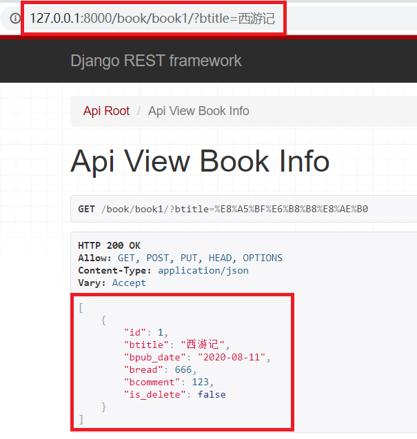

## 01.APIView介绍

### 1.1 APIView特点

`APIView`是REST framework提供的所有视图的基类，继承自Django的`View`类。

`APIView`与`View`的区别：

- **请求对象**：传入到视图中的request对象是REST framework的`Request`对象，而不再是Django原始的`HttpRequest`对象；
- **响应对象**：视图可以直接返回REST framework的`Response`对象，响应数据会根据客户端请求头`Accpet`自动转换为对应的格式进行返回；
- **异常处理**：任何`APIException`的子异常都会被DRF框架默认的异常处理机制处理成对应的响应信息返回给客户端；
- **其他功能**：认证、权限、限流。

### 1.2 Request对象

- 视图继承APIView之后，传入视图的request对象是DRF框架提供的`Request`类的对象
- Request类的对象有两个属性：

| 属性名       | 说明                                                         |
| ------------ | ------------------------------------------------------------ |
| data         | 包含解析之后的请求体数据，已经解析为了字典或类字典，相当于Django原始request对象的body、POST、FILES属性。 |
| query_params | 包含解析之后的查询字符串数据，相当于Django原始request对象的GET属性 |

### 1.3 Response对象

- 视图继承APIView之后，响应时可以统一返回Response对象，格式如下：

```python
from rest_framework.response import Response

response = Response(<原始响应数据>)
```

- 原始的响应数据，会根据客户端请求头的`Accpet`，自动转换为对应的格式并进行返回，如：

| Accept请求头     | 说明                                                         |
| ---------------- | ------------------------------------------------------------ |
| application/json | 服务器会将原始响应数据转换为json数据进行返回，没指定Accept时，默认返回json |
| text/html        | 服务器会将原始响应数据转换为html网页进行返回                 |

## 02.DRF全局配置

### 2.1 settings.py注册

- 注册

```python
INSTALLED_APPS = [
    'rest_framework',
    'django_filters',
]
```

### 2.2 全局配置DRF

```python
# 过滤器
# 1,安装 django-filter
# 2,注册应用
# 3,配置settings, 在view里配置可过滤的字段
# 4,使用 查询字符串携带过滤信息

REST_FRAMEWORK = {
    # 1.认证器（全局）：用户登录校验用户名密码或者token是否合法
    'DEFAULT_AUTHENTICATION_CLASSES': [
        # 'rest_framework_jwt.authentication.JSONWebTokenAuthentication', # 在DRF中配置JWT认证
        'rest_framework.authentication.SessionAuthentication',          # 使用session时的认证器
        'rest_framework.authentication.BasicAuthentication'             # 提交表单时的认证器
    ],
    #2.权限配置（全局）： 顺序靠上的严格（根据不同的用户角色，可以操作不同的表）
    'DEFAULT_PERMISSION_CLASSES': [
        # 'rest_framework.permissions.IsAdminUser',                # 管理员可以访问
        # 'rest_framework.permissions.IsAuthenticated',            # 认证用户可以访问
        # 'rest_framework.permissions.IsAuthenticatedOrReadOnly',  # 认证用户可以访问, 否则只能读取
        # 'rest_framework.permissions.AllowAny',                   # 所有用户都可以访问
    ],
    #3.限流（防爬虫）
    'DEFAULT_THROTTLE_CLASSES': [
        'rest_framework.throttling.AnonRateThrottle',
        'rest_framework.throttling.UserRateThrottle',
    ],
    #3.1限流策略
    'DEFAULT_THROTTLE_RATES': {
        'user': '1000/hour',    # 认证用户每小时100次
        'anon': '300/day',       # 未认证用户每天能访问3次
    },

    'DEFAULT_CONTENT_NEGOTIATION_CLASS': 'rest_framework.negotiation.DefaultContentNegotiation',
    'DEFAULT_METADATA_CLASS': 'rest_framework.metadata.SimpleMetadata',
    'DEFAULT_VERSIONING_CLASS': None,

    #4.分页（全局）：全局分页器, 例如 省市区的数据自定义分页器, 不需要分页
    'DEFAULT_PAGINATION_CLASS': 'rest_framework.pagination.PageNumberPagination',
    # 每页返回数量
    'PAGE_SIZE': 10,  # 默认 None

    #5.过滤器后端
    'DEFAULT_FILTER_BACKENDS': [
        'django_filters.rest_framework.DjangoFilterBackend',
        # 'django_filters.rest_framework.backends.DjangoFilterBackend', 包路径有变化
    ],

    #5.1过滤排序（全局）：Filtering 过滤排序
    'SEARCH_PARAM': 'search',
    'ORDERING_PARAM': 'ordering',

    'NUM_PROXIES': None,

    #6.版本控制：Versioning  接口版本控制
    'DEFAULT_VERSION': None,
    'ALLOWED_VERSIONS': None,
    'VERSION_PARAM': 'version',
}
```

## 03.APIView基本使用

### 3.1 book/models.py

```python
from django.db import models

#定义图书模型类BookInfo
class BookInfo(models.Model):
    btitle = models.CharField(max_length=20, verbose_name='名称')
    bpub_date = models.DateField(verbose_name='发布日期')
    bread = models.IntegerField(default=0, verbose_name='阅读量')
    bcomment = models.IntegerField(default=0, verbose_name='评论量')
    is_delete = models.BooleanField(default=False, verbose_name='逻辑删除')

    class Meta:
        db_table = 'tb_books'  # 指明数据库表名
        verbose_name = '图书'  # 在admin站点中显示的名称
        verbose_name_plural = verbose_name  # 显示的复数名称

    def __str__(self):
        """定义每个数据对象的显示信息"""
        return self.btitle
```

### 3.2 book/serializers.py

```python
# -*- coding: utf-8 -*-
from rest_framework import serializers
from book.models import BookInfo

class BookInfoSerializer2(serializers.ModelSerializer):
    """图书序列化器类"""
    class Meta:
        model = BookInfo
        fields = '__all__'
```

### 3.3 book/views.py

```python
from rest_framework.views import APIView
from rest_framework.response import Response
from book import serializers
from book.models import BookInfo

class APIViewBookInfoViewSet(APIView):
    def get(self, request):
        obj = BookInfo.objects.all()
        ser = serializers.BookInfoSerializer2(instance=obj, many=True)  # 关联数据多条
        return Response(ser.data)
```

### 3.4 book/urls.py

```python
from django.urls import re_path,path
from book import views

urlpatterns = [
    path('book1/', views.APIViewBookInfoViewSet.as_view()),
]
```

### 3.5 测试接口

#### 3.5.1 get获取数据

> http://127.0.0.1:8000/book/book1/

```python
[
    {
        "id": 1,
        "btitle": "西游记",
        "bpub_date": "2020-08-11",
        "bread": 666,
        "bcomment": 123,
        "heroinfo_set": [],
        "xxx": "西游记"
    },
    {
        "id": 2,
        "btitle": "水浒传",
        "bpub_date": "2020-08-11",
        "bread": 200,
        "bcomment": 100,
        "heroinfo_set": [],
        "xxx": "水浒传"
    }
]
```

#### 3.5.2 post添加数据

> http://127.0.0.1:8000/book/book1/

 </img>

#### 3.5.3 put修改数据

> http://127.0.0.1:8000/book/book1/?pk=4

 </img>

## 04.自定义分页

### 4.1 自定义分页

```python
from rest_framework.views import APIView
from rest_framework.response import Response
from rest_framework.pagination import PageNumberPagination
from book import serializers
from book.models import BookInfo


# 分页（局部）：自定义分页器 局部
class PageNum(PageNumberPagination):
    # 查询字符串中代表每页返回数据数量的参数名, 默认值: None
    page_size_query_param = 'page_size'
    # 查询字符串中代表页码的参数名, 有默认值: page
    # page_query_param = 'page'
    # 一页中最多的结果条数
    max_page_size = 2

class APIViewBookInfoViewSet(APIView):
    def get(self, request):
        queryset = BookInfo.objects.all()
        # 分页
        pg = PageNum()
        page_objs = pg.paginate_queryset(queryset=queryset, request=request, view=self)
        ser = serializers.BookInfoSerializer2(instance=page_objs, many=True)  # 关联数据多条
        return Response(ser.data)
```

### 4.2 测试分页效果

> `查找第一页，每页显示两条数据`
>
> http://127.0.0.1:8000/book/book1/?page=1&page_size=2

 </img>

## 05.认证权限

### 5.1 使用自带权限

```python
# 注：认证类都在 `rest_framework.authentication` 模块中
from rest_framework.authentication import SessionAuthentication
from rest_framework.permissions import IsAuthenticated, AllowAny


class APIViewBookInfoViewSet(APIView):
    authentication_classes = (SessionAuthentication,)
    # permission_classes = [IsAuthenticated]   # 只有认证用户才能访问接口
    permission_classes = [AllowAny]   # 只有认证用户才能访问接口

    def get(self, request):
        queryset = BookInfo.objects.all()
        # 分页
        pg = PageNum()
        page_objs = pg.paginate_queryset(queryset=queryset, request=request, view=self)
        ser = serializers.BookInfoSerializer2(instance=page_objs, many=True)  # 关联数据多条
        return Response(ser.data)
```

### 5.2 自定义权限

#### 5.2.1 自定义权限

```python
from rest_framework.permissions import BasePermission

# 自定义权限（局部）
class MyPermission(BasePermission):
    # has_permission 是用户对这个视图有没有 GET POST PUT PATCH DELETE 权限的分别判断
    def has_permission(self, request, view):
        print('has_perm')
        # print(view.kwargs.get("pk"), request.user.id)
        """判断用户对模型有没有访问权"""
        # 任何用户对使用此权限类的视图都有访问权限
        if request.user.is_superuser:
            # 管理员对用户模型有访问权
            return True
        elif view.kwargs.get('pk') == str(request.user.id):
            # 携带的id和用户的id相同时有访问权
            return True
        return False

    # has_object_permission 是用户过了 has_permission 判断有权限以后，再判断这个用户有没有对一个具体的对象有没有操作权限
    def has_object_permission(self, request, view, obj):
        print('has_object_perm')
        """获取单个数据时,判断用户对某个数据对象是否有访问权限"""
        if request.user.id == obj.id:
            return True
        return False
```

#### 5.2.2 使用自定义权限

```python
# 注：认证类都在 `rest_framework.authentication` 模块中
from rest_framework.authentication import SessionAuthentication

class APIViewBookInfoViewSet(APIView):
    authentication_classes = (SessionAuthentication,)
    permission_classes = [MyPermission,]     # 只有认证用户才能访问接口

    def get(self, request):
        queryset = BookInfo.objects.all()
        # 分页
        pg = PageNum()
        page_objs = pg.paginate_queryset(queryset=queryset, request=request, view=self)
        ser = serializers.BookInfoSerializer2(instance=page_objs, many=True)  # 关联数据多条
        return Response(ser.data)
```

## 06.限流

### 6.1 全局配置

- `DEFAULT_THROTTLE_RATES` 可以使用 `second`、`minute`、`hour` 或`day`来指明限流周期。

```python
REST_FRAMEWORK = {
    ...
    # 针对匿名用户和认证通过用户分别进行限流控制
    'DEFAULT_THROTTLE_CLASSES': (
        # 针对未登录(匿名)用户的限流控制类
        'rest_framework.throttling.AnonRateThrottle',
        # 针对登录(认证通过)用户的限流控制类
        'rest_framework.throttling.UserRateThrottle'
    ),
    # 指定限流频次
    'DEFAULT_THROTTLE_RATES': {
        # 认证用户的限流频次
        'user': '5/minute',
        # 匿名用户的限流频次
        'anon': '3/minute',
    },
}
```

### 6.2 指定视图配置

- 也可以某个视图中通过 `throttle_classes` 属性来指定某视图所使用的限流控制类

```python
from rest_framework.throttling import AnonRateThrottle

class BookInfoViewSet(ReadOnlyModelViewSet):
    ...
    # 此时设置当前视图仅针对匿名用户进行限流控制
    throttle_classes = [AnonRateThrottle]
```

## 07.过滤

### 7.1 自定义过滤

```python
from django_filters.rest_framework import DjangoFilterBackend

class APIViewBookInfoViewSet(APIView):
    filter_backends = (DjangoFilterBackend,)
    # 指定过滤字段, 不设置, 过滤功能不起效
    filter_fields = ('btitle', )  # ?username=tom&phone=&is_active=true

    def filter_queryset(self, queryset):
        for backend in list(self.filter_backends):
            queryset = backend().filter_queryset(self.request, queryset, self)
        return queryset

    def get(self, request):
        queryset = BookInfo.objects.all()
        # 过滤
        queryset = self.filter_queryset(queryset)

        # 分页
        pg = PageNum()
        page_objs = pg.paginate_queryset(queryset=queryset, request=request, view=self)
        ser = serializers.BookInfoSerializer2(instance=page_objs, many=True)  # 关联数据多条
        return Response(ser.data)
```

### 7.2 测试过滤功能

http://127.0.0.1:8000/book/book1/?btitle=西游记

 </img>

## 08.排序

### 8.1 配置排序

````python
from django_filters.rest_framework import DjangoFilterBackend
from rest_framework.filters import OrderingFilter

class APIViewBookInfoViewSet(APIView):
    filter_backends = (DjangoFilterBackend,OrderingFilter)
    # 指定过滤字段, 不设置, 过滤功能不起效
    filter_fields = ('btitle', )  # ?username=tom&phone=&is_active=true
    # 5.1指定排序字段, 不设置, 排序功能不起效
    ordering_fields = ('id',)    # ?ordering=-id

    def filter_queryset(self, queryset):
        for backend in list(self.filter_backends):
            queryset = backend().filter_queryset(self.request, queryset, self)
        return queryset
````

### 8.2 测试排序功能

http://127.0.0.1:8000/book/book1/?ordering=-id

 </img>