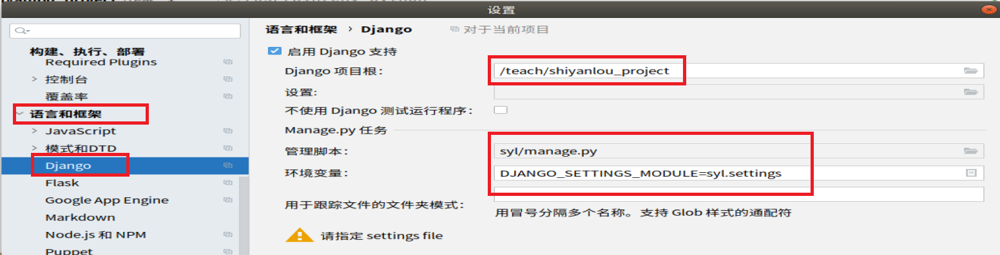

## 01.初始化项目结构

```python
└─shiyanlou_project          # 项目根路径
    │  .gitignore             # 提交git仓库时，不提交的文件必须要在这里进行标注
    │  README.en.md           # 英文（项目介绍）
    │  README.md              # 中文项目简介
    │  requirements.txt       # django项目安装文件
    │
    ├─celery_task            # 用来存放celery相关文件（以便分布式部署）
    │      __init__.py
    │
    ├─db                     # 数据库相关：1.数据库初始化sql脚本； 2.数据库维护脚本，清理，备份脚本
    ├─scrips                 # 脚本目录：1.定时任务脚本；2.页面静态化脚本；处理项目脚本
    ├─logs                   # 存放日志
    ├─packages               # 外部包，原始的，未配置的：1.七牛云sdk；2.阿里云短信；
    └─uwsgi_conf             # uwsgi配置，日志，pid
    │
    │
    └─syl                    # 真正的django项目（代码）django-admin startproject   项目名
        │  apps （python包）                   # Django各种app模块 
        │  libs （python包）                   # 七牛云sdk+配置（外部下载）
        │  utils （python包）                  # 小工具，常用函数(自己写的)
        │  static                 
        │  templates
        │  syl（项目配置）
        │  manager.py
```

 </img>

## 02.创建Django项目

```python
root@dev:shiyanlou_project# workon syl
(syl) root@dev:shiyanlou_project# cd /aaa/shiyanlou_project/
(syl) root@dev:shiyanlou_project# django-admin startproject syl
# 注：创建三个python包， apps、utils、libs
```

- 使用pycharm打开项目

     - 1.右击---->编辑配置----->

          - ```
               PYTHONUNBUFFERED               1 
               DJANGO_SETTINGS_MODULE         syl.settings
               ```

          -  </img>

     - 2.文件---->设置----->

          -  </img>

     - 3.文件---->设置----->

          -  </img>


## 03.创建user模型

### 3.1 创建用户模型user

```python
python ../manage.py startapp user  # 创建user模型
```

### 3.2 在setting.py中注册user模型（第一步）

```python
INSTALLED_APPS = [
    'user.apps.UserConfig',
]
# 注：pycharm无法联想，需要把apps文件夹设置为源根
```

- 要想让pycharm识别要这样操作
     -  </img>

### 3.3 syl/urls.py添加主路由（第二步）

```python
urlpatterns = [
    path('user/', include('user.urls')),
]
```

### 3.5 syl/settings.py中添加apps路径

```python
# 把apps目录插入，到系统包搜索路径第一个位置中
sys.path.insert(0,os.path.join(BASE_DIR,'apps'))
```

### 3.4 创建 user/urls.py子路由文件（第三步）

```python
from django.urls import path

urlpatterns = [

]
```

## 04.重写Django默认认证用户模型

### 4.1 重写django user表

```python
from django.db import models
from django.contrib.auth.models import AbstractUser

# Create your models here.
class User(AbstractUser):
    phone = models.CharField('手机号',max_length=20)
    img = models.ImageField(upload_to='user',null=True)
    nick_name = models.CharField('昵称',max_length=20)
    address = models.CharField('地址',max_length=255)

    class Meta:
        db_table = 'tb_user'
```

### 4.2 syl/settings.py中注册

```python
# 注册自己的用户模型类: 应用名.模型名，指定我们重写的User表进行身份验证
AUTH_USER_MODEL = 'user.User'
```

### 4.3 配置mysql

```python
'''1.创建mysql数据库'''
mysql> create database syldatabase charset utf8;

'''2.在syl/settings.py中配置mysql'''
DATABASES = {
    'default': {
        'ENGINE': 'django.db.backends.mysql',
        'NAME': 'syldatabase',              # 指定数据库名称：syldatabase
        'USER': 'root',
        'PASSWORD': '1',
        'HOST': '127.0.0.1',
        'PORT': '3306',
    }
}
```

### 4.4生成表

```python
python manage.py makemigrations
python manage.py migrate
```

## 05.python中的三种路径

### 5.1 操作系统绝对路径（第一种）

- django 静态文件查找, 模板查找（第一种）

```python
# 去配置好的 文件夹 中查找指定的文件
BASE_DIR = os.path.dirname(os.path.dirname(os.path.abspath(__file__)))
STATIC_URL = '/static/'
# /teach/shiyanlou_project/syl/apps/user/   # linux
# E:\_000\XSX
```


### 5.2 django 导包路径（第二种）

- 第一：`当期文件夹`
- 第二：`sys.path`

```python
导包之前, 包的上级路径, 需要存在于 python system 的 path
sys.path  这是一个列表
​```
sys.path.insert(0, os.path.join(BASE_DIR, 'apps'))
​```
from xxx import yyy  才能成功
```

### 5.3 django模型引用（第三种）

```python
想使用 一个 models.py 文件中的模型
apps名称.model模型名
'users.User'
```


