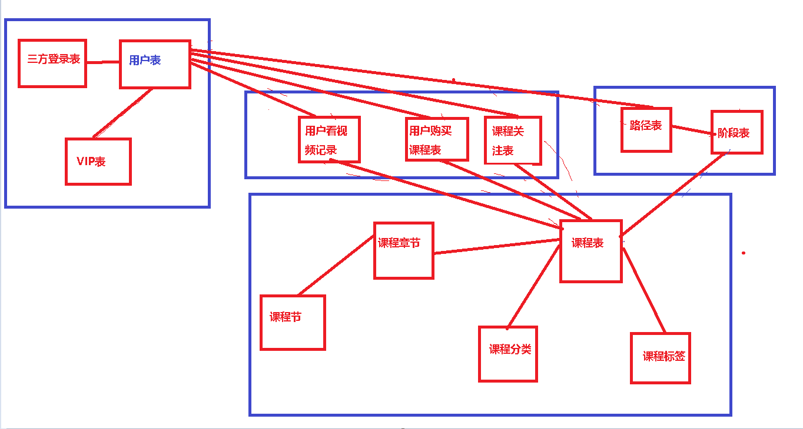

 </img>

# 1.用户模块

- 用户表
  - 用户名
  - 手机号
  - 邮箱
  - 密码
  - `Vip-->(Vip表)`
  - 用户状态（激活/禁用）
- Vip表
  - 会员名称（普通用户/普通会员/金卡会员）
  - 会员等级
  - 描述信息
  - 有效期

- 三方登录表
  - `userid--->用户表`
  - `uid--->第三方的唯一ID`
  - 认证类型（微信/QQ/微博）

# 2.课程模块

- 课程表
  - 课程名称
  - 关注人数
  - 学习人数
  - 课程描述
  - 图片路径
  - 课程状态（上线/即将上线）
  - `课程标签--->课程标签表`
  - `课程类别---->课程类别表`

- 课程标签
  - 标签名
  - 显示顺序号
- 课程类别
  - 名称
  - 显示序号

- 章表
  - 章名称
  - 章序号
  - `课程--->课程表`
- 节表
  - 节名称
  - 节序号(第1节，第2节)
  - 序号（显示顺序）

