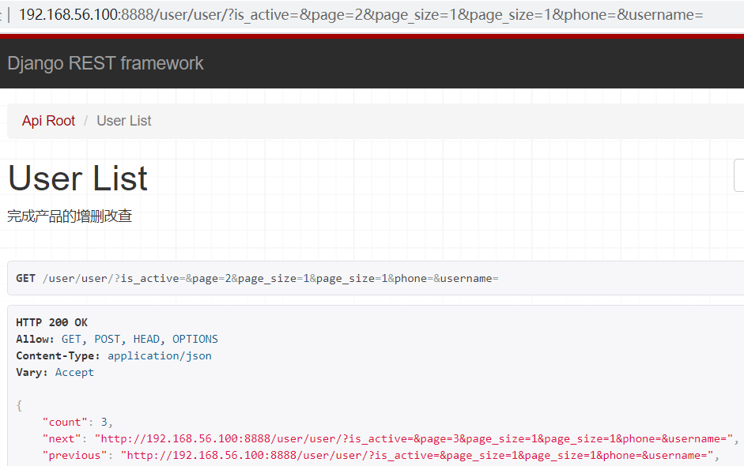

# 1.DRF初始化

### 1.1 安装DjangoRestFramework

```python
pip install djangorestframework==3.11.1
pip install django-filter==2.3.0             # 过滤器
pip install markdown                         # Markdown support for the browsable API.
```

### 1.2 在syl/settings.py中注册 

```python
INSTALLED_APPS = [
    'django_filters',
    'rest_framework',
]
```

### 1.3 syl/settings.py配置DRF

```python
# 过滤器
# 1,安装 django-filter
# 2,注册应用
# 3,配置settings, 在view里配置可过滤的字段
# 4,使用 查询字符串携带过滤信息

REST_FRAMEWORK = {
    # 文档报错： AttributeError: ‘AutoSchema’ object has no attribute ‘get_link’
    # 用下面的设置可以解决
    'DEFAULT_SCHEMA_CLASS': 'rest_framework.schemas.AutoSchema',
    # 默认设置是:
    # 'DEFAULT_SCHEMA_CLASS': 'rest_framework.schemas.openapi.AutoSchema',

    # 异常处理器
    # 'EXCEPTION_HANDLER': 'user.utils.exception_handler',

    # Base API policies
    'DEFAULT_RENDERER_CLASSES': [
        'rest_framework.renderers.JSONRenderer',
        'rest_framework.renderers.BrowsableAPIRenderer',
    ],
    'DEFAULT_PARSER_CLASSES': [
        'rest_framework.parsers.JSONParser',
        'rest_framework.parsers.FormParser',
        'rest_framework.parsers.MultiPartParser'
    ],
    # 1.认证器
    'DEFAULT_AUTHENTICATION_CLASSES': [
        'rest_framework.authentication.SessionAuthentication',  # 使用session时的认证器
        'rest_framework.authentication.BasicAuthentication'     # 提交表单时的认证器
    ],
    #2.权限配置（全局）： 顺序靠上的严格
    'DEFAULT_PERMISSION_CLASSES': [
        # 'rest_framework.permissions.IsAdminUser',  # 管理员可以访问
        # 'rest_framework.permissions.IsAuthenticated',  # 认证用户可以访问
        # 'rest_framework.permissions.IsAuthenticatedOrReadOnly',  # 认证用户可以访问, 否则只能读取
        # 'rest_framework.permissions.AllowAny',  # 所有用户都可以访问
    ],
    #3.限流
    'DEFAULT_THROTTLE_CLASSES': [
        'rest_framework.throttling.AnonRateThrottle',
        'rest_framework.throttling.UserRateThrottle',
    ],
    #3.1限流策略
    'DEFAULT_THROTTLE_RATES': {
        'user': '100/hour',    # 认证用户每小时10次
        'anon': '3/day',
    },

    'DEFAULT_CONTENT_NEGOTIATION_CLASS': 'rest_framework.negotiation.DefaultContentNegotiation',
    'DEFAULT_METADATA_CLASS': 'rest_framework.metadata.SimpleMetadata',
    'DEFAULT_VERSIONING_CLASS': None,

    #4.分页（全局）：全局分页器, 例如 省市区的数据自定义分页器, 不需要分页
    'DEFAULT_PAGINATION_CLASS': 'rest_framework.pagination.PageNumberPagination',
    # 每页返回数量
    'PAGE_SIZE': 10,  # 默认 None

    #5.过滤器后端
    'DEFAULT_FILTER_BACKENDS': [
        'django_filters.rest_framework.DjangoFilterBackend',
        # 'django_filters.rest_framework.backends.DjangoFilterBackend', 包路径有变化
    ],

    #5.1过滤排序（全局）：Filtering 过滤排序
    'SEARCH_PARAM': 'search',
    'ORDERING_PARAM': 'ordering',

    'NUM_PROXIES': None,

    #6.版本控制：Versioning  接口版本控制
    'DEFAULT_VERSION': None,
    'ALLOWED_VERSIONS': None,
    'VERSION_PARAM': 'version',

    # Authentication  认证
    # 未认证用户使用的用户类型
    'UNAUTHENTICATED_USER': 'django.contrib.auth.models.AnonymousUser',
    # 未认证用户使用的Token值
    'UNAUTHENTICATED_TOKEN': None,

    # View configuration
    'VIEW_NAME_FUNCTION': 'rest_framework.views.get_view_name',
    'VIEW_DESCRIPTION_FUNCTION': 'rest_framework.views.get_view_description',

    'NON_FIELD_ERRORS_KEY': 'non_field_errors',

    # Testing
    'TEST_REQUEST_RENDERER_CLASSES': [
        'rest_framework.renderers.MultiPartRenderer',
        'rest_framework.renderers.JSONRenderer'
    ],
    'TEST_REQUEST_DEFAULT_FORMAT': 'multipart',

    # Hyperlink settings
    'URL_FORMAT_OVERRIDE': 'format',
    'FORMAT_SUFFIX_KWARG': 'format',
    'URL_FIELD_NAME': 'url',

    # Encoding
    'UNICODE_JSON': True,
    'COMPACT_JSON': True,
    'STRICT_JSON': True,
    'COERCE_DECIMAL_TO_STRING': True,
    'UPLOADED_FILES_USE_URL': True,

    # Browseable API
    'HTML_SELECT_CUTOFF': 1000,
    'HTML_SELECT_CUTOFF_TEXT': "More than {count} items...",

    # Schemas
    'SCHEMA_COERCE_PATH_PK': True,
    'SCHEMA_COERCE_METHOD_NAMES': {
        'retrieve': 'read',
        'destroy': 'delete'
    },
}
```

### 1.4 创建user/serializers.py写序列化器

```python
from rest_framework import serializers
from user.models import User


def address_validate(data):
    # 独立校验器
    # raise serializers.ValidationError('请填写实际地址')  # 有错就抛出异常
    # 没错就返回数据
    return data


class UserSerializer(serializers.ModelSerializer):
    # 1.独立校验器：重新设定字段, 替换掉模型中的设定, 重新设定地址的长度为5
    address = serializers.CharField(max_length=255, min_length=5, validators=[address_validate])

    # 2.单一字段验证, 验证地址
    def validate_address(self, data):
        if data == '测试':
            raise serializers.ValidationError('请填写实际地址')  # 有错就抛出异常
        return data  # 没错就返回结果

    def validate_phone(self, data):
        # 不符合手机号格式
        # raise serializers.ValidationError('手机号格式不正确')
        model = self.root.Meta.model
        num = model.objects.filter(phone=data).count()
        if num > 0:
            raise serializers.ValidationError('手机号已存在')
        return data

    # 3.所有属性验证器
    def validate(self, attrs):
        # 所有属性验证器
        # self.context 中有request和view上下文
        # self.context['view'].action 可以取到动作
        # attrs 是需要序列化的数据
        # raise serializers.ValidationError('xxx错误')  # 有问题报错
        return attrs  # 没问题返回数据

    class Meta:
        model = User
        # fields = ('id', ) # 临时添加字段也需要写在这里
        fields = '__all__'  # 所有字段
        # exclude = ['id']  # 排除 id 字段
        read_only_fields = ('',)  # 指定字段为 read_only,

        # 扩展address： extra_kwargs = {}  # 局部替换某些字段的设定, 或者新增设定
        extra_kwargs = {
            "address": {
                "min_length": 5,  # 给地址增加 最小长度限制
                "default": '默认测试地址',  # 增加默认值
            }
        }


class UserUnActiveSerializer(serializers.ModelSerializer):
    class Meta:
        model = User
        fields = ('id', 'username', 'is_active')  # 临时添加字段也需要写在这里
        # fields = '__all__'  # 所有字段

```

# 2. DRF 认证、权限、限流、分页、过滤、序列化

### 2.1 user/urls.py

```python
from django.urls import include, path
from user import views
from rest_framework.routers import SimpleRouter, DefaultRouter

# 自动生成路由方法, 必须使用视图集
# router = SimpleRouter()  # 没有根路由  /user/ 无法识别
router = DefaultRouter()  # 有根路由
router.register(r'user', views.UserViewSet)

urlpatterns = [
    path('index/', views.index),
    path('api-auth/', include('rest_framework.urls', namespace='rest_framework'))  # 认证地址
]

urlpatterns += router.urls  # 模块地址
```


### 2.2 user/views.py

```python
from django.http import HttpResponse
from django_filters.rest_framework import DjangoFilterBackend
from rest_framework import viewsets
from rest_framework.authentication import BasicAuthentication, SessionAuthentication
from rest_framework.decorators import action
from rest_framework.filters import OrderingFilter
from rest_framework.permissions import AllowAny, IsAdminUser, IsAuthenticated, IsAuthenticatedOrReadOnly
from rest_framework.response import Response
from rest_framework.throttling import UserRateThrottle
from rest_framework.pagination import PageNumberPagination
from rest_framework.views import APIView
from rest_framework.permissions import BasePermission, SAFE_METHODS
from user.models import User
from user.serializers import UserSerializer, UserUnActiveSerializer


def index(request):
    # 需要认证才能访问的视图
    return HttpResponse('hello')


# 分页（局部）：自定义分页器 局部
class PageNum(PageNumberPagination):
    # 查询字符串中代表每页返回数据数量的参数名, 默认值: None
    page_size_query_param = 'page_size'
    # 查询字符串中代表页码的参数名, 有默认值: page
    # page_query_param = 'page'
    # 一页中最多的结果条数
    max_page_size = 2


# 自定义权限（局部）
class MyPermission(BasePermission):
    def has_permission(self, request, view):
        print(view.kwargs.get("pk"), request.user.id)
        """判断用户对模型有没有访问权"""
        # 任何用户对使用此权限类的视图都有访问权限
        print(request)
        if request.user.is_superuser:
            # 管理员对用户模型有访问权
            return True
        elif view.kwargs.get('pk') == str(request.user.id):
            # 携带的id和用户的id相同时有访问权
            return True
        return False

    def has_object_permission(self, request, view, obj):
        """获取单个数据时,判断用户对某个数据对象是否有访问权限"""
        if request.user.id == obj.id:
            return True
        return False


class UserViewSet(viewsets.ModelViewSet):
    """
    完成产品的增删改查
    """
    queryset = User.objects.all()
    serializer_class = UserSerializer  # 优先使用 get_serializer_class 返回的序列化器

    # # 1.认证：自定义认证类, 自定义会覆盖全局配置
    # authentication_classes = (BasicAuthentication, SessionAuthentication)
    # # 2.权限：自定义权限类
    # permission_classes = (MyPermission,)
    
    # 3.分页：自定义分页器 覆盖全局配置
    pagination_class = PageNum
    
    # 4.限流：自定义限流类
    throttle_classes = [UserRateThrottle]

    # 5.过滤：指定过滤方法类, 排序方法类, 一个或多个
    filter_backends = (DjangoFilterBackend, OrderingFilter)  # 同时支持过滤和排序
    # 5.1指定排序字段, 不设置, 排序功能不起效
    ordering_fields = ('date_joined', 'id')              # ?ordering=-id
    # 5.2指定过滤字段, 不设置, 过滤功能不起效
    filter_fields = ('username', 'phone', 'is_active')   # ?username=tom&phone=&is_active=true


    # 根据不同的请求, 获得不同的序列化器
    def get_serializer_class(self):
        if self.action == 'unactived':
            return UserUnActiveSerializer
        else:
            return UserSerializer

    @action(methods=['get'], detail=False)
    def unactived(self, request, *args, **kwargs):
        # 获取查询集, 过滤出未激活的用户
        qs = self.queryset.filter(is_active=False)
        # 使用序列化器, 序列化查询集, 并且是
        ser = self.get_serializer(qs, many=True)
        return Response(ser.data)
```


# 3.测试接口

```python
#1.查询所有用户
http://192.168.56.100:8888/user/user/
#2.查询id=1的用户
http://192.168.56.100:8888/user/user/1/
#3.查询 用户名（tom），激活的用户
http://192.168.56.100:8888/user/user/?username=tom&phone=&is_active=true
#4.查询所有用户 用id 反向排序
http://192.168.56.100:8888/user/user/?ordering=-id
#5.查询用户表中第一页，每页显示一条数据
http://192.168.56.100:8888/user/user/?page=1&page_size=1
```

 </img>

```python
{
    "count": 3,
    "next": "http://192.168.56.100:8888/user/user/?is_active=&page=3&page_size=1&page_size=1&phone=&username=",
    "previous": "http://192.168.56.100:8888/user/user/?is_active=&page_size=1&page_size=1&phone=&username=",
    "results": [
        {
            "id": 2,
            "address": "河南郑州市",
            "password": "chn@1099",
            "last_login": null,
            "is_superuser": false,
            "username": "zhangsan",
            "first_name": "",
            "last_name": "",
            "email": "",
            "is_staff": false,
            "is_active": true,
            "date_joined": "2020-09-20T13:41:58.528732Z",
            "phone": "18538752511",
            "img": null,
            "nick_name": "吊炸天",
            "groups": [],
            "user_permissions": []
        }
    ]
}
```


