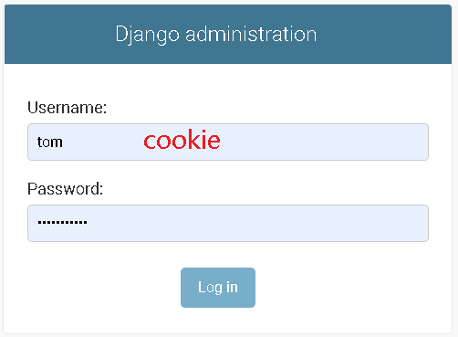
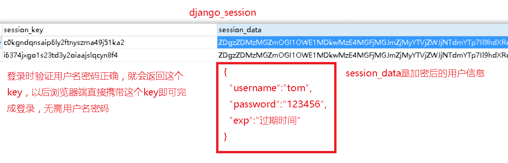
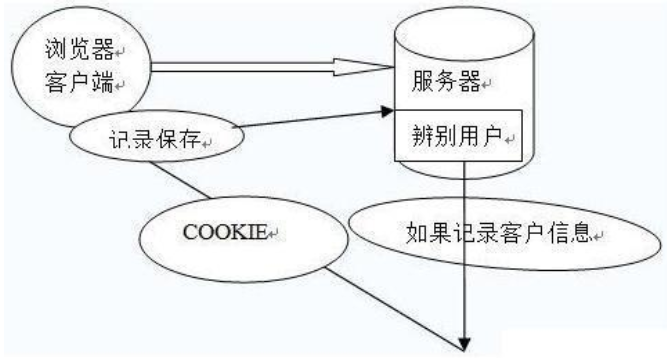
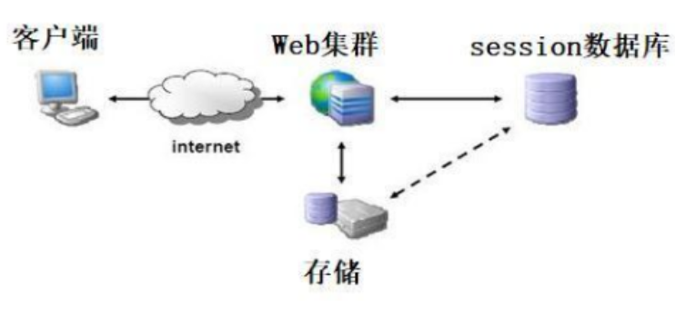
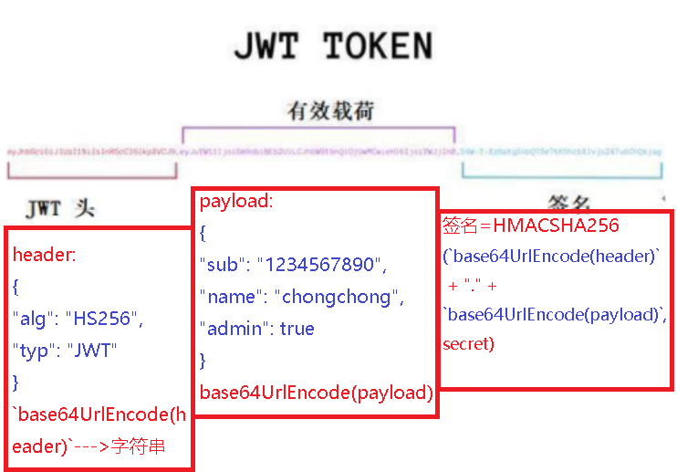

# 1.COOKIE使用和优缺点

https://www.cnblogs.com/xiaonq/p/11094480.html

### 1.1 cookie原理：`用户名+密码`

- cookie是保存在用户浏览器端，用户名和密码等明文信息

 </img>

### 1.2 session使用原理

- `session是存储在服务器端的一段字符串,相当于字典的key`

 </img>

- 1.用户向服务器发送用户名和密码。
- 2.验证服务器后，相关数据（如用户角色，登录时间等）将保存在当前会话中。
- 3.服务器向用户返回session_id，session信息都会写入到用户的Cookie。
- 4.用户的每个后续请求都将通过在Cookie中取出session_id传给服务器。
- 5.服务器收到session_id并对比之前保存的数据，确认用户的身份。

 </img>

### 1.3 session使用缺点

```
CPU
主板
显卡
内存条（把硬盘中的程序读取到内存中，就变成了进程）
硬盘（1T， 500G）（可运行的代码存储在硬盘中，就是程序）
IO操作（把硬盘中或者网络中的数据读取到内存中就是IO操作）
```

- `session默认存储在登录的那台服务器的内存中。`
- 1.这种模式最大的问题是，没有分布式架构，无法支持横向扩展。
- 2.如果使用一个服务器，该模式完全没有问题。
- 3.但是，如果它是服务器群集或面向服务的跨域体系结构的话，则需要一个统一的session数据库库来保存会话数据实现共享，
- 4.这样负载均衡下的每个服务器才可以正确的验证用户身份。

### 1.4 常用解决session方法

- 1.一种解决方案是通过持久化session数据，写入数据库或文件持久层等。
- 2.收到请求后，验证服务从持久层请求数据。
- 3.依赖于持久层的数据库或者问题系统，会有单点风险，如果持久层失败，整个认证体系都会挂掉。

 </img>

- 第一种：没有session持久化
  - 没有分布式架构，无法支持横向扩展
  - session默认存储在内存中，如果把代码部署在多台机器上，session保存到了其中某一台机器的内存中
  - 用户如果在A机器上登录，只有A机器的内存中存了这个session的key，如果请求nginx路由到B机器，B机器内存中没有这个session数据，就需要从新登录
- 第二种：写入数据库或文件持久层（`session+redis`）
  - 解决了横向扩展问题
  - 数据库持久层出现问题，所有集群都没办法登录，`单点故障`
  - 如果数据放到mysql中，用户量过大，查询很慢，效率很低

# 2. JWT介绍

### 2.1 jwt原理

- 最简单理解：jwt本质就是，`把用户信息通过加密后生成的一个字符串`

```python
JWT的原则是在服务器身份验证之后，将生成一个JSON对象并将其发送回用户
{
"UserName": "Chongchong",
"Role": "Admin",
"Expire": "2018-08-08 20:15:56"
}

之后，当用户与服务器通信时，客户在请求中发回JSON对象，服务器仅依赖于这个JSON对象来标识用户。
为了防止用户篡改数据，服务器将在生成对象时添加签名（有关详细信息，请参阅下文）。
服务器不保存任何会话数据，即服务器变为无状态，使其更容易扩展
```

### 2.2 JWT的数据结构

- 1）jwt头：JWT头部分是一个描述JWT元数据的JSON对象
- 2）有效载荷：七个默认字段+自定义私有字段（用户信息）
- 3）签名=HMACSHA256(`base64UrlEncode(header)` + "." + `base64UrlEncode(payload)`,secret)

 </img>

> 第一部分：`JWT头`

- `base64UrlEncode(header)`--->字符串

```python
# JWT头部分是一个描述JWT元数据的JSON对象，通常如下所示。
{
"alg": "HS256",
"typ": "JWT"
}
# 1）alg属性表示签名使用的算法，默认为HMAC SHA256（写为HS256）；
# 2）typ属性表示令牌的类型，JWT令牌统一写为JWT。
# 3）最后，使用Base64 URL算法将上述JSON对象转换为字符串保存。
```

> 第二部分：`有效载荷`   没有敏感数据的用户信息

- `base64UrlEncode(payload)`--->字符串

```python
#1、有效载荷部分，是JWT的主体内容部分，也是一个JSON对象，包含需要传递的数据。 JWT指定七个默认字段供选择。
'''
iss：发行人
exp：到期时间
sub：主题
aud：用户
nbf：在此之前不可用
iat：发布时间
jti：JWT ID用于标识该JWT
'''

#2、除以上默认字段外，我们还可以自定义私有字段，如下例：
{
"sub": "1234567890",
"name": "chongchong",
"admin": true
}

#3、注意
默认情况下JWT是未加密的，任何人都可以解读其内容，因此不要构建隐私信息字段，存放保密信息，以防止信息泄露。
JSON对象也使用Base64 URL算法转换为字符串保存。
```

> 第三部分：`签名哈希`

- 签名=HMACSHA256(`base64UrlEncode(header)` + "." + `base64UrlEncode(payload)`,secret)

```python
# 1.签名哈希部分是对上面两部分数据签名，通过指定的算法生成哈希，以确保数据不会被篡改。
# 2.首先，需要指定一个密码（secret），该密码仅仅为保存在服务器中，并且不能向用户公开。
# 3.然后，使用标头中指定的签名算法（默认情况下为HMAC SHA256）根据以下公式生成签名。
# 4.HMACSHA256(base64UrlEncode(header) + "." + base64UrlEncode(payload),secret)
# 5.在计算出签名哈希后，JWT头，有效载荷和签名哈希的三个部分组合成一个字符串，每个部分用"."分隔，就构成整个JWT对象。
```

### 2.3 jwt核心

- 1）给用户颁发的token值相当于一把锁，服务器端的秘钥相当于一把钥匙
- 2）每次客户端请求都会携带这把锁，服务器端用秘钥去开这把锁，若果无法打开就证明是伪造的

### 2.4 jwt特点分析

- 1、JWT的最大缺点是服务器不保存会话状态，所以在使用期间不可能取消令牌或更改令牌的权限，一旦JWT签发，在有效期内将会一直有效。
- 2、JWT本身包含认证信息，因此一旦信息泄露，任何人都可以获得令牌的所有权限。
- 3、为了减少盗用和窃取，JWT不建议使用HTTP协议来传输代码，而是使用加密的HTTPS协议进行传输。
- 4、JWT不仅可用于认证，还可用于信息交换，善用JWT有助于减少服务器请求数据库的次数。