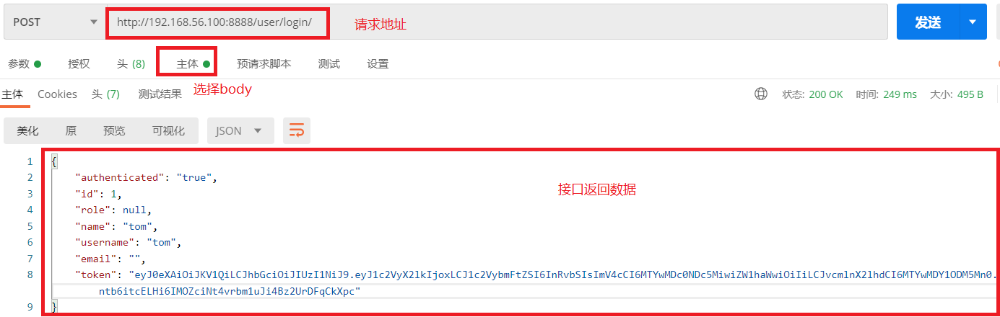
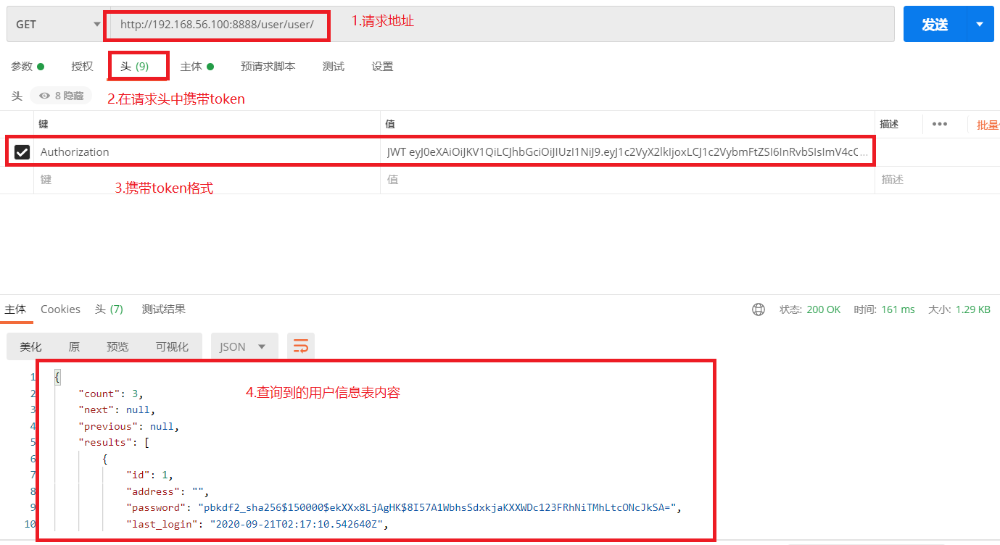

```
1.登录接口
2.刷新接口
3.自定义返回格式
```

- 可用地方

```python
'''第一：提供三个视图函数'''
# obtain_jwt_token = ObtainJSONWebToken.as_view()      # 获取token
# refresh_jwt_token = RefreshJSONWebToken.as_view()    # 刷新token
# verify_jwt_token = VerifyJSONWebToken.as_view()      # 修改token
'''第二：jwt_response_payload_handler可以重写返回'''
```

# 1.JWT安装配置

### 1.1 安装JWT

```
pip install djangorestframework-jwt==1.11.0
```

### 1.2 `syl/settings.py`配置jwt载荷中的有效期设置

```python

# jwt载荷中的有效期设置
JWT_AUTH = {
    # 1.token前缀：headers中 Authorization 值的前缀
    'JWT_AUTH_HEADER_PREFIX': 'JWT',
    # 2.token有效期：一天有效
    'JWT_EXPIRATION_DELTA': datetime.timedelta(days=1),
    # 3.刷新token：允许使用旧的token换新token，接口对接需要设置为true
    'JWT_ALLOW_REFRESH': True,
    # 4.token有效期：token在24小时内过期, 可续期token
    'JWT_REFRESH_EXPIRATION_DELTA': datetime.timedelta(hours=24),
    # 5.自定义JWT载荷信息：自定义返回格式，需要手工创建
    'JWT_RESPONSE_PAYLOAD_HANDLER': 'user.utils.jwt_response_payload_handler',
}
```

### 1.3 `syl/settings.py`JWT结合DRF进行认证权限配置

```python
# 在DRF配置文件中开启认证和权限
REST_FRAMEWORK = {
    ...
    # 用户登陆认证方式
    'DEFAULT_AUTHENTICATION_CLASSES': [
        'rest_framework_jwt.authentication.JSONWebTokenAuthentication',    # 在DRF中配置JWT认证
        # 'rest_framework.authentication.SessionAuthentication',  # 使用session时的认证器
        # 'rest_framework.authentication.BasicAuthentication'     # 提交表单时的认证器
    ],
    # 权限配置, 顺序靠上的严格
    'DEFAULT_PERMISSION_CLASSES': [
        # 'rest_framework.permissions.IsAdminUser',                # 管理员可以访问
        'rest_framework.permissions.IsAuthenticated',              # 全局配置只有认证用户可以访问接口
        # 'rest_framework.permissions.IsAuthenticatedOrReadOnly',  # 认证用户可以访问, 否则只能读取
        # 'rest_framework.permissions.AllowAny',                   # 所有用户都可以访问
    ],
    ...
}
```

### 1.4 `user/urls.py`增加获取token接口和刷新token接口

```python
from django.urls import include, path
from rest_framework.authtoken.views import obtain_auth_token

from user import views
from rest_framework.routers import SimpleRouter, DefaultRouter
from rest_framework_jwt.views import obtain_jwt_token, refresh_jwt_token

# 自动生成路由方法, 必须使用视图集
# router = SimpleRouter()  # 没有根路由  /user/ 无法识别
router = DefaultRouter()   # 有根路由
router.register(r'user', views.UserViewSet)

urlpatterns = [
    path('index/', views.index),          # 函数视图
    path('login/', obtain_jwt_token),     # 获取token，登录视图
    path('refresh/', refresh_jwt_token),  # 刷新token
    path('api-auth/', include('rest_framework.urls', namespace='rest_framework')),  # 认证地址
]

urlpatterns += router.urls  # 模块地址
# print(router.urls)

# obtain_jwt_token = ObtainJSONWebToken.as_view()      # 获取token
# refresh_jwt_token = RefreshJSONWebToken.as_view()    # 刷新token
# verify_jwt_token = VerifyJSONWebToken.as_view()      # 修改token
```

### 1.5 在user/utils.py中从写jwt_response_payload_handler

```python
def jwt_response_payload_handler(token, user=None, request=None, role=None):
    """
    自定义jwt认证成功返回数据
    :token  返回的jwt
    :user   当前登录的用户信息[对象]
    :request 当前本次客户端提交过来的数据
    :role 角色
    """
    if user.first_name:
        name = user.first_name
    else:
        name = user.username
    return {
        'authenticated': 'true',
        'id': user.id,
        "role": role,
        'name': name,
        'username': user.username,
        'email': user.email,
        'token': token,
    }
```

# 2.postman测试接口

### 2.1 测试登录接口，获取token

```javascript
http://192.168.56.100:8888/user/login/
```

 </img>

```python
'''自定义认证和权限优先级更高，可以覆盖settings.py中的 '''
# 自定义权限类
permission_classes = (MyPermission,)
# 自定义认证类, 自定义会覆盖全局配置
authentication_classes = (JSONWebTokenAuthentication,)
```

### 2.2 使用获得的token获取所有用户信息

```javascript
http://192.168.56.100:8888/user/user/
```

 </img>


# 3.源码分析

```python
class JSONWebTokenAPIView(APIView):
    """
    Base API View that various JWT interactions inherit from.
    """
    permission_classes = ()
    authentication_classes = ()

    def get_serializer_context(self):
        """
        Extra context provided to the serializer class.
        """
        return {
            'request': self.request,
            'view': self,
        }

    def get_serializer_class(self):
        """
        Return the class to use for the serializer.
        Defaults to using `self.serializer_class`.
        You may want to override this if you need to provide different
        serializations depending on the incoming request.
        (Eg. admins get full serialization, others get basic serialization)
        """
        assert self.serializer_class is not None, (
            "'%s' should either include a `serializer_class` attribute, "
            "or override the `get_serializer_class()` method."
            % self.__class__.__name__)
        return self.serializer_class

    def get_serializer(self, *args, **kwargs):
        """
        Return the serializer instance that should be used for validating and
        deserializing input, and for serializing output.
        """
        serializer_class = self.get_serializer_class()
        kwargs['context'] = self.get_serializer_context()
        return serializer_class(*args, **kwargs)

    def post(self, request, *args, **kwargs):
        serializer = self.get_serializer(data=request.data)

        if serializer.is_valid():
            user = serializer.object.get('user') or request.user   # User表对象
            token = serializer.object.get('token')                 # 获取到生成的token
            response_data = jwt_response_payload_handler(token, user, request)
            response = Response(response_data)
            if api_settings.JWT_AUTH_COOKIE:
                expiration = (datetime.utcnow() +
                              api_settings.JWT_EXPIRATION_DELTA)
                response.set_cookie(api_settings.JWT_AUTH_COOKIE,
                                    token,
                                    expires=expiration,
                                    httponly=True)
            return response

        return Response(serializer.errors, status=status.HTTP_400_BAD_REQUEST)
```


