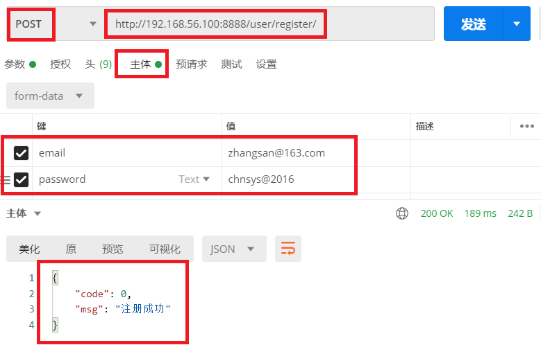
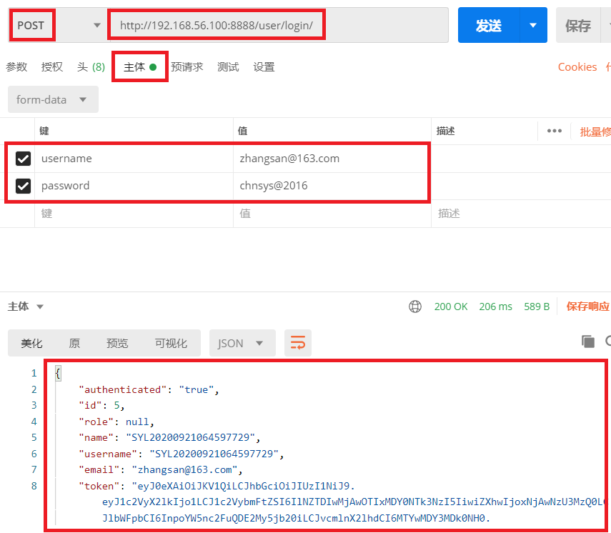
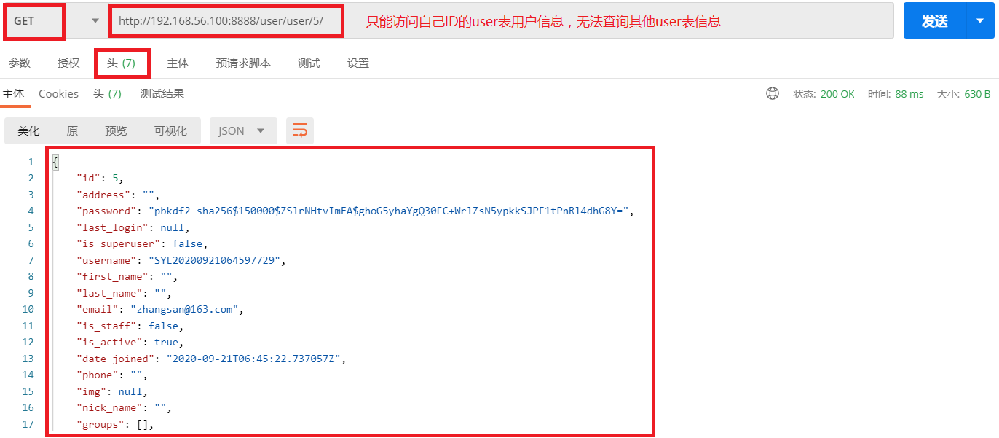

# 1.编写注册接口

### 1.1 `user/urls.py`中添加路由

```python
urlpatterns = [
    path('register/', views.RegisterView.as_view()),  # 注册视图,  /user/register/
]
```

### 1.2 `user/views.py`中写注册视图函数

```python

class RegisterView(APIView):
    """
    用户注册, 权限是: 匿名用户可访问
    """
    # 自定义权限类
    permission_classes = (AllowAny,)

    def post(self, request):
        """
        接收邮箱和密码, 前端校验两遍一致性, 注册成功后返回成功, 然后用户自行登录获取token
        1. 随机用户名
        2. 生成用户
        3. 设置用户密码
        4. 保存用户
        :param request:
        :return:  {'code':0,'msg':'注册成功'}
        """
        email = request.data.get('email')
        passwrod = request.data.get('password')
        username = request.data.get('username')

        if all([email, passwrod]):
            pass
        else:
            return Response({'code':9999,'msg':'参数不全'})
        user = User(username=username, email=email)
        user.set_password(passwrod)                   # 密码加密
        user.save()
        return Response({'code': 0, 'msg': '注册成功'})
```

# 2.重写django认证

### 2.1 `syl/settings.py`中指定自定义后端认证函数位置

```python
# 自定义验证后端，使用我们自己写的认证类来验证用户登录身份
AUTHENTICATION_BACKENDS = ['user.utils.EmailAuthBackend']
```

### 2.2 `user/utils.py`中重写认证函数（django多账号登录）

```python
# 以前使用username进行用户验证，现在修改成email进行验证

class EmailAuthBackend:
    def authenticate(self, request, username=None, password=None):
        '''
        request: request请求对象
        username:  用户名&邮箱&手机号
        password: 密码
        '''
        try:  # 通过用户名获取
            user = User.objects.get(username=username)
        except Exception as e:
            user = None
        if not user:
            try:
                user = User.objects.get(email=username)
            except Exception as e:
                user = None
        if user and user.check_password(password):
            return user
        else:
            return None
        
    def get_user(self, user_id):
        try:
            return User.objects.get(pk=user_id)
        except User.DoesNotExist:
            return None
```

# 3.注册用户 & 测试登录

### 3.1 注册接口测试

```javascript
http://192.168.56.100:8888/user/register/
```

 </img>

### 3.2 登录接口测试

注：`认证时只能识别username，所以必须要在请求中携带username字段`

```javascript
http://192.168.56.100:8888/user/login/
```

 </img>

### 3.3 获取用户列表接口测试

- 访问接口

```javascript
http://192.168.56.100:8888/user/user/5/
```

- `测试自定义权限`

```python
# 自定义权限类
permission_classes = (MyPermission,)
# 自定义认证类, 自定义会覆盖全局配置
authentication_classes = (JSONWebTokenAuthentication,)
```

 </img>


