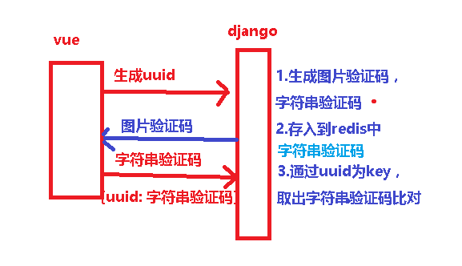
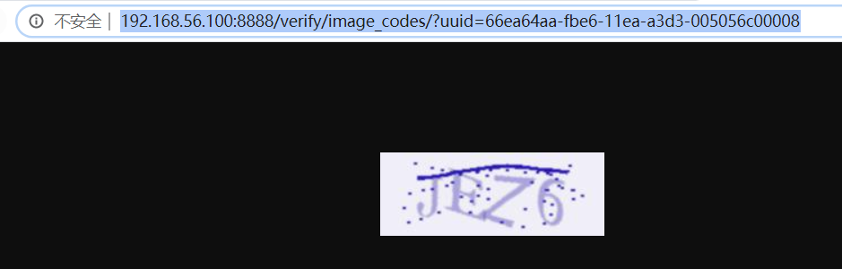

# 1.django 缓存设置

`django的六种缓存（mysql+redis）`：https://www.cnblogs.com/xiaonq/p/7978402.html#i6

`redis使用：`https://www.cnblogs.com/xiaonq/category/1544586.html

### 1.1 安装Django缓存模块

```python
pip install django-redis==4.12.1
```

### 1.2 `syl/settings.py`中配置缓存

```python
# 缓存配置
CACHES = {
    # django存缓默认位置,redis 0号库
    # default: 连接名称
    "default": {  
        "BACKEND": "django_redis.cache.RedisCache",
        "LOCATION": "redis://127.0.0.1:6379/0",
        "OPTIONS": {
            "CLIENT_CLASS": "django_redis.client.DefaultClient",
        }
    },
    # django session存 reidis 1 号库（现在基本不需要使用）
    "session": {  
        "BACKEND": "django_redis.cache.RedisCache",
        "LOCATION": "redis://127.0.0.1:6379/1",
        "OPTIONS": {
            "CLIENT_CLASS": "django_redis.client.DefaultClient",
        }
    },
    # 图形验证码，存redis 2号库
    "img_code": {  
        "BACKEND": "django_redis.cache.RedisCache",
        "LOCATION": "redis://127.0.0.1:6379/2",
        "OPTIONS": {
            "CLIENT_CLASS": "django_redis.client.DefaultClient",
        }
    }
}

# 配置session使用redis存储
SESSION_ENGINE = "django.contrib.sessions.backends.cache"
# 配置session存储的位置: 使用cache中的 session配置
SESSION_CACHE_ALIAS = "session"
```

# 2.新建应用verifications

-   图形验证码
-   短信验证码
-   邮件验证

```python
'''2.1 在apps文件夹下新建应用： verifications'''
python ../manage.py startapp verifications   # 切换到apps文件夹下执行创建命令


'''2.2 在syl/settings.py中添加应用'''
INSTALLED_APPS = [
    'verifications.apps.VerificationsConfig',
]

'''2.3 在syl/urls.py主路由中添加'''
path('verify/', include('verifications.urls')),

'''2.4 添加子路由： verifications/urls.py'''
from django.urls import path
from . import views
urlpatterns = [
    # path('image_codes/', views.ImageCodeView.as_view())
]
```

# 3.图形验证码captcha使用

```python
1.下载captcha压缩包captcha.zip，放到项目packages文件夹下
2.解压captcha.zip放到syl/libs文件夹下
3.解压文件中的syl/libs/captcha/captcha.py 右键运行即可生成图片验证码
unzip xxx.zip
```

# 4.在verifications/views.py中使用

 </img>

```python
from django.http import HttpResponse, HttpResponseForbidden
from django.views import View
from django_redis import get_redis_connection
from libs.captcha.captcha import captcha


class ImageCodeView(View):
    def get(self, request):
        # 1.接收数据(uuid)
        uuid = request.GET.get('uuid')

        # 2.校验数据
        if not uuid:
            return HttpResponseForbidden('uuid无效')

        # 3.处理业务
        # 获取图片文本内容和图片二进制代码
        text, image = captcha.generate_captcha()   # text=GPMZ; image=图片

        # 4.把uuid和图片文本存入redis
        redis_client = get_redis_connection('img_code')  # 获取redis客户端
        
        # 5.写入redis(是字符串)
        redis_client.setex(uuid, 60 * 5, text)

        # 6.返回响应图片
        return HttpResponse(image, content_type='image/jpg')
```

# 5.测试验证码接口

```javascript
http://192.168.56.100:8888/verify/image_codes/?uuid=66ea64aa-fbe6-11ea-a3d3-005056c00008
```

 </img>

```python
127.0.0.1:6379>#  select 2
OK
127.0.0.1:6379[2]>#  keys *
1) "66ea64aa-fbe6-11ea-a3d3-005056c00008"
127.0.0.1:6379[2]>#  get 66ea64aa-fbe6-11ea-a3d3-005056c00008
"JEZ6"
```


