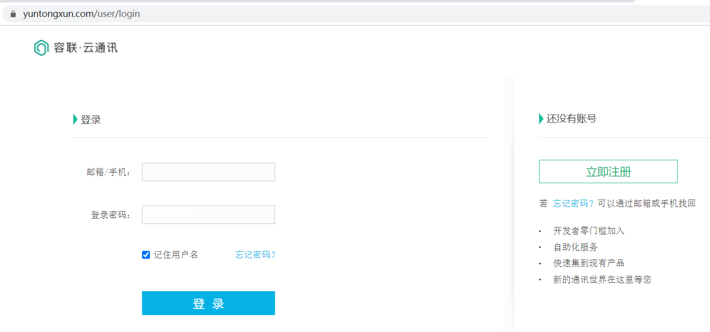
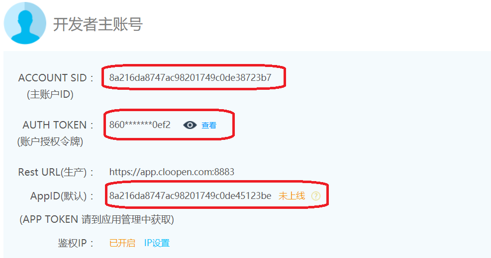
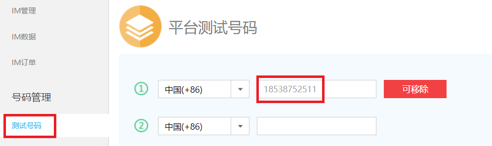
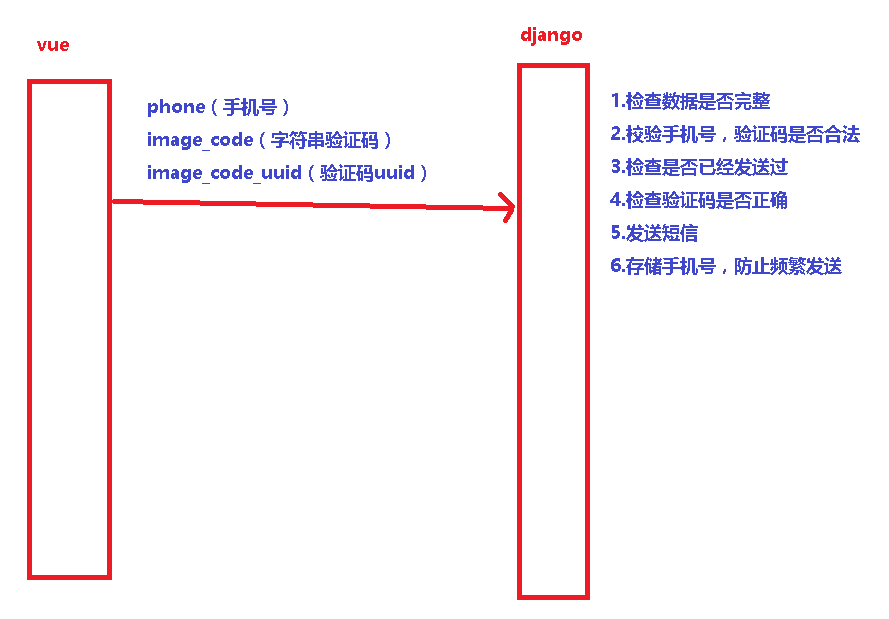

# 1.注册容联云账号

### 1.1  注册账号

https://www.yuntongxun.com/user/login 

 </img>


### 1.2 登录即可看到开发者账号信息

 </img>

### 1.3 添加测试账号

 </img>

# 2.使用容联云发送代码测试

```python
'''1. 安装容联云sdk'''
pip install ronglian_sms_sdk
# 免费测试文档地址:https://doc.yuntongxun.com/p/5a531a353b8496dd00dcdfe2

'''2. 短信发送代码'''
# libs/rl_sms.py
from ronglian_sms_sdk import SmsSDK

accId = '8a216da8747ac98201749c0de38723b7'
accToken = '86072b540b4648229b27400414150ef2'
appId = '8a216da8747ac98201749c0de45123be'


def send_message(phone, datas):
    sdk = SmsSDK(accId, accToken, appId)
    tid = '1'  # 测试模板id为: 1. 内容为: 【云通讯】您的验证码是{1}，请于{2}分钟内正确输入。
    # mobile = '13303479527'
    # datas = ('666777', '5')  # 模板中的参数按照位置传递
    resp = sdk.sendMessage(tid, phone, datas)
    return resp
```

# 3.在视图函数中使用

### 3.1 在verifications/urls.py中添加路由

```python
urlpatterns = [
    path('sms_codes/', views.SmsCodeView.as_view()), 
]
```

### 3.2 写试图函数

 </img>

```python
# verifications/views.py
from rest_framework.permissions import AllowAny
from rest_framework.views import APIView
from rest_framework.response import Response
import re
import random
from utils.rl_sms import send_message


class SmsCodeView(APIView):
    # 1. 所有人可以访问
    permission_classes = (AllowAny,)

    def post(self, request):
        # 1. 获取参数
        phone = request.data.get('phone') 
        image_code = request.data.get('image_code')    # 字符串验证码
        image_code_uuid = request.data.get('image_code_uuid')   # 前端生成的uuid，是redis中图片验证码的key

        # 2. 检查参数是否完整
        if not all([phone, image_code, image_code_uuid]):
            return Response({"code": 999, "msg": "参数不全"})
        if not re.match(r'^1[3456789]\d{9}$', phone):
            return Response({"code": 999, "msg": "手机号码不正确"})

        # 3. 检查是否已经发送过
        redis_client = get_redis_connection('img_code')  # 连接redis
        phone_exists = redis_client.get(phone)
        if phone_exists:
            return Response({"code": 999, "msg": "频繁发送, 请稍后再试"})

        # 4.检查图片验证码是否合法
        redis_image_code = redis_client.get(image_code_uuid)  # 字符串验证码
        if redis_image_code:
            # bytes 转成 string
            redis_image_code = redis_image_code.decode()
        # 比较用户提供的图片内容是否和redis中保存的一致
        if image_code.upper() != redis_image_code:
            return Response({'code': 999, 'msg': '图片验证码不正确'})

        # 5. 发送
        code = '%06d' % random.randint(0, 999999)  # 随机6位验证码
        send_resp = send_message(phone, (code, "5"))

        # 5.1 保存code 到 redis中
        # redis_client.setex(phone, 60 * 5, code)  # phone:code, 5分钟有效期

        # 5.2 从redis中删除这个图片验证码, 以防再次被使用
        # redis_client.delete(image_code_uuid)

        # 6.存储这个已经出发发送的手机号，防止频繁发送 （使用 pipeline 批量操作）
        pl = redis_client.pipeline()      # 实例化一个pipeline对象
        pl.setex(phone, 60 * 5, code)
        pl.delete(image_code_uuid)
        pl.execute()

        # 6. 返回结果
        return Response({"code": 0, "msg": "短信发送成功"})
```


