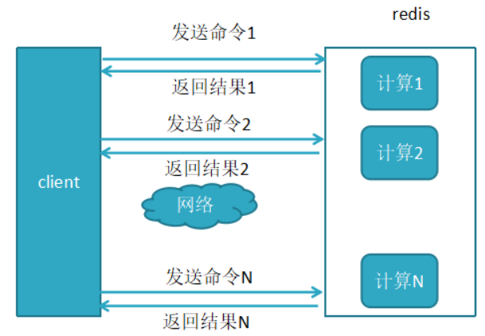
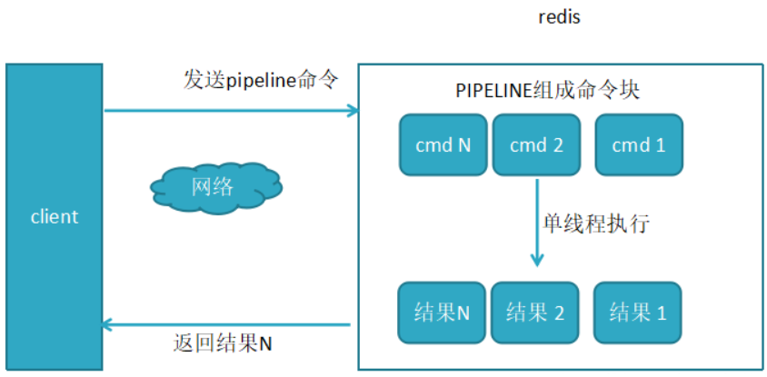

# 1.pipeline原理

redis基本语法：https://www.cnblogs.com/xiaonq/p/7919111.html

redis四篇：https://www.cnblogs.com/xiaonq/category/1544586.html

### 1.1 redis发送数据原理

- Redis是建立在TCP协议基础上的CS架构，客户端client对redis server采取请求响应的方式交互。
- 一般来说客户端从提交请求到得到服务器相应，需要传送两个tcp报文。

- 设想这样的一个场景，你要批量的执行一系列redis命令，例如执行100次get key，这时你要向redis请求100次+获取响应100次。如果能一次性将100个请求提交给redis server，执行完成之后批量的获取相应，只需要向redis请求1次，然后批量执行完命令，一次性结果，性能是不是会好很多呢？

### 1.2 未使用pipeline执行N条命令

 </img>

### 1.3 使用了pipeline执行N条命令

 </img>


# 2.pipeline性能代码展示

```python
In [1]: from django_redis import get_redis_connection       # 导入get_redis_connection模块
In [2]: redis_client = get_redis_connection('default')      # 连接redis 0号库
    
'''方法1：使用普通方法执行'''
In [3]: for i in range(99999):
   ...:     redis_client.set(i,i)

'''方法2：使用pipeline执行'''
In [4]: p1 = redis_client.pipeline()           # 实例化一个pipeline对象             
In [5]: for i in range(99999):
   ...:     p1.set(i,i)                        # 把要执行的命令打包到pipeline
In [6]: p1.execute()
```

