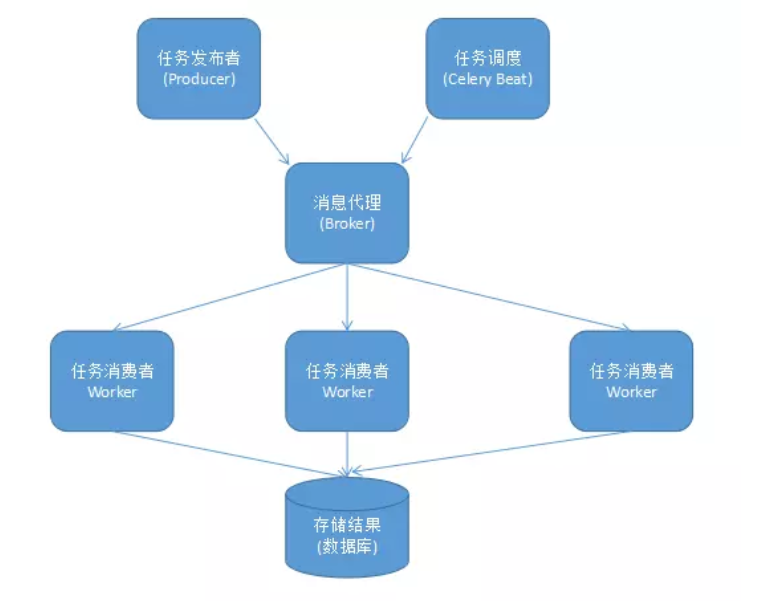
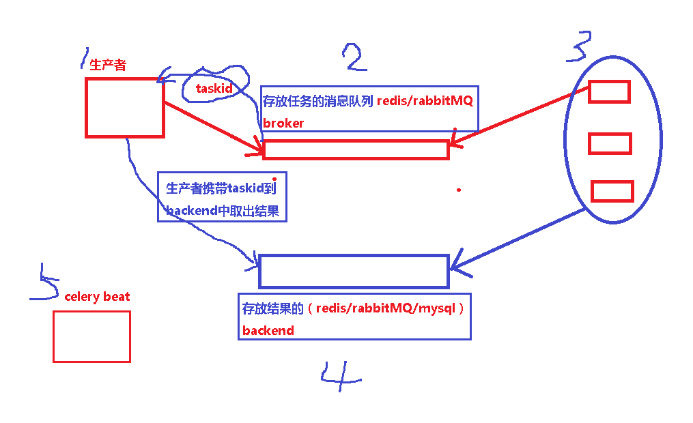
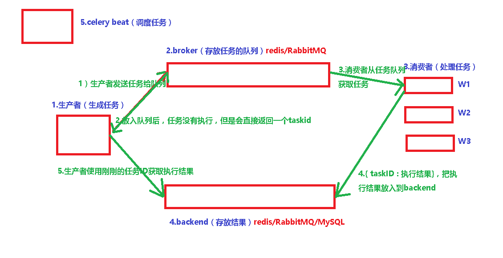

# 1.Celery介绍

https://www.cnblogs.com/xiaonq/p/11166235.html#i1

### 1.1 celery应用举例

- Celery 是一个 基于python开发的`分布式异步消息任务队列`，通过它可以轻松的实现任务的异步处理，如果你的业务场景中需要用到异步任务，就可以考虑使用celery

- 你想对100台机器执行一条批量命令，可能会花很长时间 ，但你不想让你的程序等着结果返回，而是给你返回 一个任务ID,你过一段时间只需要拿着这个任务id就可以拿到任务执行结果， 在任务执行ing进行时，你可以继续做其它的事情
- Celery 在执行任务时需要通过一个消息中间件来接收和发送任务消息，以及存储任务结果， 一般使用rabbitMQ or Redis

### 1.2 Celery有以下优点

- 简单：一单熟悉了celery的工作流程后，配置和使用还是比较简单的
- 高可用：当任务执行失败或执行过程中发生连接中断，celery 会自动尝试重新执行任务
- 快速：一个单进程的celery每分钟可处理上百万个任务
- 灵活： 几乎celery的各个组件都可以被扩展及自定制

### 1.3 Celery 特性

- 方便查看定时任务的执行情况, 如 是否成功, 当前状态, 执行任务花费的时间等.

- 可选 多进程, Eventlet 和 Gevent 三种模型并发执行.

- `Celery 是语言无关的.它提供了python 等常见语言的接口支持.`

# 2.celery 组件

https://www.cnblogs.com/xiaonq/p/11166235.html#i2

### 2.1 Celery 扮演生产者和消费者的角色

- **Celery Beat :** 任务调度器. Beat 进程会读取配置文件的内容, 周期性的将配置中到期需要执行的任务发送给任务队列.

- **Celery Worker :** 执行任务的消费者, 通常会在多台服务器运行多个消费者, 提高运行效率.

- **Broker :** 消息代理, 队列本身. 也称为消息中间件. 接受任务生产者发送过来的任务消息, 存进队列再按序分发给任务消费方(通常是消息队列或者数据库).

- **Producer :** 任务生产者. 调用 Celery API , 函数或者装饰器, 而产生任务并交给任务队列处理的都是任务生产者.

- **Result Backend :** 任务处理完成之后保存状态信息和结果, 以供查询.

### 2.2 celery架构图（`生产者消费者模型`）

 </img>

 </img>

 </img>

### 2.3 产生任务的方式 

- 发布者发布任务(WEB 应用)

- 任务调度按期发布任务(定时任务)

### 2.4 celery 依赖三个库: 这三个库, 都由 Celery 的开发者开发和维护.

- `billiard :` 基于 Python2.7 的 multisuprocessing 而改进的库, 主要用来提高性能和稳定性.
- `librabbitmp : `C 语言实现的 Python 客户端
- `kombu :` Celery 自带的用来收发消息的库, 提供了符合 Python 语言习惯的, 使用 AMQP 协议的高级借口.