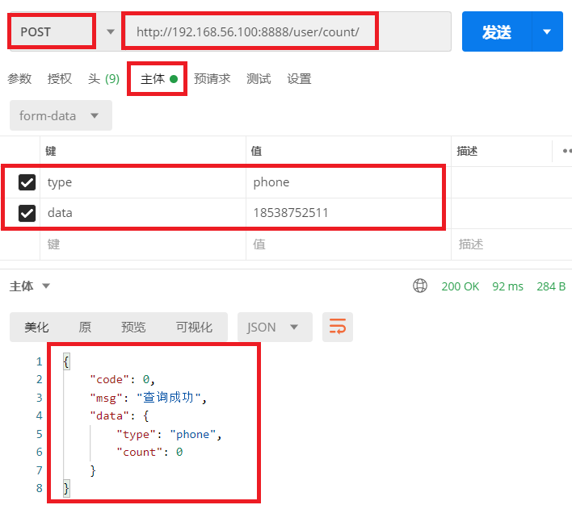

# 1.django添加检查用户名和手机号数量接口

### 1.1 在`user/urls.py`中添加

```python
urlpatterns = [
    path('count/', views.RegCountView.as_view()),  # 查询用户名手机号使用量的视图,  /user/count/
]
```

### 1.2 在`user/views.py`中添加视图函数

```python
# 查询用户数量接口
class RegCountView(APIView):
    # 注册时需要验证的用户名和手机号是否使用

    # 自定义权限类
    permission_classes = (AllowAny,)

    def post(self, request):
        # 接收参数:  验证的内容type: username/phone,  data: '用户名' 或者 '手机号',
        datatype = request.data.get('type')
        data = request.data.get('data')
        if not all([data, datatype]):
            return Response({'code': 999, 'msg': '参数不完整'})
        if datatype == 'username':
            count = User.objects.filter(username=data).count()
        if datatype == 'phone':
            count = User.objects.filter(phone=data).count()

        return Response({'code': 0, 'msg': '查询成功', 'data': {'type': datatype, 'count': count}})
```

# 2.测试接口

- 测试接口URL

```javascript
http://192.168.56.100:8888/user/count/
```

- 演示结果

 </img>


