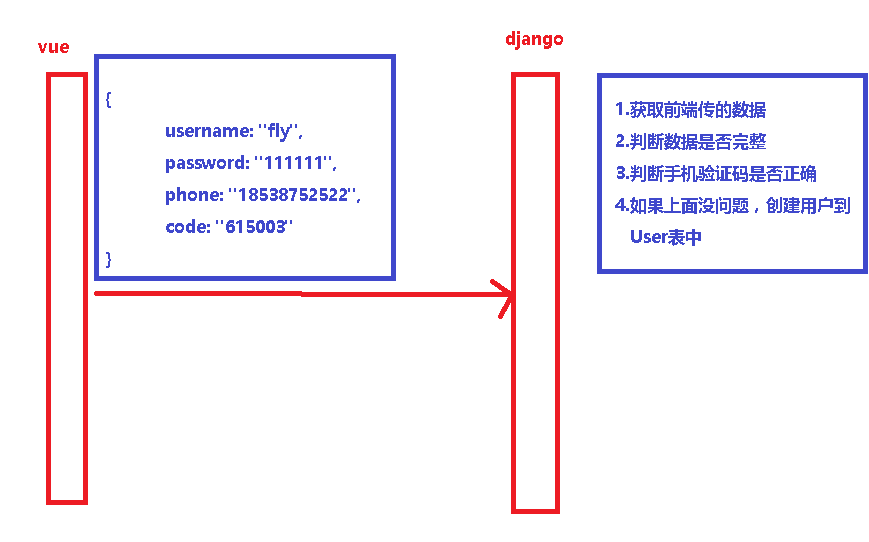

# 1.完善注册接口

 </img>

### 1.1 修改`user/views.py`中完善视图函数

```python
# 注册接口
class RegisterView(APIView):
    """
    用户注册, 权限是: 匿名用户可访问
    """
    # 自定义权限类
    permission_classes = (AllowAny,)

    def post(self, request):
        """
        接收用户名,密码,手机号和验证码, 前端校验两遍一致性, 注册成功后返回成功, 然后用户自行登录获取token
        1. 用户名
        2. 密码
        3. 手机号
        4. 短信验证码
        :param request:
        :return:  {'code':0,'msg':'注册成功'}
        code: "260361"
        password: "123123"
        phone: "13303479527"
        username: "liangxuepeng"
        """
        # 1.获取参数：{username: "fly", password: "111111", phone: "18538752522", code: "615003"}
        username = request.data.get('username')
        phone = request.data.get('phone')
        code = request.data.get('code')
        passwrod = request.data.get('password')

        # 2.检查参数是否完整
        if all([username, passwrod, phone, code]):
            pass
        else:
            return Response({'code': 999, 'msg': '参数不全'})

        # 3.验证手机验证码
        redis_client = get_redis_connection('verify_code')
        code_redis = redis_client.get(phone)
        if code_redis:
            code_redis = code_redis.decode()
        if not code == code_redis:
            return Response({'code': 999, 'msg': '手机验证码错误'})

        # 4.创建用户
        user = User(username=username, phone=phone)
        user.set_password(passwrod)
        user.save()

        return Response({'code': 0, 'msg': '注册成功','data':{}})
```


