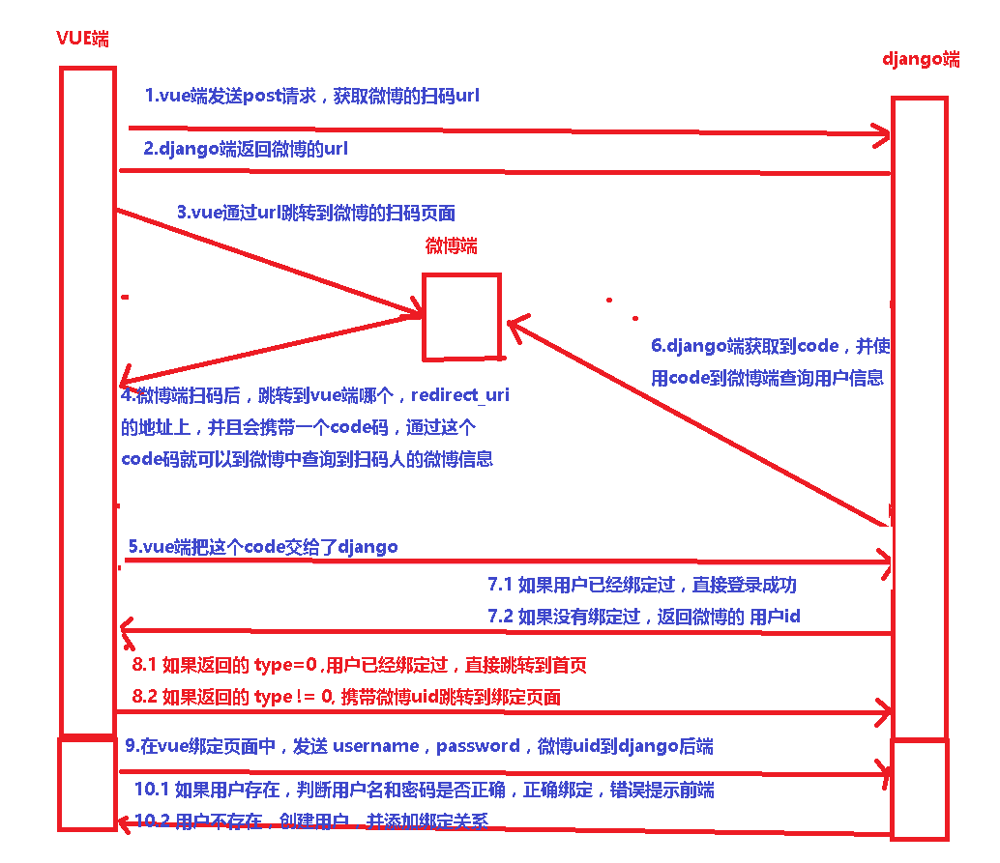

# 1.微博三方登录流程

 </img>

```
https://api.weibo.com/oauth2/authorize?
client_id=4122644977
&response_type=code
&state=study&
forcelogin=true&
redirect_uri=https%3A%2F%2Fstudy.163.com%2Fsns%2Fweibo%2FoAuthCallback.htm%3FoauthType%3Dlogin%26returnUrl%3DaHR0cHM6Ly9zdHVkeS4xNjMuY29tL3Byb3ZpZGVyLzQwMDAwMDAwMDQ3ODAxMi9pbmRleC5odG0%2FZnJvbT1zdHVkeQ%3D%3D%26nrsstcw%3Dfalse%26nc%3Dtrue###
https://study.163.com/provider/400000000478012/index.htm?from=study
```

### 1.1 前端获取认证code

- 1.在Vue页面加载时`动态发送请求获取微博授权url`
- 2.django收到请求的url后，通过微博`应用ID(client_id)和回调地址(redirect_uri)`动态`生成授权url返回给Vue`

- 3.当用户点击上面的url进行扫码，授权成功会`跳转我们的回调界面并附加code参数`

- 4.Vue获取到微博返回的code后，会   `将code发送给django后端` (上面的redirect_uri)

### 1.2 获取微博access_token

- `后端获取code后，结合client_id、client_secret、redirect_uri参数进行传递,获取微博access_token`

### 1.3 获取微博用户基本信息并保存到数据库

- 使用获得的access_token调用获取用户基本信息的接口，`获取用户第三方平台的基本信息`
- 用户基本信息  `保存到数据库，然后关联本地用户`，然后将用户信息返回给前端

### 1.4 生成token给Vue

- django后端借助微博认证成功后，可以`使用JWT生成token`，返回给Vue
- `Vue将token存储到localStorage中`，以便用户访问其他页面进行身份验证


# 2.第三方登录与本地登录的关联（三种情况）

### 2.1 情况1: 本地未登录，第一次登录第三方

此时相当于注册，直接把第三方信息拉取来并注册成本地用户就可以了，并建立本地用户与第三方用户（openid）的绑定关系

### 2.2 情况2：本地未登录，再次登录第三方

此时用户已注册，获取到openid后直接找出对应的本地用户即可

### 2.3 情况3：本地登录，并绑定第三方

这个只要将获取到的openid绑定到本地用户就可以了

# 3.oauth认证原理

- OAuth是一个开放标准，允许用户让第三方应用访问该用户在某一网站上存储的私密的资源，而无需将用户名和密码提供给第三方应用。

- OAuth允许用户提供一个令牌，而不是用户名和密码来访问他们存放在特定服务提供者的数据。

- 这个code如果能出三方换取到数据就证明这个用户是三方真实的用户

# 4.为什么使用三方登录

- 服务方希望用户注册, 而用户懒得填注册时的各种信息(主要是为了保证用户的唯一性,各种用户名已占用,密码格式限制).

- 而像微信, QQ, 微博等几乎每个人都会安装的应用中用户肯定会在其中某一个应用中已经注册过，证明该用户在已经注册的应用中的唯一性.

- 第三方登录的实质就是在授权时获得第三方应用提供的代表了用户在第三方应用中的唯一性的openid.并将openid储存在第三方服务控制的本地储存.


