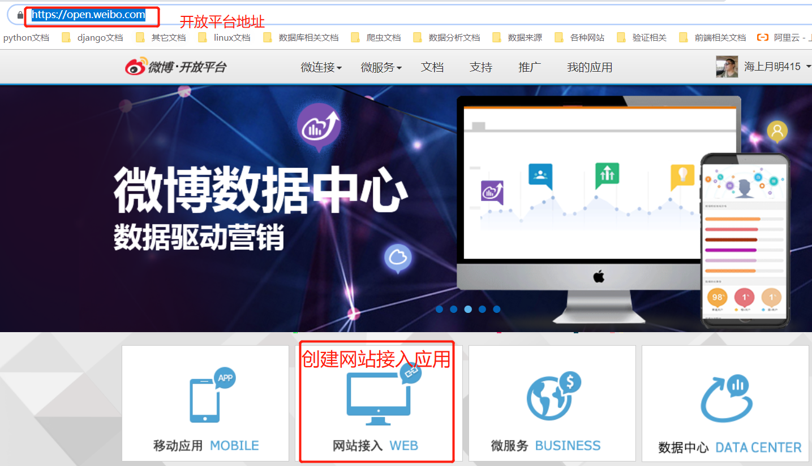
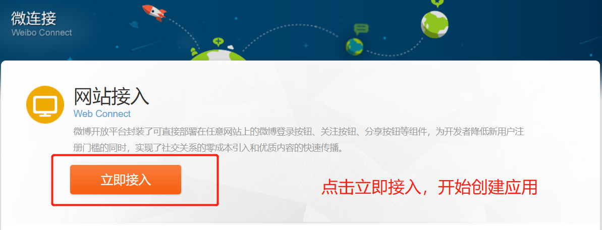
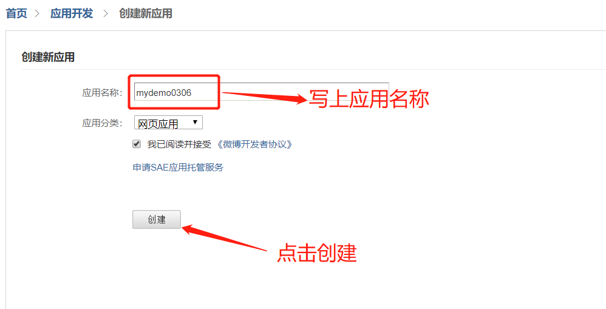
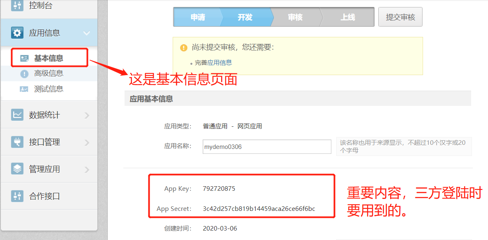
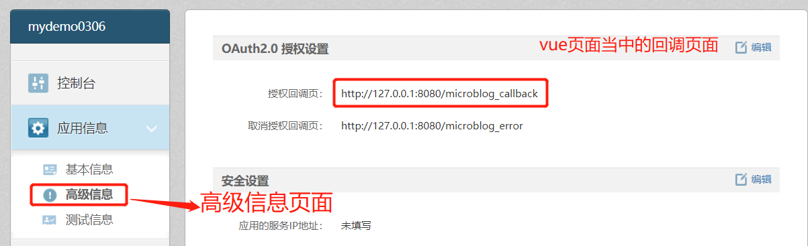
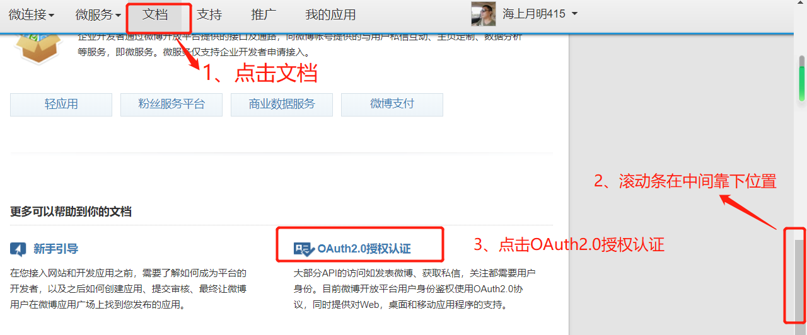
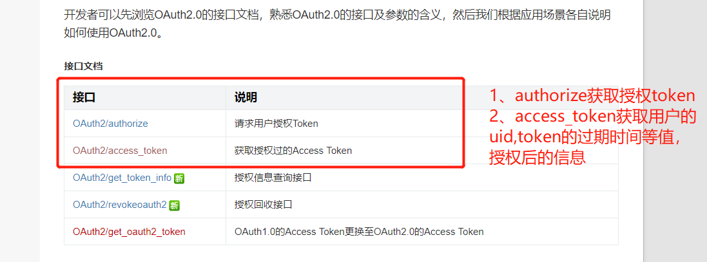

> 新浪微博开放平台：https://open.weibo.com/

# 1.注册账号

- ##### 注册新浪微博账号

- **进入首页。创建网站接入的应用**: https://open.weibo.com/

 </img>

- ##### 选择立即接入，进入到创建应用页面

 </img>

- ##### 创建应用

 </img>

- ##### 基本信息页面: https://open.weibo.com/apps/3516473472/info/advanced

 </img>

- ##### 高级信息页面

 </img>

# 2.接口文档

- ##### 查看接口文档

```javascript
https://open.weibo.com/wiki/授权机制说明
```

 </img>

 </img>

- OAuth2.0授权认证

| 接口                                                         | 说明                          |
| ------------------------------------------------------------ | ----------------------------- |
| [OAuth2/authorize](https://open.weibo.com/wiki/Oauth2/authorize) | 请求用户授权Token             |
| [OAuth2/access_token](https://open.weibo.com/wiki/Oauth2/access_token) | 获取授权过的Access Token, UID |
