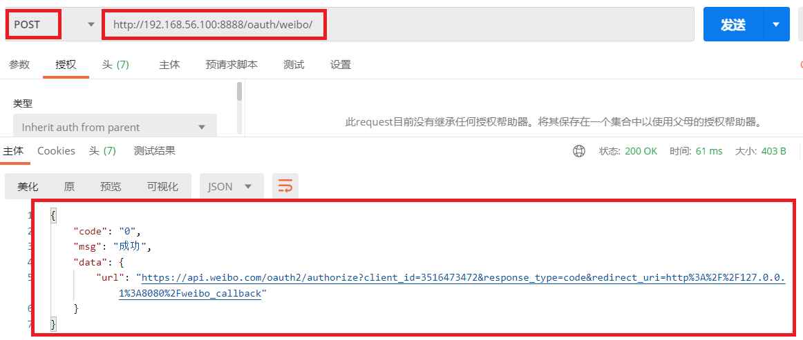
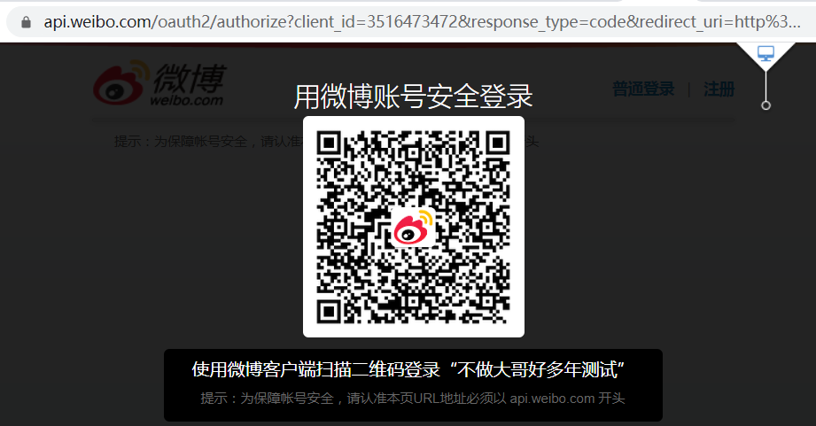

# 1.创建`apps/oauth`模块进行oauth认证

```python
'''2.1 在apps文件夹下新建应用： oauth'''
cd syl/apps
python ../manage.py startapp oauth   # 切换到apps文件夹下执行创建命令

'''2.2 添加子路由： oauth/urls.py'''
from django.urls import path
from . import views
urlpatterns = [

]

'''2.3 在syl/settings.py中添加应用'''
INSTALLED_APPS = [
    'oauth.apps.OauthConfig',
]

'''2.4 在syl/urls.py主路由中添加'''
urlpatterns = [
    path('oauth/', include('oauth.urls')),
]
```


# 2.生成微博授权URL接口

### 1.1 添加子路由： `oauth/urls.py`

```python
urlpatterns = [
    path('weibo/', views.WeiboUrl.as_view()),  # /oauth/weibo/ 返回微博登录地址
]
```

### 1.2 `syl/settings.py`中配微博地址

```python
WEIBO_CLIENT_ID = '3516473472'
WEIBO_REDIRECT_URL = 'http://127.0.0.1:8888/oauth/callback/'
```

### 1.3 视图函数: `oauth/views.py`

```python
from rest_framework.permissions import AllowAny
from rest_framework.response import Response
from rest_framework.views import APIView
from urllib.parse import urlencode

# 生成前端跳转到微博扫码页面的url
class WeiboUrl(APIView):
    '''
        生成微博的登陆页面路由地址
        https://api.weibo.com/oauth2/authorize?       # 微博oauth认证地址
        client_id=4152203033&                         # 注册开发者id
        response_type=code&
        redirect_uri=http://127.0.0.1:8888/oauth/callback/     # 获取code后将code回调给后端地址
    '''
    # 自定义权限类
    permission_classes = (AllowAny,)

    def post(self, request):
        url = 'https://api.weibo.com/oauth2/authorize?'              # 微博授权的url地址
        data = {
            'client_id': '3516473472',                               # settings.WEIBO_CLIENT_ID
            'response_type': 'code',                                 
            'redirect_uri': 'http://127.0.0.1:8888/oauth/callback/',  # VUE的回调，微博后台授权的回调地址
        }
        weibo_url = url + urlencode(data)
        # https://api.weibo.com/oauth2/authorize?client_id=4152203033&response_type=code&redirect_uri=http://127.0.0.1:8000/api/weibo_back/
        # return Response({'weibo_url': weibo_url})
        return Response({'code': '0', 'msg': '成功', 'data': {'url': weibo_url}})
```

```
//请求
https://api.weibo.com/oauth2/authorize?client_id=3516473472&redirect_uri=http://127.0.0.1:8888/oauth/callback/&response_type=code
```


# 3.测试生成微博售前URL接口

- 测试接口获取新浪微博地址

  - ```
    http://192.168.56.100:8888/oauth/weibo/
    ```

 </img>

- 在浏览器访问返回地址即可回到新浪扫码界面

```javascript
https://api.weibo.com/oauth2/authorize?client_id=3516473472&response_type=code&redirect_uri=http%3A%2F%2F127.0.0.1%3A8080%2Fweibo_callback
```

 </img>


