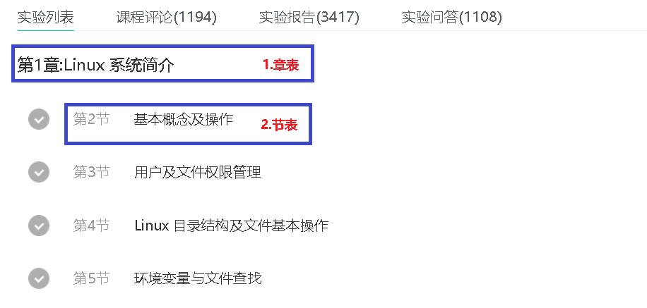

# 1.课程主页面3张表

 </img>

```python
from django.db import models
from utils.MyBaseModel import Base


class CourseType(Base):
    title = models.CharField('课程类别', max_length=16)
    sequence = models.IntegerField('展示顺序', default=10)

    class Meta:
        db_table = 'tb_coursetype'

    def __str__(self):
        return self.title


class CourseTag(Base):
    title = models.CharField('课程标签', max_length=16)
    sequence = models.IntegerField('展示顺序', default=10)

    class Meta:
        db_table = 'tb_coursetag'

    def __str__(self):
        return self.title


class Course(Base):
    STATUS = (
        ('0', '即将上线'),
        ('1', '已上线'),
        ('2', '已下线'),
    )

    title = models.CharField('课程名', max_length=24)
    desc = models.CharField('课程描述', max_length=256)
    img = models.ImageField('课程logo', upload_to='course', null=True)
    course_type = models.ForeignKey(CourseType, verbose_name='课程类型', on_delete=models.SET_NULL, default=None, null=True)
    course_tag = models.ManyToManyField(CourseTag, verbose_name='课程标签')
    status = models.CharField('课程状态', choices=STATUS, max_length=8, default='1')
    attention = models.IntegerField('关注人数', default=0)
    learner = models.IntegerField('学习人数', default=0)

    class Meta:
        db_table = 'tb_course'

    def __str__(self):
        return self.title
```

# 2.课程章节表2张表

 </img>

```python
class Chapters(Base):
    title = models.CharField('章标题', max_length=24)
    serial_num = models.IntegerField('章序号')
    course = models.ForeignKey(Course, related_name='chapters', on_delete=models.SET_NULL, null=True)

    class Meta:
        db_table = 'tb_chapters'

    def __str__(self):
        return self.title


class Sections(Base):
    title = models.CharField('节标题', max_length=24)
    serial_num = models.IntegerField('节序号')
    chapters = models.ForeignKey(Chapters, related_name='sections', on_delete=models.SET_NULL, null=True)
    learn_time = models.IntegerField('学习小时', default=1)
    video = models.FileField("上传视频", upload_to="videos/%Y%m%d/", blank=True, max_length=1024)
    seq_num = models.IntegerField("序号", default=1)

    class Meta:
        db_table = 'tb_sections'

    def __str__(self):
        return self.title
```

# 3.`course/admin.py`注册后台管理

```python
from django.contrib import admin
from . import models

admin.site.register(models.CourseType)
admin.site.register(models.CourseTag)
admin.site.register(models.Course)
admin.site.register(models.Sections)
admin.site.register(models.Chapters)
```

# 4.迁移表

```python
python manage.py makemigrations
python manage.py migrate
```

