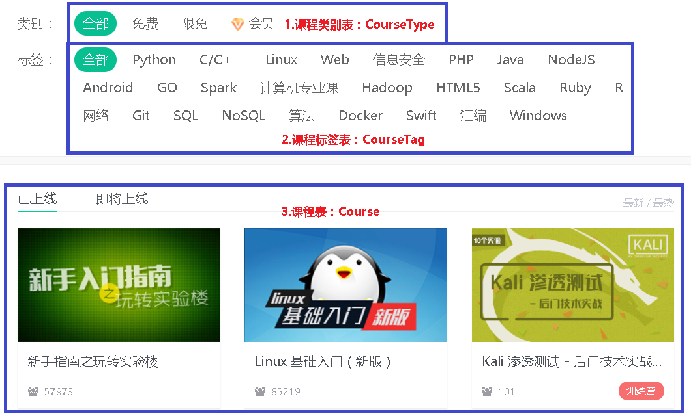
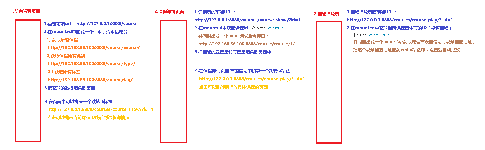
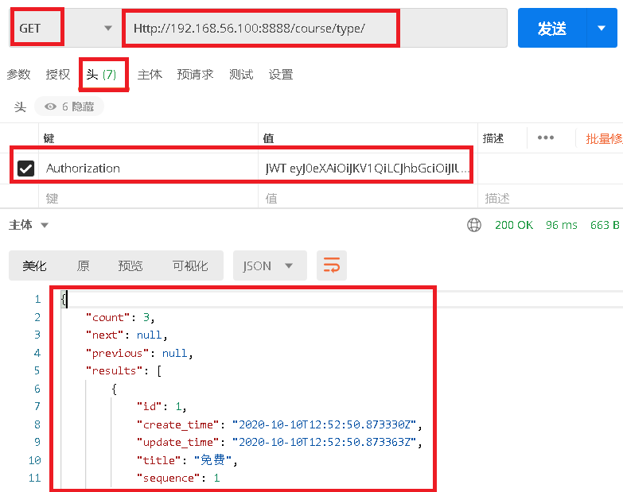
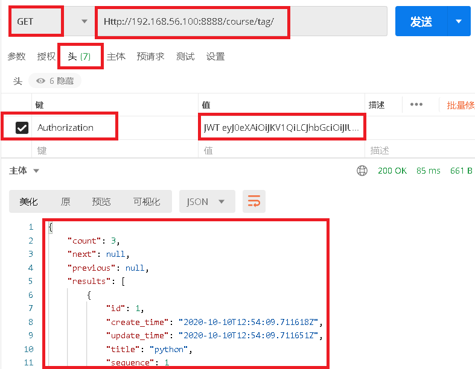
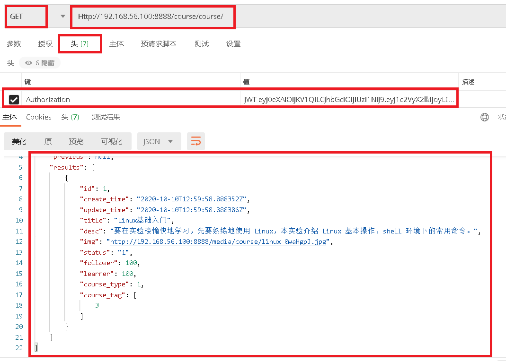

# 0.课程主页面接口对应页面效果

 </img>


 </img>

# 1.课程类别接口开发

### 1.1 `course/urls.py`添加路由

```python
from django.urls import path, re_path
from rest_framework.routers import DefaultRouter    # 导入DRF得DefaultRouter

from . import views

router = DefaultRouter()  # 有根路由
router.register(r'type', views.CourseTypeViewSet)   # 写路由

urlpatterns = [

]

urlpatterns += router.urls                          # 把两个路由列表相加
```

### 1.2 `course/serializers.py`写序列化器

```
from rest_framework import serializers
from course.models import CourseType


class CourseTypeSerializer(serializers.ModelSerializer):
    class Meta:
        model = CourseType
        fields = '__all__'
```

### 1.3`course/views.py`添加视图函数

```
from rest_framework import viewsets
from rest_framework.pagination import PageNumberPagination

from course.models import *
from course.serializers import *


class PageNum(PageNumberPagination):
    page_size_query_param = 'page_size'


class CourseTypeViewSet(viewsets.ModelViewSet):
    queryset = CourseType.objects.all()
    serializer_class = CourseTypeSerializer
```

### 1.4 `course/admin.py`注册后台管理

```
from django.contrib import admin
from . import models

admin.site.register(models.CourseType)
```

### 1.5 测试接口

```javascript
Http://192.168.56.100:8888/course/type/
```

 </img>

# 2.标签接口开发

### 2.1 `course/urls.py`添加路由

```python
router.register(r'tag', views.CourseTagViewSet)
```

### 2.2 `course/serializers.py`写序列化器

```
from rest_framework import serializers
from course.models import CourseTag

class CourseTagSerializer(serializers.ModelSerializer):
    class Meta:
        model = CourseTag
        fields = '__all__'
```

### 2.3`course/views.py`添加视图函数

```
from course.models import *
from course.serializers import *

class CourseTagViewSet(viewsets.ModelViewSet):
    queryset = CourseTag.objects.all()
    serializer_class = CourseTagSerializer
```

### 1.4 `course/admin.py`注册后台管理

```
from django.contrib import admin
from . import models

admin.site.register(models.CourseTag)
```

### 1.5 测试接口

```javascript
Http://192.168.56.100:8888/course/tag/
```

 </img>

# 3.课程接口开发

### 3.1 `course/urls.py`添加路由

```python
router.register(r'course', views.CourseViewSet)
```

### 3.2 `course/serializers.py`写序列化器

```python
# -*- coding: utf-8 -*-
from rest_framework import serializers
from course.models import *


class CourseSerializer(serializers.ModelSerializer):
    class Meta:
        model = Course
        fields = '__all__'  # 所有字段


class SectionsSerializer(serializers.ModelSerializer):
    class Meta:
        model = Sections
        fields = '__all__'


class ChaptersSerializer(serializers.ModelSerializer):
    sections = SectionsSerializer(many=True)

    class Meta:
        model = Chapters
        fields = '__all__'


class CourseDeepSerializer(CourseSerializer):
    # 字段名名, 必须是模型可以 . 引用到的变量
    # Course().   "chapters"  才能作为字段名,  如果是集合, 需要加many=True,
    chapters = ChaptersSerializer(many=True)
```

### 3.3`course/views.py`添加视图函数

```python
from django.shortcuts import render
from django_filters.rest_framework import DjangoFilterBackend
from rest_framework import viewsets
from rest_framework.filters import OrderingFilter
from rest_framework.pagination import PageNumberPagination

from course.models import *
from course.serializers import *


class CourseViewSet(viewsets.ModelViewSet):
    queryset = Course.objects.all()
    serializer_class = CourseDeepSerializer

    # 指定过滤方法类, 排序方法类, 一个或多个
    filter_backends = (DjangoFilterBackend, OrderingFilter)  # 同时支持过滤和排序

    # 指定排序字段, 不设置, 排序功能不起效
    ordering_fields = ('attention', 'learner', 'create_time')

    # 指定过滤字段, 不设置, 过滤功能不起效
    filter_fields = ('title', 'desc', 'status', 'course_type', 'course_tag')

    # 自定义分页器 覆盖全局配置
    pagination_class = PageNum

    def get_serializer_class(self):
        if self.action == 'list':
            return CourseSerializer
        else:
            return CourseDeepSerializer
```

### 3.4 `course/admin.py`注册后台管理

```
from django.contrib import admin
from . import models

admin.site.register(models.Course)
```

### 3.5 测试接口

```javascript
Http://192.168.56.100:8888/course/course/
```

 </img>

