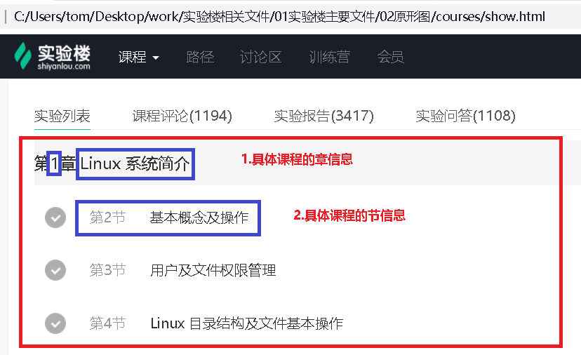
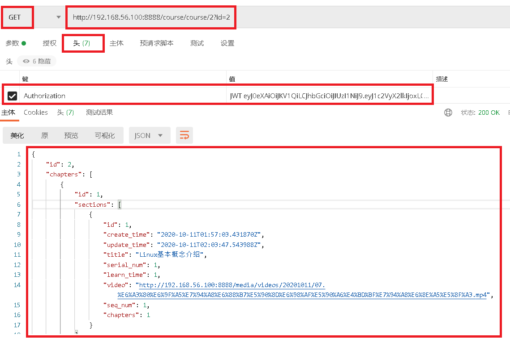

# 0.具体课程章节页面

 </img>

# 1.获取具体课程`章节`信息

### 1.1 路由地址

```javascript
http://192.168.56.100:8888/course/course/2/
```

### 1.2 测试结果

 </img>

- 返回结果展示

```python
{
    "id": 2,
    "chapters": [
        {
            "id": 1,
            "sections": [
                {
                    "id": 1,
                    "create_time": "2020-10-11T01:57:03.431870Z",
                    "update_time": "2020-10-11T02:03:47.543988Z",
                    "title": "Linux基本概念介绍",
                    "serial_num": 1,
                    "learn_time": 1,
                    "video": "http://192.168.56.100:8888/media/videos/20201011/07.%E6%A3%80%E6%9F%A5%E7%94%A8%E6%88%B7%E5%90%8D%E6%98%AF%E5%90%A6%E4%BD%BF%E7%94%A8%E6%8E%A5%E5%8F%A3.mp4",
                    "seq_num": 1,
                    "chapters": 1
                }
            ],
            "create_time": "2020-10-11T01:53:59.821333Z",
            "update_time": "2020-10-11T01:53:59.821395Z",
            "title": "Linux 系统简介",
            "serial_num": 1,
            "course": 2
        }
    ],
    "create_time": "2020-10-11T01:46:26.000141Z",
    "update_time": "2020-10-11T02:23:03.753819Z",
    "title": "Linux基础入门",
    "desc": "要在实验楼愉快地学习，先要熟练地使用 Linux，本实验介绍 Linux 基本操作，shell 环境下的常用命令。",
    "img": "http://192.168.56.100:8888/media/course/linux.jpg",
    "status": "1",
    "attention": 10,
    "learner": 100,
    "course_type": 2,
    "course_tag": [
        4
    ]
}
```