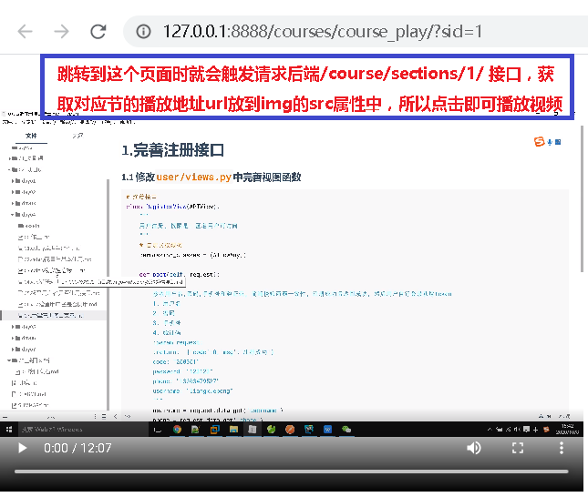
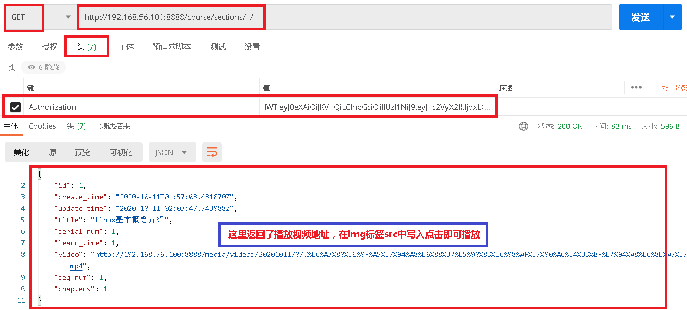

# 0.播放页面

 </img>

# 1.视频播放页面接口开发

### 1.1 `course/urls.py`添加路由

```python
router.register(r'sections', views.SectionsViewSet)
```

### 1.2 `course/serializers.py`写序列化器

```python
from rest_framework import serializers
from course.models import Sections

class SectionsSerializer(serializers.ModelSerializer):
    class Meta:
        model = Sections
        fields = '__all__'
```

### 1.3`course/views.py`添加视图函数

```
from rest_framework import viewsets
from course.models import *
from course.serializers import *

class SectionsViewSet(viewsets.ModelViewSet):
    queryset = Sections.objects.all()
    serializer_class = SectionsSerializer
```

### 1.4 `course/admin.py`注册后台管理

```
from django.contrib import admin
from . import models

admin.site.register(models.Sections)
```

### 1.5 测试接口

- 测试接口

```javascript
Http://192.168.56.100:8888/course/sections/
```

 </img>

- 返回事例

```python
{
    "id": 1,
    "create_time": "2020-10-11T01:57:03.431870Z",
    "update_time": "2020-10-11T02:03:47.543988Z",
    "title": "Linux基本概念介绍",
    "serial_num": 1,
    "learn_time": 1,
    "video": "http://192.168.56.100:8888/media/videos/20201011/07.检查用户名是否使用接口.mp4",
    "seq_num": 1,
    "chapters": 1
}
```


