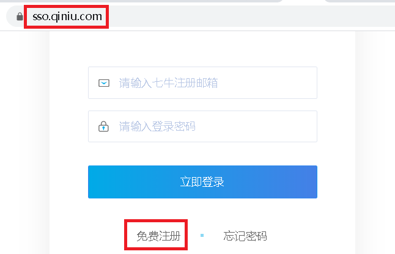
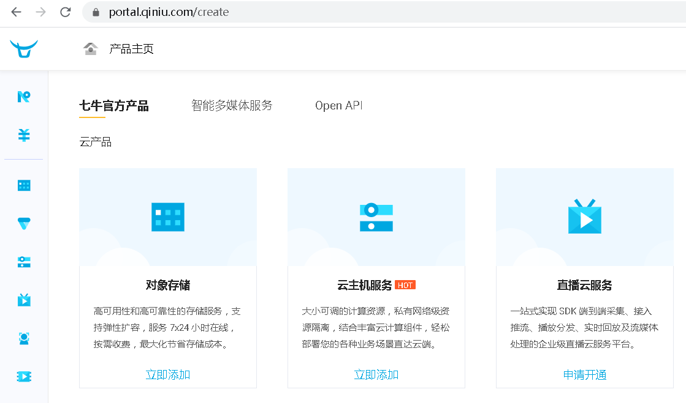
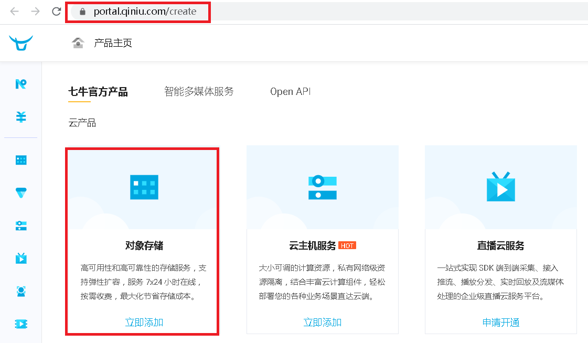
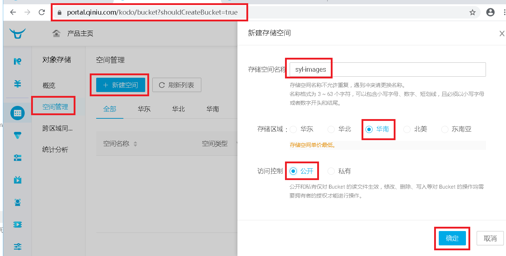
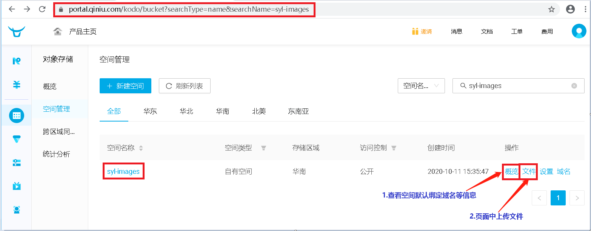
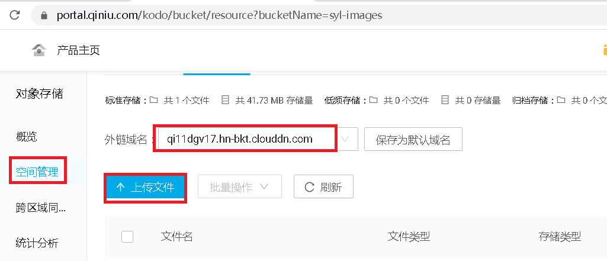
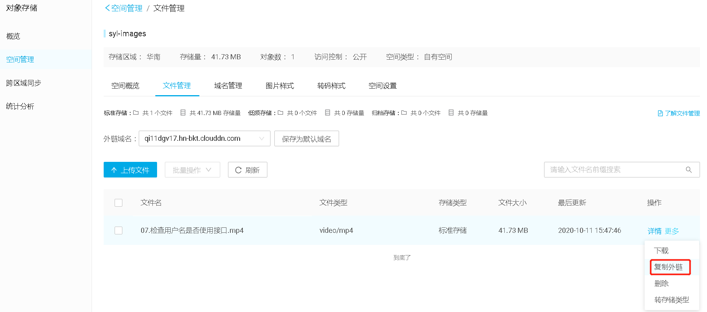

# 1.注册七牛云账号

### 1.1 注册七牛云

```javascript
https://sso.qiniu.com/
```

 </img>

### 1.2 注册完成登录即可跳转到七牛云管理界面

 </img>

# 2.七牛云快速入门

```javascript
参考官方地址：https://developer.qiniu.com/kodo/manual/1233/console-quickstart
```

## 2.1 创建空间

- 1.登录 [七牛开发者平台](https://portal.qiniu.com/signin?ref=developer.qiniu.com)
- 2.存储空间 [管理界面](https://portal.qiniu.com/bucket)

 </img>

- 3.[新建存储空间](https://portal.qiniu.com/kodo/bucket?shouldCreateBucket=true)

 </img>

- 4.创建成功后页面

 </img>

## 2.2 上传文件

- 1.空间管理---》文件

 </img>

- 2.上传文件

 </img>

- 3.上传后就可以看到这个文件，复制外链 即可在浏览器中打开

```
http://qi11dgv17.hn-bkt.clouddn.com/07.检查用户名是否使用接口.mp4
```


 </img>

