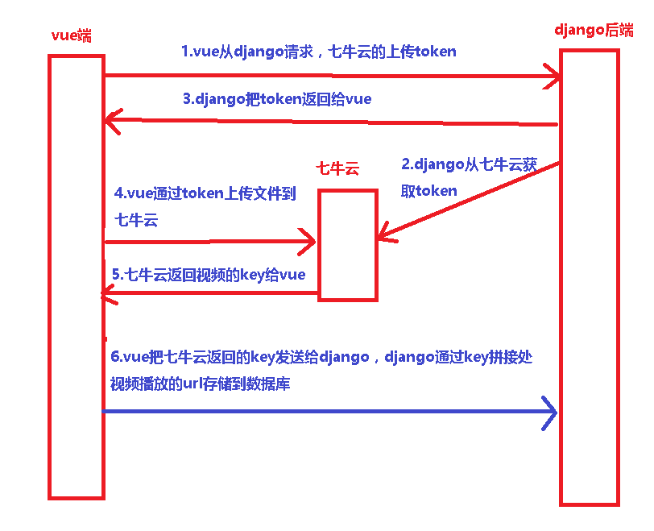

# 1.七牛云存储介绍

### 1.1 七牛云存储使用参考文档

```python
# 七牛云管理后台地址
https://portal.qiniu.com/kodo/bucket
# 七牛云使用
https://developer.qiniu.com/kodo/manual/1233/console-quickstart

# pythonSDK
https://developer.qiniu.com/kodo/sdk/1242/python
# Node.js SDK V6
https://developer.qiniu.com/kodo/sdk/3828/node-js-v6
# JavaScript SDK历史文档1.x
https://developer.qiniu.com/kodo/sdk/4244/the-javascript-sdk-historical-documents-1-x
```

### 1.2 七牛云介绍

- 以前看见过`FastDfs+FFmpeg`进行视频存储等操作，但是这种方式稳定性会低一些，而且成本也没有降低。
-  市面上关于云存储的第三方服务比比皆是，最著名的无疑就是七牛云存储，本次我们将演示用django+Vue+七牛云进行视频存储与播放。

### 1.3 七牛云上传逻辑

- 1.在做七牛云的文件上传时，很多人有一个误区，就是以为是前端先上传到后台服务器，然后后台服务器再将文件上传到七牛云。
- 2.这个逻辑本身没有问题，但是会遇到一个问题，如果文件大会导致上传很慢
- 3.正确逻辑应该是前端直接上传七牛，而后台只承担生成token和存储七牛云返回的hash的任务。

 </img>


