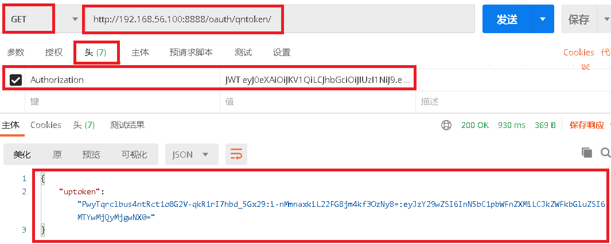

# 1.生成七牛云上传token

### 1.1 参考七牛云SDK

```python
# pythonSDK
https://developer.qiniu.com/kodo/sdk/1242/python
```

### 1.2 在`oauth/urls.py`中添加生成七牛云token的路由

```python
urlpatterns = [
    path('qntoken/', views.QNYTokenView.as_view()),  # /oauth/qntoken/
]
```

### 1.3 在 `oauth/views.py`中添加视图函数

```python
'''获取上传token'''
class QNYTokenView(APIView):
    def get(self,request):
        from qiniu import Auth, put_file, etag
        import qiniu.config
        # 需要填写你的 Access Key 和 Secret Key
        access_key = "PwyTqrclbus4ntRct1o8G2V-qkR1rI7hbd_5Gx29"
        secret_key = "IuvSm1vJh2YUiYWFwV-kGmHAJF9R9iGuH2Q1ifea"
        # 构建鉴权对象
        q = Auth(access_key, secret_key)
        # 要上传的空间
        bucket_name = 'syl-images'
        # 生成上传 Token，可以指定过期时间等
        token = q.upload_token(bucket_name, expires=3600)
        return Response({'code': 0, 'msg': '获取', 'data': {'uptoken': token}})
```

### 1.4 测试获取七牛云token接口

```javascript
http://192.168.56.100:8888/oauth/qntoken/
```

 </img>

```json
{
    "code": 0,
    "msg": "获取",
    "data": {
        "uptoken": "PwyTqrclbus4ntRct1o8G2V-qkR1rI7hbd_5Gx29:V9IaCM4--gFiyXhPdYTsWSIBLNA=:eyJzY29wZSI6InN5bC1pbWFnZXMiLCJkZWFkbGluZSI6MTYwMjY0MzY0OX0="
    }
}
```

