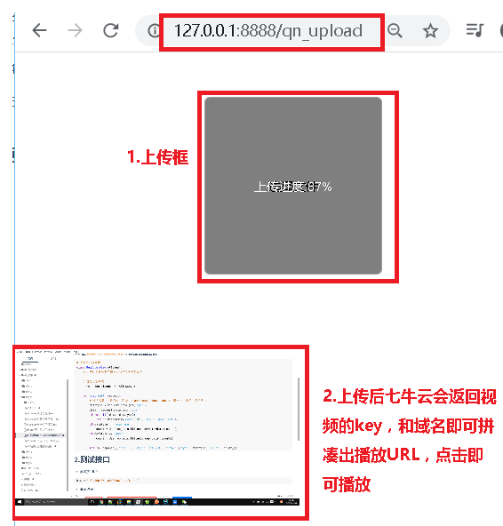

# 1.七牛云上传前台页面

https://www.cnblogs.com/xiaonq/p/12290151.html

### 1.1 安装相关包

```
npm install  --save  jquery@1.12.1     # 安装jquery
```

### 1.2` index.html `引入qiniu.min.js

```html
<!DOCTYPE html>
<html>
  <head>
    <meta charset="utf-8">
    <meta name="viewport" content="width=device-width,initial-scale=1.0">
    <title>qiniu_vue</title>
    <script src="./static/qiniu.min.js"></script>
  </head>
  <body>
    <div id="app"></div>
    <!-- built files will be auto injected -->
  </body>
</html>
```

### 1.3 新建`components\QnUpload.vue`上传视频页面

```javascript
<template>
  <div>
    <!-- 1.上传时的点击框  -->
    <div id="container">
      <div>
        <div id="uploadImage">选择文件{{uptoken}}</div>
        <div class="upload-progress"></div>
      </div>
    </div>

    <!-- 2.测试上传成功后播放功能  -->
    <div v-show="true">
      <video id="video"  width="320" height="240" :src="qn_url" controls="controls" autoplay="autoplay" muted loop="loop" >
        您的浏览器不支持 video 标签。
      </video>
    </div>
  </div>
</template>

<script>
  import $ from 'jquery'
  import { qn_token_get } from './axios_api/api'

  export default {
    data() {
      return {
        uptoken: '',                                     // 从django后端获取的七牛云认证token
        qn_url: 'http://qi11dgv17.hn-bkt.clouddn.com/',  // 七牛云给的空间测试域名
      };
    },
    methods: {
      // 1.获取七牛云认证token
      getQiniuToken: function (callback){
        qn_token_get({ }).then(resp => {
          // debugger
          this.uptoken = resp.data.uptoken;
          callback()  // callback 出入的是回调函数 initQiniu() 用来初始化Qiniu.uploader()
        }).catch( err=>{
          console.log(err,'err')
        })
      },

      // 2.初始化七牛云对象
      initQiniu: function () {
        var ths = this   // 避免七牛云对象覆盖vue的this对象，在这里提前赋值
        var uploader = Qiniu.uploader({
          disable_statistics_report: false,                                   // 禁止自动发送上传统计信息到七牛，默认允许发送
          runtimes: 'html5,flash,html4',                                      // 上传模式，依次退化
          browse_button: 'uploadImage',                                       // 上传选择的点选按钮，必需
          container: 'container',                                             // 上传区域DOM ID，默认是browser_button的父元素
          max_file_size: '500mb',                                             // 最大文件体积限制
          flash_swf_url: 'Moxie.swf',                                         // 引入flash，相对路径
          dragdrop: false,                                                    // 关闭可拖曳上传
          chunk_size: '4mb',                                                  // 分块上传时，每块的体积
          multi_selection: !(moxie.core.utils.Env.OS.toLowerCase() === "ios"),
          uptoken: this.uptoken,     // 在初始化时，uptoken，uptoken_url，uptoken_func三个参数中必须有一个被设置,uptoken是上传凭证，由其他程序生成;uptoken_url是提供了获取上传凭证的地址，如果需要定制获取uptoken的过程则可以设置uptoken_func;其优先级为uptoken > uptoken_url > uptoken_func
          // uptoken_url: 'http://127.0.0.1:8000/uptoken',                                                 // 在初始化时，uptoken，uptoken_url，uptoken_func三个参数中必须有一个被设置,uptoken是上传凭证，由其他程序生成;uptoken_url是提供了获取上传凭证的地址，如果需要定制获取uptoken的过程则可以设置uptoken_func;其优先级为uptoken > uptoken_url > uptoken_func
          // uptoken:'q06bq54Ps5JLfZyP8Ax-qvByMBdu8AoIVJpMco2m:kyTiuN6GBUpfNt1nJIA7C8CCStY=:eyJzY29wZSI6IjEzMTIzMTIzMTIzIiwiZGVhZGxpbmUiOjE1NzY0MTM3MTB9',
          domain: 'redinnovation.s3-cn-north-1.qiniucs.com',               // bucket域名，下载资源时用到，必需
          get_new_uptoken: false,                                              // 设置上传文件的时候是否每次都重新获取新的uptoken
          auto_start: true,                                                   // 选择文件后自动上传，若关闭需要自己绑定事件触发上传
          max_retries: 3,                                                     // 上传失败最大重试次数
          save_key: true,
          resize: {                                                           // 想限制上传图片尺寸，直接用resize这个属性
            width: 300,
            height: 300
          },
          init: {
            'FilesAdded': function(up, files) {                             // 文件添加进队列后，处理相关的事情
              plupload.each(files, function(file) {
                console.log(file)
              });
            },
            'BeforeUpload': function(up, file) {                            // 每个文件上传前，处理相关的事情
              console.log("开始上传之前");
              $(".upload-progress").show();
            },
            'UploadProgress': function(up, file) {                          // 每个文件上传时，处理相关的事情
              console.log("上传中");
              $(".upload-progress").html("上传进度:"+file.percent + "%");
            },
            'FileUploaded': function(up, file, info) {                       // 每个文件上传成功后，处理相关的事情
              console.log("上传成功");
              console.log(info,4567890);
              $(".upload-progress").hide();
              var img = new Image();                                      //创建一个Image对象，实现图片的预下载
              var res = JSON.parse( info.response )
              // debugger
              console.log(ths.qn_url)
              ths.qn_url = ths.qn_url + res.key;
            },
            'Error': function(up, err, errTip) {
              console.log("上传出错")
            },
            'UploadComplete': function() {
              //队列文件处理完毕后，处理相关的事情
            }
          }
        });
      }
    },
    mounted(){
      this.getQiniuToken(() => {
        this.initQiniu()  // 将initQiniu()当做callback回调函数传入给getQiniuToken函数
      })
    }
  }
</script>

<style>
  #container{
    width:200px;
    height:200px;
    border:1px solid #9d9d9d;
    border-radius: 6px;
    margin:50px auto;
    position: relative;
    overflow: hidden;
  }
  .upload-progress{
    width:100%;
    height:100%;
    position: absolute;
    top:0;
    left:0;
    background: rgba(0,0,0,0.5);
    z-index: 5;
    color:#fff;
    line-height: 200px;
    text-align: center;
    display: none;
  }
  #uploadImage{
    width:100%;
    height:100%;
    position: absolute;
    top:0;
    left:0;
    z-index: 2;
    text-align: center;
    line-height: 200px;
    cursor: pointer;
  }
  #container img{
    width:100%;
    position: absolute;
    top:0;
    left:0;
    z-index: 1;
  }
</style>
```

### 1.4 `router\index.js` 引入路由

```javascript
import qn_upload from '@/components/QnUpload'
var routes = [
    { path: '/qn_upload/', name: 'qn_upload', component: qn_upload,},
]
```

### 1.5 `axios_api\api.js`中引入后端路由

```javascript
export const qn_token_get = p => axios_get("/oauth/qntoken/", p) // 获取七牛云token
```

# 2.测试页面结果

 </img>


