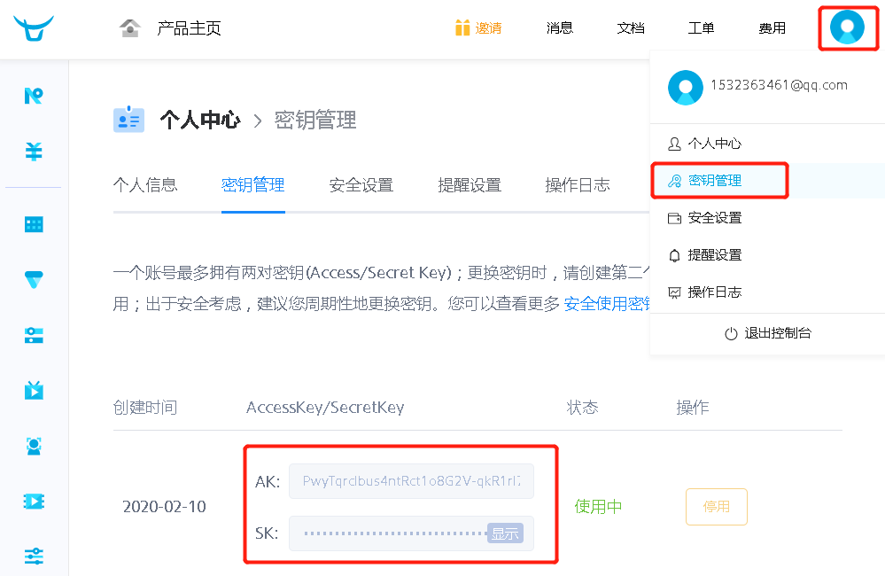

# 1.上传视频到七牛云django端实现

### 1.1 获取七牛云秘钥

```javascript
https://portal.qiniu.com/user/key
```

 </img>

### 1.2 在syl/settings.py中配置七牛云上传

- 参考官方

```javascript
https://github.com/glasslion/django-qiniu-storage
```

- `syl/settings.py`中配置七牛云上传

```python
# 增加配置settings.py
QINIU_ACCESS_KEY = "PwyTqrclbus4ntRct1o8G2V-qkR1rI7hbd_5Gx29"  # 七牛
QINIU_SECRET_KEY = "IuvSm1vJh2YUiYWFwV-kGmHAJF9R9iGuH2Q1ifea"  # 七牛
QINIU_BUCKET_NAME = "syl-images"                               # 库名字
QINIU_BUCKET_DOMAIN = "qi11dgv17.hn-bkt.clouddn.com"           # 外部访问链接
QINIU_SECURE_URL = False                                       # 使用http
PREFIX_URL = 'http://'
MEDIA_URL = PREFIX_URL + QINIU_BUCKET_DOMAIN + '/media/'
DEFAULT_FILE_STORAGE = 'qiniustorage.backends.QiniuMediaStorage'  # 指定文件管理类
MEDIA_ROOT = os.path.join('', "media")

# MEDIA_URL = '/media/'
# MEDIA_ROOT = os.path.join(BASE_DIR, 'media')
```

