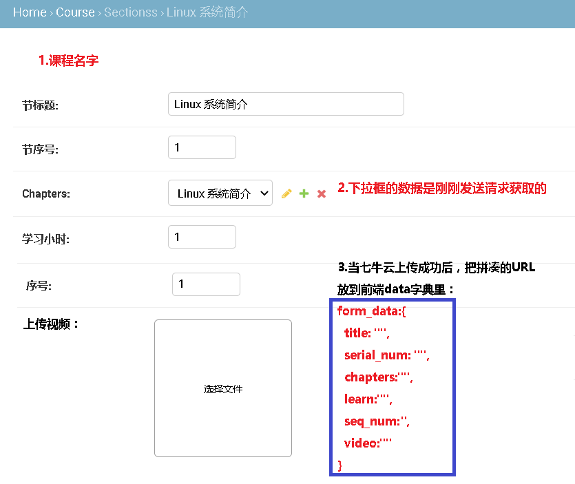

```
1.把课程的ID从路由中取出来
2.在vue钩子函数中触发请求，获取指定课程下的所有 章信息，在标题上显示课程信息
```

 </img>

# 1.获取指定课程下的所有章信息接口

```javascript
http://192.168.56.100:8888/course/course/1/
```

```javascript
{
    "id": 1,
    "goods_set": [
        {
            "id": 2,
            "create_time": "2020-10-13T03:42:53.449302Z",
            "update_time": "2020-10-13T03:42:53.449842Z",
            "goods_type": "1",
            "product_id": "1",
            "title": "Linux课程体系",
            "price": "55.00",
            "channel_type": "1",
            "period": 365,
            "is_launched": true,
            "course": 1
        }
    ],
    "chapters": [
        {
            "id": 1,
            "sections": [
                {
                    "id": 1,
                    "create_time": "2020-10-11T14:57:14.151331Z",
                    "update_time": "2020-10-11T14:57:14.151364Z",
                    "title": "Linux 系统简介",
                    "serial_num": 1,
                    "learn_time": 1,
                    "video": "http://192.168.56.100:8888/media/videos/20201011/07.%E6%A3%80%E6%9F%A5%E7%94%A8%E6%88%B7%E5%90%8D%E6%98%AF%E5%90%A6%E4%BD%BF%E7%94%A8%E6%8E%A5%E5%8F%A3.mp4",
                    "seq_num": 1,
                    "chapters": 1
                }
            ],
            "create_time": "2020-10-11T14:56:34.585658Z",
            "update_time": "2020-10-11T14:56:34.585689Z",
            "title": "Linux 系统简介",
            "serial_num": 1,
            "course": 1
        }
    ],
    "create_time": "2020-10-11T14:44:31.252836Z",
    "update_time": "2020-10-12T12:32:20.045791Z",
    "title": "Linux入门课程",
    "desc": "要在实验楼愉快地学习，先要熟练地使用 Linux，本实验介绍 Linux 基本操作，shell 环境下的常用命令。",
    "img": "http://192.168.56.100:8888/media/course/linux.jpg",
    "status": "1",
    "attention": 111,
    "learner": 222,
    "course_type": 3,
    "course_tag": [
        3
    ]
}
```

# 2.添加节视频课程的接口

```
http://192.168.56.100:8888/course/sections/
```

- 发送数据(post)

```javascript
        form_data:{
          title: "",
          serial_num: "",
          chapters:"",
          learn:"",
          seq_num:'',
          video:""
        }
```


