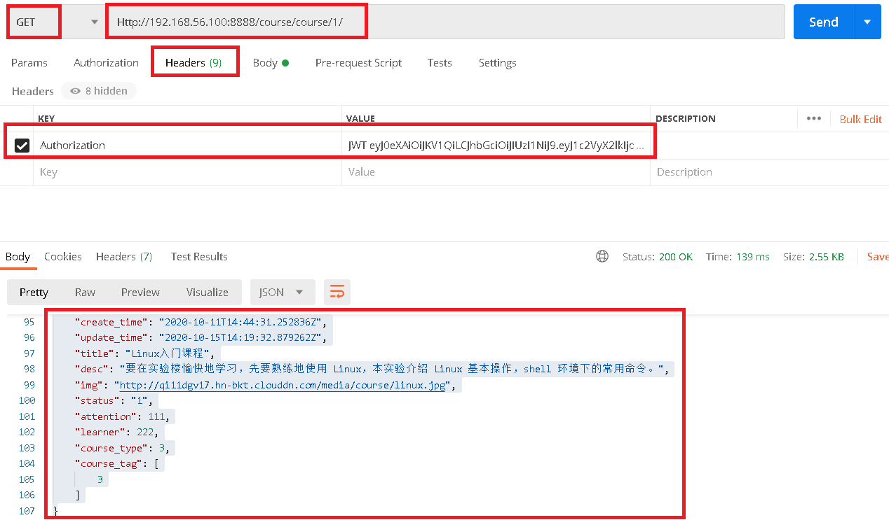

# 1.查询指定课程评论接口

### 1.1 `course/urls.py`中还是查询课程的路由

```javascript
router.register(r'course', views.CourseViewSet)
```

### 1.2 `course/serializers.py`中添加评论相关查询

```python
from goods.serializers import GoodsSerializer
class CourseDeepSerializer(CourseSerializer):
    comment = CommentSerializer(many=True)
    
class CommentSerializer(serializers.ModelSerializer):
    user = serializers.CharField(source='user.username')
    to_user = serializers.SerializerMethodField(required=False)

    class Meta:
        model = Comment
        fields = '__all__'

    def get_to_user(self,row):
        if row.to_user:
            return row.to_user.username
        return ''
```


# 2.测试获取评论接口

```javascript
Http://192.168.56.100:8888/course/course/1/
```

 </img>

- 接口结果

```python
{
    "id": 1,
    "goods_set": [
        {
            "id": 2,
            "create_time": "2020-10-13T03:42:53.449302Z",
            "update_time": "2020-10-13T03:42:53.449842Z",
            "goods_type": "1",
            "product_id": "1",
            "title": "Linux课程体系",
            "price": "55.00",
            "channel_type": "1",
            "period": 365,
            "is_launched": true,
            "course": 1
        }
    ],
    "comment": [
        {
            "id": 1,
            "user": "tom",
            "to_user": "zhangsan",
            "create_time": "2020-11-04T10:41:25.656763Z",
            "update_time": "2020-11-04T11:14:03.786135Z",
            "content": "tom第一次评论",
            "course": 1,
            "fid": null
        },
        {
            "id": 2,
            "user": "zhangsan",
            "to_user": "tom",
            "create_time": "2020-11-04T11:15:49.188855Z",
            "update_time": "2020-11-04T11:15:49.188898Z",
            "content": "zhangsan评论tom",
            "course": 1,
            "fid": 1
        },
        {
            "id": 3,
            "user": "tom",
            "to_user": "",
            "create_time": "2020-11-04T12:25:15.105667Z",
            "update_time": "2020-11-04T12:25:15.105946Z",
            "content": "<p>11111</p>\n",
            "course": 1,
            "fid": null
        }
    ],
    "chapters": [
        {
            "id": 1,
            "sections": [
                {
                    "id": 1,
                    "create_time": "2020-10-11T14:57:14.151331Z",
                    "update_time": "2020-10-11T14:57:14.151364Z",
                    "title": "Linux 系统简介",
                    "serial_num": 1,
                    "learn_time": 1,
                    "video": "http://qi11dgv17.hn-bkt.clouddn.com/media/videos/20201011/07.%E6%A3%80%E6%9F%A5%E7%94%A8%E6%88%B7%E5%90%8D%E6%98%AF%E5%90%A6%E4%BD%BF%E7%94%A8%E6%8E%A5%E5%8F%A3.mp4",
                    "seq_num": 1,
                    "chapters": 1
                },
                {
                    "id": 2,
                    "create_time": "2020-10-15T13:26:21.528687Z",
                    "update_time": "2020-10-15T14:20:33.813725Z",
                    "title": "七牛测试上传图片",
                    "serial_num": 2,
                    "learn_time": 1,
                    "video": "http://qi11dgv17.hn-bkt.clouddn.com/media/videos/20201015/linux.jpg",
                    "seq_num": 2,
                    "chapters": 1
                },
                {
                    "id": 3,
                    "create_time": "2020-10-15T13:46:48.629237Z",
                    "update_time": "2020-10-15T13:46:48.629319Z",
                    "title": "七牛视频上传",
                    "serial_num": 3,
                    "learn_time": 1,
                    "video": "http://qi11dgv17.hn-bkt.clouddn.com/media/videos/20201015/07.%E6%A3%80%E6%9F%A5%E7%94%A8%E6%88%B7%E5%90%8D%E6%98%AF%E5%90%A6%E4%BD%BF%E7%94%A8%E6%8E%A5%E5%8F%A3.mp4",
                    "seq_num": 1,
                    "chapters": 1
                }
            ],
            "create_time": "2020-10-11T14:56:34.585658Z",
            "update_time": "2020-10-11T14:56:34.585689Z",
            "title": "Linux 系统简介",
            "serial_num": 1,
            "course": 1
        }
    ],
    "create_time": "2020-10-11T14:44:31.252836Z",
    "update_time": "2020-10-15T14:19:32.879262Z",
    "title": "Linux入门课程",
    "desc": "要在实验楼愉快地学习，先要熟练地使用 Linux，本实验介绍 Linux 基本操作，shell 环境下的常用命令。",
    "img": "http://qi11dgv17.hn-bkt.clouddn.com/media/course/linux.jpg",
    "status": "1",
    "attention": 111,
    "learner": 222,
    "course_type": 3,
    "course_tag": [
        3
    ]
}
```

# 3.前端代码

- `src\components\course_show.vue`

- `src\components\common\comment.vue`

