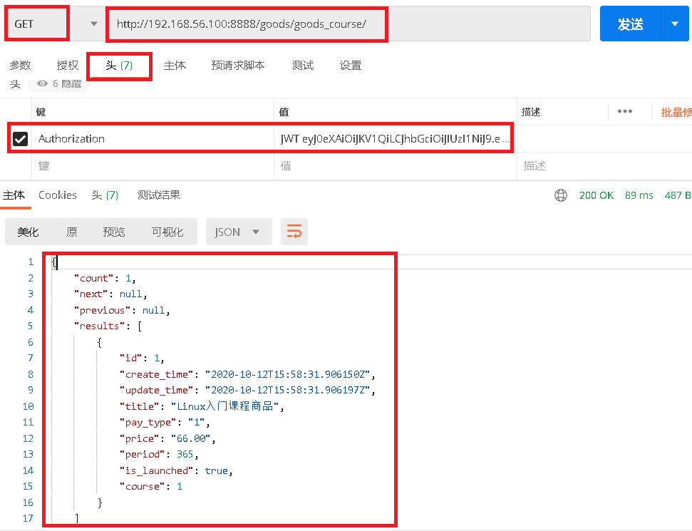

# 1.获取goods信息

### 1.1 `goods/urls.py`添加路由

```python
# -*- coding: utf-8 -*-
from django.urls import path, re_path
from rest_framework.routers import DefaultRouter

router = DefaultRouter()  # 有根路由
router.register(r'goods', views.GoodsViewSet)  # /goods/goods/?

urlpatterns = [

]

urlpatterns += router.urls  # 模块地址
```

### 1.2 `course/serializers.py`写序列化器

```python
# -*- coding: utf-8 -*-
from rest_framework import serializers
from goods.models import Goods

class GoodsSerializer(serializers.ModelSerializer):
    class Meta:
        model = Goods
        fields = '__all__'  # 所有字段
```

### 1.3`course/views.py`添加视图函数

```python
from rest_framework import viewsets
from .serializers import GoodsCourseSerializer
lass GoodsViewSet(viewsets.ModelViewSet):
    queryset = Goods.objects.all()
    serializer_class = GoodsSerializer  # 优先使用 get_serializer_class 返回的序列化器
```

### 1.4 测试接口

- 测试接口

```javascript
http://192.168.56.100:8888/goods/goods/2/
```

 </img>

- 返回事例

```python
{
    "count": 1,
    "next": null,
    "previous": null,
    "results": [
        {
            "id": 1,
            "create_time": "2020-10-12T15:58:31.906150Z",
            "update_time": "2020-10-12T15:58:31.906197Z",
            "title": "Linux入门课程商品",
            "pay_type": "1",
            "price": "66.00",
            "period": 365,
            "is_launched": true,
            "course": 1
        }
    ]
}
```


