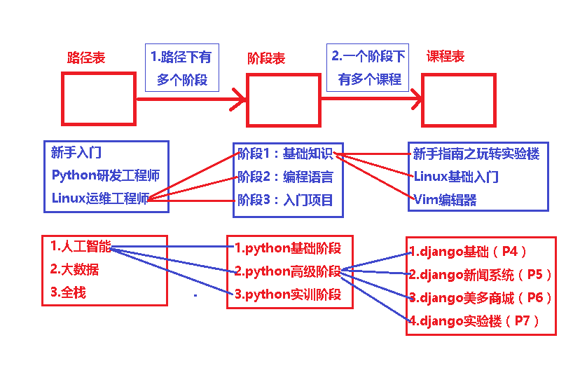
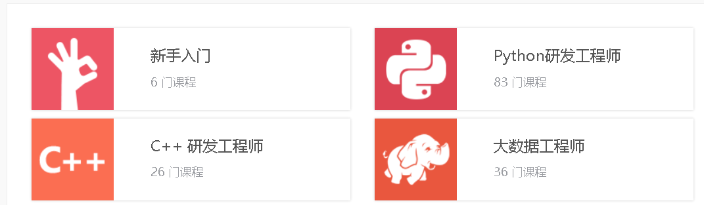

# 0.路径表关系梳理

 

# 1.路径表

```python
# 路径表
class Path(Base):
    title = models.CharField('路径名', max_length=16)
    img = models.ImageField('路径图片', upload_to='path', null=True)
    desc = models.CharField('路径描述', max_length=255)
    user = models.ManyToManyField('user.User', blank=True)

    def course_total(self):
        count = 0
        for jd in self.jieduan.all():
            count = count + jd.courses.count()
        return count

    class Meta:
        db_table = 'tb_path'

    def __str__(self):
        return self.title
```

 </img>

# 2.阶段表

```python
class JieDuan(Base):
    title = models.CharField('阶段名', max_length=16)
    serial_num = models.IntegerField('阶段序号')
    path = models.ForeignKey(Path, related_name='jieduan', on_delete=models.SET_NULL, null=True)
    courses = models.ManyToManyField(Course, blank=True)

    class Meta:
        db_table = 'tb_jieduan'

    def __str__(self):
        return "%s-第%s阶段-%s" % (self.path.title, self.serial_num, self.title)
```

 </img>