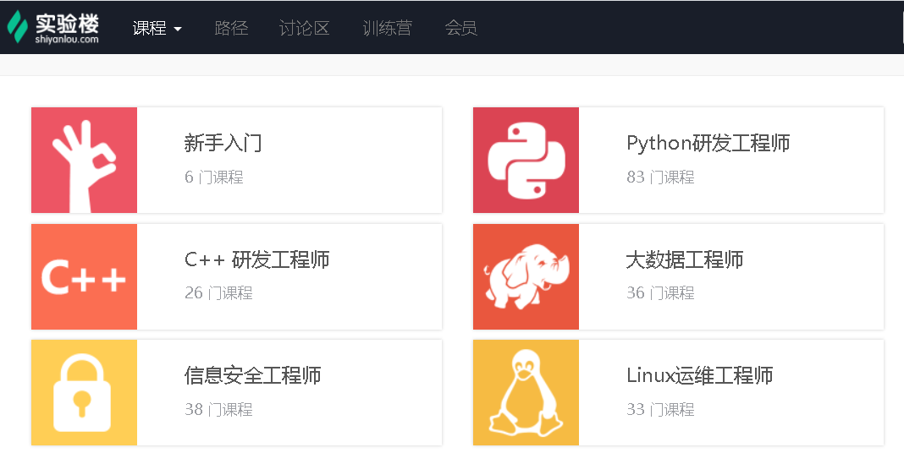
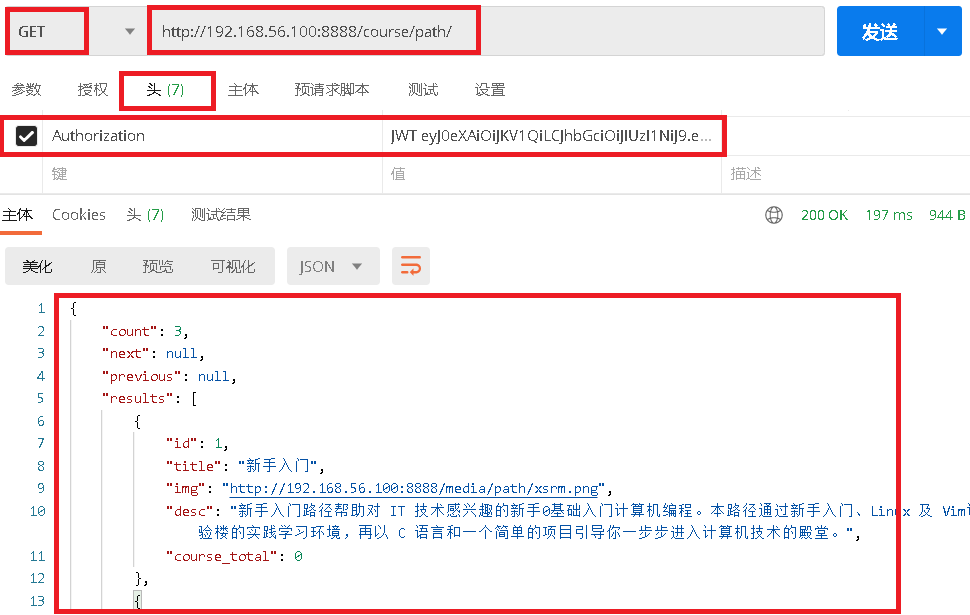

# 0.路径页面图

 </img>

# 1.课程路径接口开发

### 1.1 `course/urls.py`添加路由

```python
router.register(r'path', views.PathViewSet)
```

### 1.2 `course/serializers.py`写序列化器

```python
from rest_framework import serializers
from course.models import Path

class PathSerializer(serializers.ModelSerializer):
    class Meta:
        model = Path
        fields = ('id', 'title', 'img', 'desc', 'course_total')
        # fields = '__all__'
        # exclude = ['user']


class JieDuanSerializer(serializers.ModelSerializer):
    courses = CourseSerializer(many=True)

    class Meta:
        model = JieDuan
        fields = '__all__'


class PathDeepSerializer(serializers.ModelSerializer):
    jieduan = JieDuanSerializer(many=True)
```

### 1.3`course/views.py`添加视图函数

```
from rest_framework import viewsets
from course.models import *
from course.serializers import *

class PathViewSet(viewsets.ModelViewSet):
    queryset = Path.objects.all()

    def get_serializer_class(self):
        if self.action == 'list':
            return PathSerializer
        else:
            return PathDeepSerializer
```

### 1.4 `course/admin.py`注册后台管理

```
from django.contrib import admin
from . import models

admin.site.register(models.Path)
```

### 1.5 测试接口

- 测试接口

```javascript
http://192.168.56.100:8888/course/path/
```

 </img>

- 返回事例

```python
{
    "count": 3,
    "next": null,
    "previous": null,
    "results": [
        {
            "id": 1,
            "title": "新手入门",
            "img": "http://192.168.56.100:8888/media/path/xsrm.png",
            "desc": "新手入门路径帮助对 IT 技术感兴趣的新手0基础入门计算机编程。本路径通过新手入门、Linux 及 Vim课程熟悉实验楼的实践学习环境，再以 C 语言和一个简单的项目引导你一步步进入计算机技术的殿堂。",
            "course_total": 0
        },
        {
            "id": 2,
            "title": "Python研发工程师",
            "img": "http://192.168.56.100:8888/media/path/python_path.png",
            "desc": "快乐学习python",
            "course_total": 0
        },
        {
            "id": 3,
            "title": "Linux入门课程",
            "img": "http://192.168.56.100:8888/media/path/linux_path.png",
            "desc": "学习linux",
            "course_total": 0
        }
    ]
}
```


