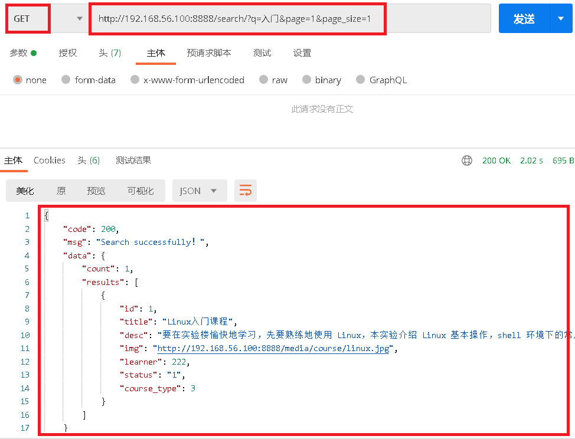

# 1.基本介绍

前后端不分离：https://www.cnblogs.com/xiaonq/p/12363589.html

### 1.1 安装

```python
pip install drf-haystack   # django的开源 搜索框架（python语音写的，搜索框架可以使用其他语音的搜索引擎）
pip install whoosh         # 搜索引擎（python语音写的）
pip install jieba          # 中文分词Jieba，由于Whoosh自带的是英文分词，对中文的分词支持不是太好
```

### 1.2 什么是haystack？

- haystack是django的开源搜索框架，该框架支持`Solr,Elasticsearch,Whoosh, Xapian` 搜索引擎，不用更改代码，直接切换引擎，减少代码量。

- 搜索引擎使用Whoosh，这是一个由纯Python实现的全文搜索引擎，没有二进制文件等，比较小巧，配置比较简单，当然性能自然略低。

- 中文分词Jieba，由于Whoosh自带的是英文分词，对中文的分词支持不是太好，故用jieba替换whoosh的分词组件。

# 2.配置使用

### 2.1 `syl/settings.py` 全文检索配置

```python
'''1.注册app '''
INSTALLED_APPS = [
    'haystack',   # haystack要放在应用的上面
]

'''2.模板路径 '''
TEMPLATES = [
    {
        'DIRS': [os.path.join(BASE_DIR,'templates')],

    },
]

'''3.全文检索配置'''
HAYSTACK_SEARCH_RESULTS_PER_PAGE = 15      # 搜索出多条数据时需要分页
HAYSTACK_CONNECTIONS = {
    'default': {
        # 'ENGINE': 'haystack.backends.whoosh_backend.WhooshEngine',
        'ENGINE': 'course.whoosh_cn_backend.MyWhooshEngine',
        'PATH': os.path.join(BASE_DIR, 'whoosh_index'),             # 指定倒排索引存放位置
    },
}
# # ES引擎
# HAYSTACK_CONNECTIONS = {
#     'default': {
#         'ENGINE': 'haystack.backends.elasticsearch_backend.ElasticsearchSearchEngine',
#         'URL': 'http://10.211.55.15:9200/',  # Elasticsearch服务器ip地址，端口号固定为9200
#         'INDEX_NAME': 'syl',  # Elasticsearch建立的反向索引库的名称
#     },
# }
# 添加此项，当数据库改变时，会自动更新索引，非常方便
HAYSTACK_SIGNAL_PROCESSOR = 'haystack.signals.RealtimeSignalProcessor'
```

### 2.2 在子应用下创建索引文件

- `apps/course/search_indexes.py`

```python
# apps/course/search_indexes.py   
# 文件名必须是 search_indexes.py
from haystack import indexes
from .models import Course

# 修改此处，类名为模型类的名称+Index，比如模型类为GoodsInfo,则这里类名为GoodsInfoIndex(其实可以随便写)
class CourseIndex(indexes.SearchIndex, indexes.Indexable):
    """
    Course索引类
    """
    # text为索引字段
    # document = True，这代表haystack和搜索引擎将使用此字段的内容作为索引进行检索
    # use_template=True 指定根据表中的那些字段建立索引文件的说明放在一个文件中
    text = indexes.CharField(document=True, use_template=True)

    # 对那张表进行查询
    def get_model(self):     # 重载get_model方法，必须要有
        """返回建立索引的模型类"""
        return Course       # 返回这个model

     # 建立索引的数据
    def index_queryset(self, using=None):
        """返回要建立索引的数据查询集"""
        # 这个方法返回什么内容，最终就会对那些方法建立索引，这里是对所有字段建立索引
        return self.get_model().objects.all()
```

### 2.3 指定索引模板文件

- `templates/search/indexes/course/course_text.txt`

- ```python
  # 创建文件路径命名必须这个规范：templates/search/indexes/应用名称/模型类名称_text.txt
  ```

```
{{object.id}}
{{object.title}}
{{object.desc}}
```

### 2.4 修改为jieba分词中的中文分析器

- `apps/course/whoosh_cn_backend.py`

```python
# 更换 text 字段的 分析方式, 变为jieba分词中的中文分析器
from haystack.backends.whoosh_backend import WhooshEngine, WhooshSearchBackend
from whoosh.fields import TEXT
from jieba.analyse import ChineseAnalyzer


class MyWhooshSearchBackend(WhooshSearchBackend):
    def build_schema(self, fields):
        (content_field_name, schema) = super().build_schema(fields)
        # 指定whoosh使用jieba进行分词
        schema._fields['text'] = TEXT(stored=True,
                                      analyzer=ChineseAnalyzer(),
                                      field_boost=fields.get('text').boost,
                                      sortable=True)
        return (content_field_name, schema)


class MyWhooshEngine(WhooshEngine):
    backend = MyWhooshSearchBackend
```

### 2.5 课程全文检索接口视图函数

- `course/views.py`

```python
from syl import settings
from django.core.paginator import InvalidPage, Paginator
from haystack.forms import ModelSearchForm
from django.http import JsonResponse

# 如果settings.py中配置就是用settings中配置的，否则就每页15条
RESULTS_PER_PAGE = getattr(settings, 'HAYSTACK_SEARCH_RESULTS_PER_PAGE', 15)   


def course_index_search(request):
    #1.获取前端传过来的关键字（查询数据）
    query = request.GET.get('q', None)
    page = int(request.GET.get('page', 1))   # 第几页
    page_size = int(request.GET.get('page_size', RESULTS_PER_PAGE))  #每页多少条
    
    #2.获取查询条件，进行查询
    if query:
        form = ModelSearchForm(request.GET, load_all=True)  # 将查询条件传递给查询对象
        if form.is_valid():  
            results = form.search()   # 查询出来的最终数据
        else:
            results = []
    else:
        return JsonResponse({"code": 404, "msg": 'No file found！', "data": []})

    #3.对结果集进行分页
    paginator = Paginator(results, page_size)
    try:
        page = paginator.page(page)   # 从分好的页中拿第几页
    except InvalidPage:               # 如果分页出错
        return JsonResponse({"code": 404, "msg": 'No file found！', "data": []})

    #4.把查询的分页结果集对象转换成json格式
    jsondata = []
    for result in page.object_list:   # 分页后的课程查询结果
        data = {
            'id': result.object.id,
            'title': result.object.title,
            'desc': result.object.desc,
            'img': request.scheme+'://'+request.META['HTTP_HOST']+result.object.img.url,
            #'follower': result.object.follower,
            'learner': result.object.learner,
            'status': result.object.status,
            'course_type': result.object.course_type.id
        }
        jsondata.append(data)
    result = {
        "code": 200,
        "msg": 'Search successfully！',
        "data": {"count": page.paginator.count, "results": jsondata}
    }
    return JsonResponse(result)
```

### 2.6 `syl/urls.py`添加路由

```
urlpatterns = [
    path('search/', course_index_search),
]
```

### 2.7 命令构建倒排索引

```python
python manage.py rebuild_index
```

# 3.测试课程全文检索

- 测试接口

```
http://192.168.56.100:8888/search/?q=入门&page=1&page_size=1
```

- 测试结果

 </img>

- 返回

```python
{
    "code": 200,
    "msg": "Search successfully！",
    "data": {
        "count": 1,
        "results": [
            {
                "id": 1,
                "title": "Linux入门课程",
                "desc": "要在实验楼愉快地学习，先要熟练地使用 Linux，本实验介绍 Linux 基本操作，shell 环境下的常用命令。",
                "img": "http://192.168.56.100:8888/media/course/linux.jpg",
                "learner": 222,
                "status": "1",
                "course_type": 3
            }
        ]
    }
}
```

