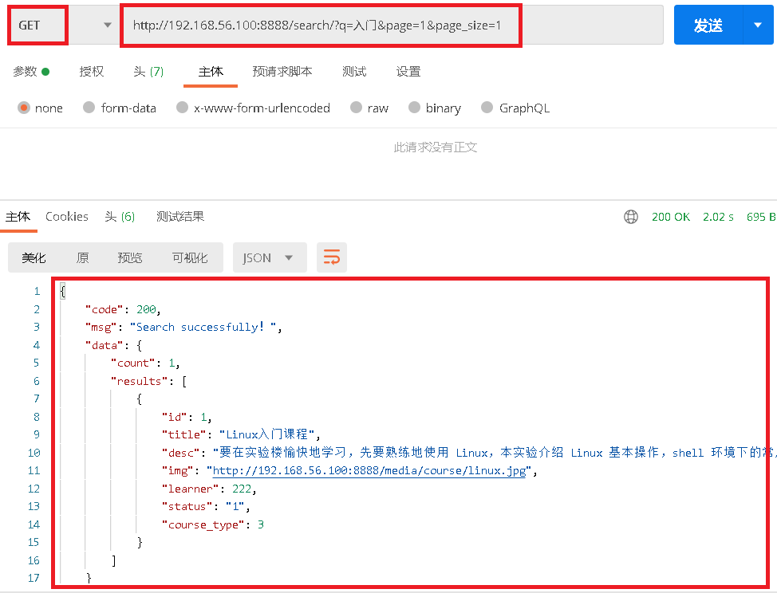

# 1.docker安装ES

- `1.拉取docker镜像`

```python
# 从仓库拉取镜像
sudo docker image pull delron/elasticsearch-ik:2.4.6-1.0
```

- `2.使用docker安装ES`

```python
docker run -d -p 9200:9200 -p 9300:9300 --name elasticsearch delron/elasticsearch-ik:2.4.6-1.0
```

- `3.在页面中测试`

```javascript
http://192.168.56.100:9200/
```

 </img>

# 2.使用ES替代whoosh全文检索

### 2.1 在Django中修改搜索引擎为ES

```python
# settings.py  修改haystack配置
# ES引擎
HAYSTACK_CONNECTIONS = {
    'default': {
        'ENGINE': 'haystack.backends.elasticsearch_backend.ElasticsearchSearchEngine',
        'URL': 'http://127.0.0.1:9200/',        # Elasticsearch服务器ip地址，端口号固定为9200
        'INDEX_NAME': 'syl',                    # Elasticsearch建立的反向索引库的名称
    },
}
```

### 2.2 命令构建倒排索引

```python
python manage.py rebuild_index
```

# 3.测试课程全文检索

- 测试接口

```
http://192.168.56.100:8888/search/?q=入门&page=1&page_size=1
```

- 测试结果

 </img>

- 返回

```python
{
    "code": 200,
    "msg": "Search successfully！",
    "data": {
        "count": 1,
        "results": [
            {
                "id": 1,
                "title": "Linux入门课程",
                "desc": "要在实验楼愉快地学习，先要熟练地使用 Linux，本实验介绍 Linux 基本操作，shell 环境下的常用命令。",
                "img": "http://192.168.56.100:8888/media/course/linux.jpg",
                "learner": 222,
                "status": "1",
                "course_type": 3
            }
        ]
    }
}
```

