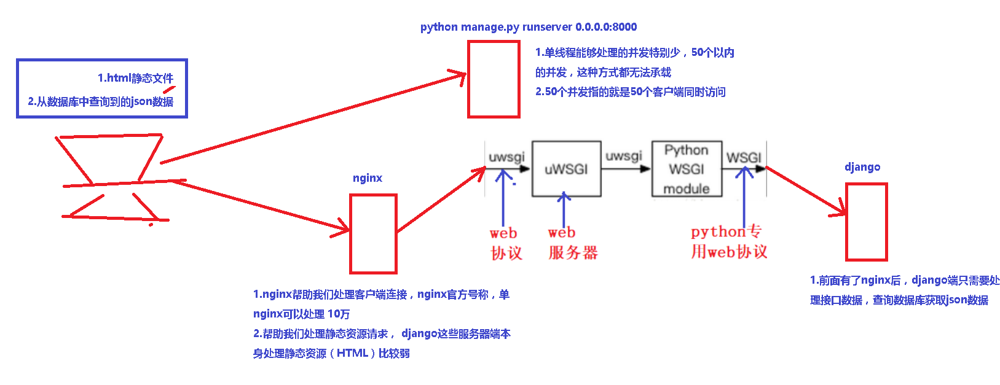
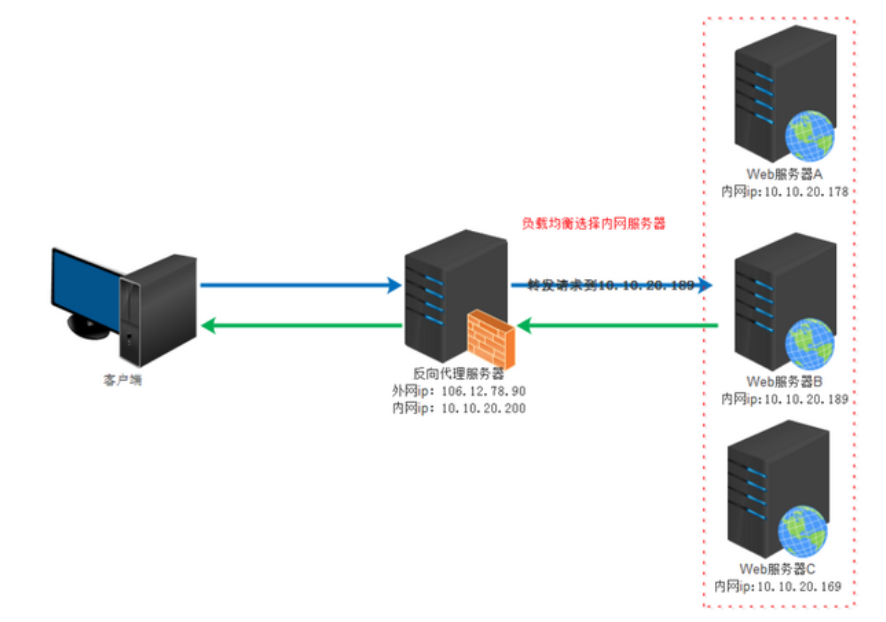

# 1.一些重要概念

https://www.cnblogs.com/xiaonq/p/8932266.html

### 1.1 web容器

- 什么是web容器
  - 1.web容器是帮助我们部署java、php、python、vue等项目的

- 作用（处理请求，返回数据）
  - 第一，帮助django服务端处理客户端连接，官方号称可以处理10万（实现高并发）
  - 第二，帮助处理静态资源请求（html、css、JS），返回给客户端浏览器（django等web服务器处理静态资源能力差）
- 常见web容器
  - `1.nginx（python、php）`
    - LNMP
      - L：LInux
      - N：Nginx
      - M：MySQL
      - P： php
  - `2.apache（PHP）`
    - LAMP
      - L：LInux
      - A：Apache
      - M：MySQL
      - P： php
  - `3.Tomcat（JAVE）`

### 1.2 什么是WSGI（web协议）

- WSGI是一种`python专用`的web协议 和http类似
-  WSGI实质：WSGI是一种描述web服务器（如`nginx，uWSGI web服务器`）如何与`web框架`（如用Django、Flask框架写的程序）通信的规范、协议

- WSGI定义了使用`python编写的web app(django)与web server（uWSGI）之间接口格式`

- **为什么需要web协议：**
  - 1）不同的框架有不同的开发方式，但是无论如何，开发出的`应用程序(django)都要和服务器(nginx)程序配合`，才能为用户提供服务。
  - 2） 这样，`服务器程序(nginx)`就需要为不同的框架提供不同的支持,只有支持它的服务器才能被开发出的应用使用，显然这是不可行的。
  - 3）**web协议本质：**就是定义了`Web服务器和Web应用程序或框架之间的一种简单而通用的接口规范`。

### 1.3` uWSGI`（web服务器   和nginx类似）

- 什么是uWSGI： uWSGI是一个全功能的HTTP服务器，实现了`WSGI协议`、`uwsgi协议`、`http协议`等。

- uWSGI作用：它要做的就是把HTTP协议转化成语言支持的网络协议，比如把`HTTP协议转化成WSGI协议，让Python可以直接使用`。

- uWSGI特点：轻量级，易部署，性能比nginx差很多,支持多种协议

### 1.4 Nginx

- Nginx是一个Web服务器,其中的HTTP服务器功能和`uWSGI功能很类似`
- 但是Nginx还可以用作更多用途，比如最常用的`反向代理、负载均衡、拦截攻击`等，而且`性能极高`
- 单台nginx号称可以处理10万并发

### 1.5 Django

-  Django是一个Web框架，框架的作用在于处理request和 reponse，其他的不是框架所关心的内容。

-  所以如何部署Django不是Django所需要关心的。


# 2.nginx+uwsgi+django部署各模块作用

 </img>


### 2.1 Django + Uwsgi + Nginx方案

 </img>

- 1.请求处理整体流程
  - nginx接收到浏览器发送过来的http请求，将包进行解析，分析url
    - **`静态文件请求：`**就直接访问用户给nginx配置的静态文件目录`(html/css/js/图片)`，直接返回用户请求的静态文件
  - **`动态接口请求：`**那么nginx就将请求转发给uWSGI，最后到达django处理

- 2.各模块作用
- `nginx`：是对外的服务器，外部浏览器通过url访问nginx，nginx主要处理静态请求`(html/css/js/图片)`
  - `uWSGI`：是对内的服务器，主要用来`处理动态请求`。(从mysql、redis、es等中动态查询到的数据)
  - `uwsgi`：是一种web协议，接收到请求之后将包进行处理，处理成wsgi可以接受的格式，并发给wsgi
  - `wsgi`：是python专用的web协议，根据请求调用应用程序（django）的某个文件，某个文件的某个函数
  - `django`：是真正干活的，查询数据等资源，把处理的结果再次返回给WSGI， WSGI 将返回值进行打包，打包成uwsgi能够接收的格式
  
- `uwsgi`：接收wsgi发送的请求，并转发给nginx,nginx最终将返回值返回给浏览器

### 2.2 Django + uWSGI方案特点

- 没有nginx而只有uwsgi的服务器，则是Internet请求直接由uwsgi处理，并反馈到web项目中。

- nginx可以实现安全过滤，防DDOS等保护安全的操作，并且如果配置了多台服务器，nginx可以保证服务器的负载相对均衡。

- 而uwsgi则是一个web服务器，实现了WSGI协议(Web Server Gateway Interface)，http协议等，它可以接收和处理请求，发出响应等。
  所以只用uwsgi也是可以的。

### 2.3 nginx和uWSGI特点

- 1.nginx的作用
  - 反向代理，可以拦截一些web攻击，保护后端的web服务器
  - 负载均衡，根据轮询算法，分配请求到多节点web服务器
  - 缓存静态资源，加快访问速度，释放web服务器的内存占用，专项专用
  -  

- 2.uWSGI的适用
  - 单节点服务器的简易部署
  - 轻量级，好部署


```python
## 1)基本信息介绍
面试官您好，我叫xxx，今年26岁，家在辽宁。今天，来面试python开发这个职位。
## 2)做过什么
我是17年6月的时候毕业的，在两家公司就职过，先后参与过4个项目的开发，主要包括股票、校园服务平台、机器人自动化以及缴费平台。
## 3）擅长做什么
我有3年的python开发经验，熟悉Django、Flask等多个后端框架，以及Vue、Bootstrap等多个前端框架，了解的数据库有mysql、mongodb、ES等，会使用Git、Docker工具，对restful风格代码有极致追求。
## 4）凸出自己好学，解决问题能力强
我觉得我最大的核心竞争力就是具有较好的逻辑分析能力和一定的解决问题的能力，我一直都以成为一个优秀的架构师为目标。
我期望加入贵公司，并与公司携手共赢，谢谢。

```


```python
我是17年毕业的，最近三年主要负责python后端开发；
上家公司在内蒙古金财，主要负责 机器人自动化平台和金牛缴费平台研发工作，在这里我前端和后端都有参与，前端主要用的是vue框架，后端主要用django框架，测试环境采用Docker容器化部署，线上环境部署在阿里云，使用SLB和nginx
在这之前，我在清华科技做过一年多，主要负责自动化工单系统和监控系统的自动化平台开发；
您看，还有什么需要了解的
```

