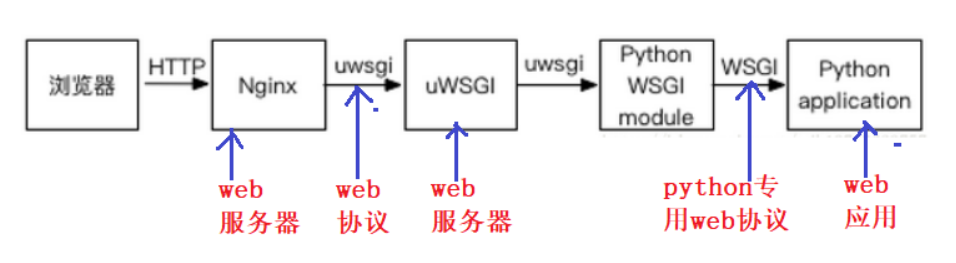

# 1.django的settings配置

https://www.cnblogs.com/xiaonq/p/8932266.html

```python
# 1.修改配置
# 正式上线关闭调试模式, 不会暴露服务器信息
DEBUG = False

# 2.允许的主机
ALLOWED_HOSTS = ['xxx.com','127.0.0.1']

# 3.前端修改接口地址（vue）
http://192.168.56.100:8888/   =>  http://xxx.com/

# 4.MySQL数据库根据实际情况配置（注意地址）

# 5.缓存配置, 改为默认, 最简单形式（配置redis）

# 6.收集静态文件
# 静态资源收集位置
STATIC_ROOT = os.path.join(BASE_DIR, 'static')

# 7.命令行执行
python manage.py collectstatic
```


# 2.安装uwsgi 配置uWSGI

### 2.1 安装uwsgi

```python
'''1. 安装uwsgi'''
[root@linux-node1 /]# workon syl
[root@linux-node1 /]# pip3 install uwsgi     # 安装uwsgi
[root@linux-node1 /]# whereis uwsgi          # 查看uwsgi安装路径
uwsgi: /root/.virtualenvs/syl/bin/uwsgi
```

### 2.2 配置uwgsi.ini启动文件

 </img>

```
1.每个请求处理时间为0.5s？
2.当前配置QPS是多少？（每秒能处理的请求数量）
QPS就是160
```

- 在`uwsgi_conf/uwsgi.ini`下新建这个文件

```python
[root@linux-node1 /]# vim uwsgi_conf/uwsgi.ini
[uwsgi]
# 使用Nginx连接时使用，Django程序所在服务器地址和端口号
socket=127.0.0.1:8000
# 项目目录绝对路径
chdir=/teach/shiyanlou_project/syl
# 项目中wsgi.py文件的目录，相对于项目目录
wsgi-file=syl/wsgi.py
# 进程数（机器核数的1倍）
processes=4
# 线程数
threads=50
# uwsgi服务器的角色
master=True
# 存放进程编号的文件
pidfile=uwsgi.pid
# 日志文件
daemonize=uwsgi.log
# 指定依赖的虚拟环境
virtualenv=/root/.virtualenvs/syl
```

### 2.3 使用uwsgi启动django：一定要在这个项目目录中

- `测试命令，和我们下面没有任何关系`

```python
'''3. 使用uwsgi启动django：一定要在这个项目目录中'''
[root@linux-node1 /]# uwsgi --http 192.168.56.100:6666 --file syl/wsgi.py --static-map=/static=static
访问项目：http://192.168.56.11
```

# 3.安装配置nginx

### 3.1 安装nginx

```python
[root@linux-node1 /]# sudo apt update                  # 更新apt
[root@linux-node1 /]# sudo apt install nginx           # 安装nginx
[root@linux-node1 /]# sudo systemctl status nginx      # 查看nginx状态
```

### 3.2  配置nginx+uwsgi启动

- 在`/etc/nginx/conf.d/`文件夹下新建任意名字 xxx.conf即可，写入的内容是官方给的

```javascript
# /etc/nginx/conf.d/django.conf
server {
    listen       8888;
    server_name  192.168.56.100;
        # /teach/shiyanlou_project/syl/static/admin/css/base.css
        # http://192.168.56.100/static/admin/css/base.css
        location /static {   
            alias /teach/shiyanlou_project/syl/static;
        }
    
        location / {
              include uwsgi_params;
              uwsgi_pass 127.0.0.1:8000;
              uwsgi_ignore_client_abort on;
        }
}
```

### 3.3  `/etc/nginx/nginx.conf`nginx主配置文件解读(`不用变`)

````python
user www-data;
worker_processes auto;
pid /run/nginx.pid;
include /etc/nginx/modules-enabled/*.conf;

events {
	worker_connections 768;      # 链接数量
}

http {
	sendfile on;
	tcp_nopush on;
	tcp_nodelay on;
	keepalive_timeout 65;
	types_hash_max_size 2048;
	
	access_log /var/log/nginx/access.log;         # 1.客户浏览器访问nginx服务记录（客户户端访问异常时可以查看）
	error_log /var/log/nginx/error.log;           # 2.nginx错误日志（nginx启动时报错的日志）
	include /etc/nginx/conf.d/*.conf;             # 3.nginx扩展配置文件
	include /etc/nginx/sites-enabled/*;
}
````

# 4. uwsgi和nginx 启动、关闭、查看日志

```python
'''1.启动并查看nginx日志'''
[root@linux-node1 demo2]# systemctl restart nginx         # 开启nginx
root@dev:uwsgi_conf# tail -f /var/log/nginx/access.log    # 查看nginx接入日志
root@dev:uwsgi_conf# tail -f /var/log/nginx/error.log     # 查看nginx错误日志

'''2.启动并查看uwsgi日志'''
root@dev:uwsgi_conf# cd /teach/shiyanlou_project/uwsgi_conf     # 进入实验楼目录
[root@linux-node1 demo2]# uwsgi --ini uwsgi.ini                 # 启动uwsgi的django项目
# http://192.168.56.100:8888/ 访问项目
[root@linux-node1 demo2]# uwsgi --stop uwsgi.pid                # 关闭uwsgi
[root@dev:uwsgi_conf# tail -f uwsgi.log                         # 查看uwsgi日志
```


````python
(syl) root@dev:uwsgi_conf# ps -ef|grep uwsgi       # 查看uwsgi服务是否启动
root      92328  89266  0 14:37 pts/1    00:00:00 grep --color=auto uwsgi
(syl) root@dev:uwsgi_conf# netstat -anptu | grep 8888     # 查看8888端口被哪一个程序占用
````

