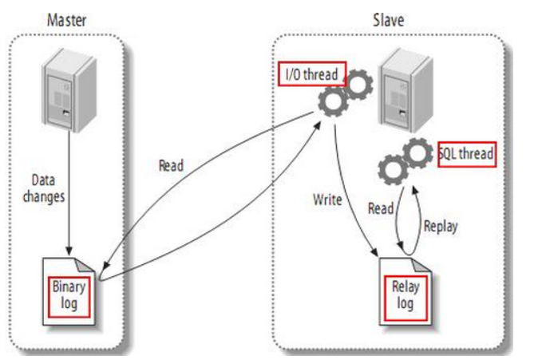

# 1.主从同步机制

### 1.1 主从同步介绍和优点

- 在多台数据服务器中，分为`主服务器和从服务器`,一台主服务器对应多台从服务器。
- `主服务器只负责写入数据`，从服务器只负责同步主服务器的数据，并让外部程序读取数据。
- 主服务器写入数据后，`即刻将写入数据的命令发送给从服务器`，从而使得主从数据同步。
- 应用程序可以随机读取某一台从服务器的数据，这样就可以`分摊读取数据的压力`。
- 当从服务器不能工作时，整个系统将不受影响；当主服务器不能工作时，可以方便地`从从服务器选举一台来当主服务器`
- 使用主从同步的优点：
  - 提高读写性能
    - 因为主从同步之后，`数据写入和读取是在不同的服务器上进行的`，而且可以通过增加从服务器来提高数据库的读取性能。
  - 提高数据安全
    - 因为数据已复制到从服务器，可以在从服务器上备份而不破坏主服务器相应数据。

### 1.2 主从同步机制

- 主从同步（两种）
  - 全量同步
  - 增量同步

- MySQL服务器之间的主从同步是基于**`二进制日志机制`**，主服务器使用二进制日志来记录数据库的变动情况

- 从服务器通过读取和执行该日志文件来保持和主服务器的数据一致

 </img>

