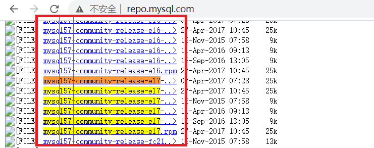
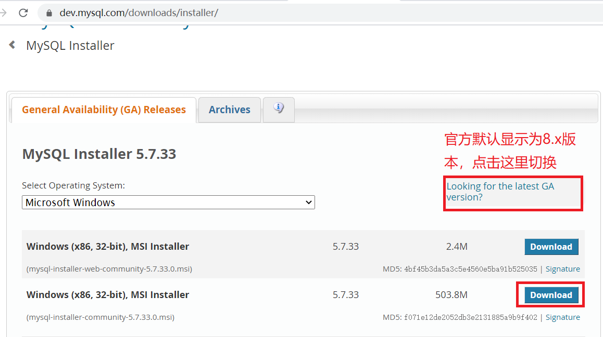

## 01.Linux安装MySQL

参考：https://www.runoob.com/mysql/mysql-install.html

### 1.1 安装前说明

- 所有平台的 MySQL 下载地址为： [MySQL 下载](https://dev.mysql.com/downloads/mysql/) 
- 挑选你需要的 *MySQL Community Server* 版本及对应的平台。

- `安装前，我们可以检测系统是否自带安装 MySQL`

```python
[root@iZ2ze4owq6ailug7vb38z5Z ~]#  rpm -qa | grep mysql
[root@iZ2ze4owq6ailug7vb38z5Z ~]#  yum list installed | grep mysql
```

- `如果你系统有安装，那可以选择进行卸载`

```python
[root@iZ2ze4owq6ailug7vb38z5Z ~]#  rpm -e mysql　         # 普通删除模式
[root@iZ2ze4owq6ailug7vb38z5Z ~]#  rpm -e --nodeps mysql　　 # 强力删除模式，如果使用上面命令删除时，提示有依赖的其它文件，则用该命令可以对其进行强力删除
[root@iZ2ze4owq6ailug7vb38z5Z ~]# yum erase mysql-*        # yum删除所有mysql相关包
```

### 1.2 下载 Yum 资源包

```bash
[root@iZ2ze4owq6ailug7vb38z5Z ~]#  wget http://repo.mysql.com/mysql57-community-release-el7-10.noarch.rpm
[root@iZ2ze4owq6ailug7vb38z5Z ~]#  rpm -ivh mysql57-community-release-el7-10.noarch.rpm
[root@iZ2ze4owq6ailug7vb38z5Z ~]#  yum update
```

- 获取域名资源包地址：http://repo.mysql.com/

 </img>

### 1.3 安装mysql服务

```python
[root@iZ2ze4owq6ailug7vb38z5Z ~]#  yum install mysql-server       # 安装mysql服务端
[root@iZ2ze4owq6ailug7vb38z5Z ~]#  yum -y install mysql-devel      # 安装mysql所需的库和包含文件
```

- 服务管理

```python
[root@iZ2ze4owq6ailug7vb38z5Z ~]# systemctl status start
[root@iZ2ze4owq6ailug7vb38z5Z ~]# systemctl status mysqld
root@iZ2ze4owq6ailug7vb38z5Z ~]# systemctl enable mysqld
```

### 1.4 设置登录密码

```python
[root@iZ2ze4owq6ailug7vb38z5Z ~]#  mysql -uroot -p
[root@iZ2ze4owq6ailug7vb38z5Z ~]#  mysqladmin -u root password "1"      # 给root用户配置密码：1
[root@iZ2ze4owq6ailug7vb38z5Z ~]#  mysql -uroot -p1                # 配置完密码后必须使用密码登录
```

- 如果出现下面报错：`Please use mysql_upgrade to fix this error.`

```python
[root@iZ2ze4owq6ailug7vb38z5Z ~]# mysql_upgrade -u root -p
```

- 修改mysql密码

```mysql
mysql>  update mysql.user set authentication_string=password('v5blog.cn') where user='root' and Host = 'localhost';
mysql>  flush privileges; 
```

### 1.5 连接MySQL

```
[root@iZ2ze4owq6ailug7vb38z5Z ~]# mysql -uroot -p
Enter password:  ******
```

- `mysql -h 主机名 -u 用户名 -p`
- 参数说明
     - **-h** : 指定客户端所要登录的 MySQL 主机名, 登录本机(localhost 或 127.0.0.1)该参数可以省略;
     - **-u** : 登录的用户名;
     - **-p** : 告诉服务器将会使用一个密码来登录, 如果所要登录的用户名密码为空, 可以忽略此选项。

## 02.Win10安装MySQL

详细步骤参考：https://www.runoob.com/w3cnote/windows10-mysql-installer.html

### 2.1 下载安装包

- 进入官网找到自己所需的安装包：https://dev.mysql.com/  
- 路径：DOWNLOAD-->MYSQL Community Edition(GRL)-->MYSQL on Windows (Installer & Tool)

- 或直接点击 https://dev.mysql.com/downloads/windows/installer/ 查看最新版本。

 </img>