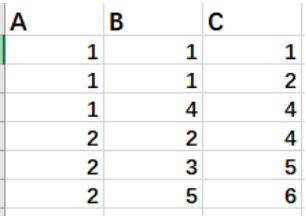
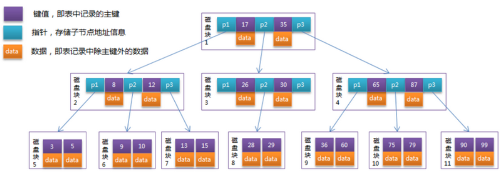
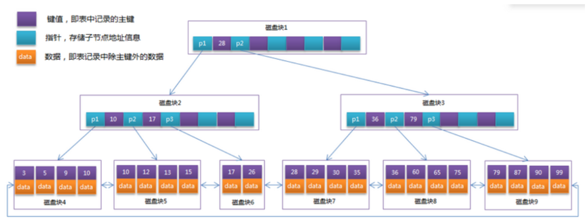

## 01.Mysql索引

### 1.1 mysql索引类型

- 单列索引
     -  `主键索引(不能为空)`
          - 设定为主键后数据库会自动建立索引
     -  ` 唯一索引(可为空)`
          - 索引列的值必须唯一，但允许有空值
     -  ` 普通索引(可重复)`
          - 可以为空，可以重复
- `组合索引(一个索引包含多个列)`
     - 最左前缀

### 1.2 组合索引

#### 1.2.1 复合索引特点

- 联合索引其实很简单，相对于一般索引只有一个字段，联合索引可以为多个字段创建一个索引

- 它的原理也很简单，比如，我们在（a,b,c）字段上创建一个联合索引，则索引记录会首先按照A字段排序，然后再按照B字段排序然后再是C字段*

- 其实联合索引的查找就跟查字典是一样的，先根据第一个字母查，然后再根据第二个字母查

- 或者只根据第一个字母查，但是不能跳过第一个字母从第二个字母开始查。这就是所谓的最左前缀原理。*

- 联合索引的特点就是：
     - 1）第一个字段一定是有序的
     - 2）当第一个字段值相等的时候，第二个字段又是有序的，比如下表中当A=2时所有B的值是有序排列的，依次类推，当同一个B值得所有C字段是有序排列的
     -  </img>

#### 1.2.2 最左前缀原理

```python
'''最左前缀原理'''

##### 1、以下的查询方式都可以用到索引
'''
select * from table where a=1；
select * from table where a=1 and b=2；
select * from table where a=1 and b=2 and c=3；
上面三个查询按照 （a ）, （a，b ）,（a，b，c ）的顺序都可以利用到索引，这就是最左前缀匹配。
'''

##### 2、如果查询语句是：
'''
select * from table where a=1 and c=3； 那么只会用到索引a。
'''

##### 3、这样不会用的索引
'''
select * from table where b=2 and c=3； 因为没有用到最左前缀a，所以这个查询是用户到索引的。
'''
```

### 1.3 mysql索引失效

- 1、like 以%开头，索引无效；当like前缀没有%，后缀有%时，索引有效。

     - ```javascript
          ## 1)不能命中索引
          select * from table where name LIKE "%张%"
          select * from table where name LIKE "%张"
          ## 2）可以命中索引
          select * from table where name LIKE "张%"
          ```

- 2、or语句前后没有同时使用索引。当or左右查询字段只有一个是索引，该索引失效，只有当or左右查询字段均为索引时，才会生效

     - ```javascript
          ## 1）命中索引
          select * from table where uid=24 or uid=18;
          ## 2）无法命中索引
          select * from table where uid=24 or name=zhangsan;
          ```

- 3、组合索引，不是使用第一列索引，索引失效。

     - ```javascript
          ## 1)只会用到索引a
          select * from table where a=1 and c=3；
          ## 2）因为没有用到最左前缀a，所以无法使用索引
          select * from table where b=2 and c=3； 
          ## 3）命中索引
          select * from table where a=1 and b=2 and c=3；
          ```

## 02.B-tree/B+tree

### 2.1 B-Tree

- 每个节点占用一个盘块的磁盘空间，一个节点上有两个升序排序的关键字和三个指向子树根节点的指针，指针存储的是子节点所在磁盘块的地址。

- 两个关键词划分成的三个范围域对应三个指针指向的子树的数据的范围域。

- 以根节点为例，关键字为17和35，P1指针指向的子树的数据范围为小于17，P2指针指向的子树的数据范围为17~35，P3指针指向的子树的数据范围为大于35。

 </img>

- 模拟查找关键字29的过程

```python
'''模拟查找关键字29的过程：'''
## 根据根节点找到磁盘块1，读入内存。【磁盘I/O操作第1次】
## 比较关键字29在区间（17,35），找到磁盘块1的指针P2。
## 根据P2指针找到磁盘块3，读入内存。【磁盘I/O操作第2次】
## 比较关键字29在区间（26,30），找到磁盘块3的指针P2。
## 根据P2指针找到磁盘块8，读入内存。【磁盘I/O操作第3次】
## 在磁盘块8中的关键字列表中找到关键字29。
```

### 2.2 B+tree

- `B+Tree是在B-Tree基础上的一种优化`，使其更适合实现外存储索引结构，`InnoDB存储引擎就是用B+Tree实现其索引结构`。

- B-Tree结构图中可以看到每个节点中不仅包含数据的key值，还有data值
- 而每一个页的存储空间是有限的，如果data数据较大时将会导致每个节点（即一个页）能存储的key的数量很小
- 当存储的数据量很大时同样会导致B-Tree的深度较大，增大查询时的磁盘I/O次数，进而影响查询效率。
- `在B+Tree中，所有根节点只存储 键和指针，只有叶子节点才存放数据`

 </img>


### 2.3 MySQL底层索引存储

- 1.InnoDB存储引擎中页的大小为16KB，一般表的主键类型为INT（占用4个字节）或BIGINT（占用8个字节），指针类型也一般为4或8个字节

- 2.也就是说一个页（B+Tree中的一个节点）中大概存储16KB/(8B+8B)=1K个键值（这里的K取值为〖10〗^3）。

- 3.也就是说一个深度为3的B+Tree索引可以维护10^3 * 10^3 * 10^3 = 10亿 条记录。

- 说明：
     - 实际情况中每个节点可能不能填充满，因此在数据库中，B+Tree的高度一般都在2~4层。
     - mysql的InnoDB存储引擎在设计时是将根节点常驻内存的，也就是说查找某一键值的行记录时最多只需要1~3次磁盘I/O操作。