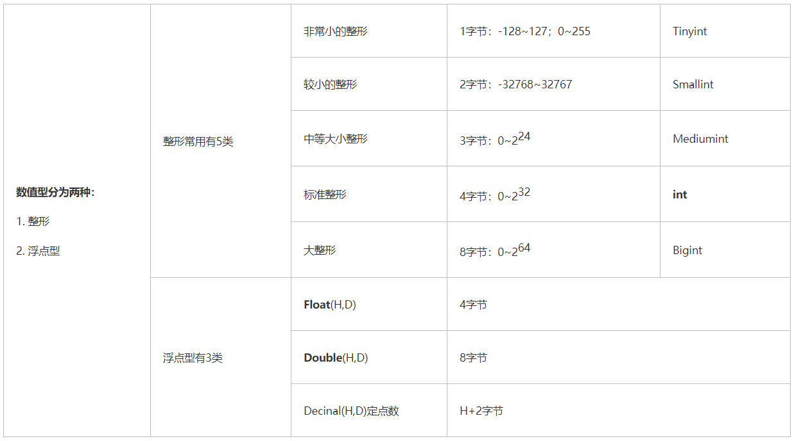
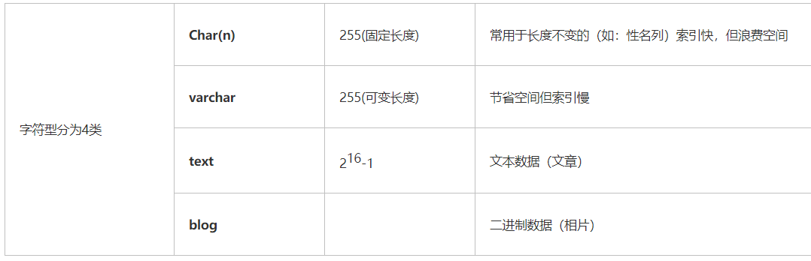
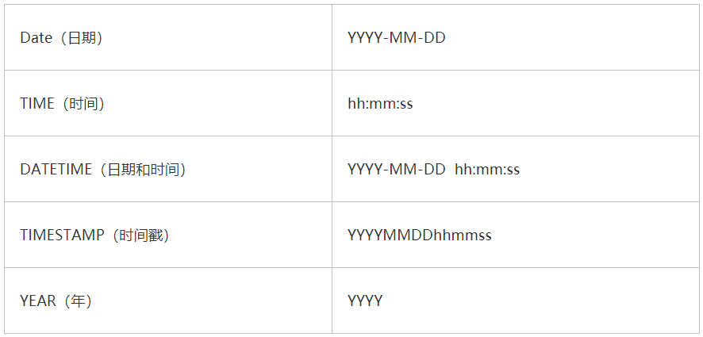

## 01.数据库管理

### 1.1 创建数据库

```python
# 1.创建数据库
mysql> show databases;
mysql> create database tomdb charset utf8;     #创建数据库tomdb，使用utf-8做字符编码
mysql> use tomdb                      #选择使用tomdb数据库
mysql> drop database tomdb;
mysql> show create database tomdb;          # 查看创建数据库的语法
```

### 1.2 用户管理

```python
# 1、创建用户
mysql> create user 'tom'@'%' identified by '123456';

# 2、授予mup用户授予对mup数据库的操作权限
mysql> GRANT ALL ON tomdb.* TO 'tom'@'%';
mysql> flush privileges;
mysql> select host,user from mysql.user;
mysql> show grants for tom;

# 3、删除用户
mysql> Delete FROM mysql.user Where User='mup' and Host=”localhost”; 
mysql> Delete FROM mysql.user Where User='mup'; 

# 4、修改tom用户密码
mysql> select user,host from mysql.user where user='tom' and host='%';
mysql> update mysql.user set authentication_string=password('chnsys') where user='tom' and host='%';
mysql> flush privileges;

# 5、修改root密码
mysql> update mysql.user set authentication_string=password('mysqlRootPwd') where user='root' and Host = 'localhost';
```

## 02.简单创建表测试

### 2.1 创建表语法

- 创建学生表

```mysql
create table student(
  id int auto_increment,
  name char(32) not null,
  age int not null,
  register_data date not null,
  primary key (id)
);
```

- 创建表解释

```mysql
mysql> create table student(               #在tomdb数据库中创建表：student
    -> id int auto_increment,              #在表中创建第一个字段：“id”
    -> name char(32) not null,             #在表中创建第二个字段：“name”
    -> age int not null,                   #在表中创建第三个字段：“age”
    -> register_data date not null,        #在表中创建第四个字段：日期
    -> primary key (id));                  #将表的主键设置为字段：“id
Query OK, 0 rows affected (0.10 sec)       #这里是创建成功的提示
```

### 2.2 插入数据

```python
mysql> desc student;                             # 查看student表所有字段
mysql> insert into student(name,age,register_data) values("zhangsan",100,"2016-06-20");
mysql> select * from student;                       #查看student表有哪些数据
```

## 03.MySQL三种数据类型

### 3.1 数值格式有哪

 </img>

### 3.2 字符串格式

 </img>

### 2.3 日期型

 </img>

## 04.mysql导入导出

### 4.1 查看mysql相关目录

- 首先linux 下查看mysql相关目录 

```python
[root@op-workorder bin]# whereis mysql
mysql: /usr/bin/mysql /usr/lib64/mysql /usr/include/mysql
```

### 4.2 导出数据库

- `导出数据和表结构`

```mysql
[root@k8s-master ~]# cd /home/work/mysql/bin       # 先cd到mysql的运行路径下，再执行一下命令
# mysqldump -u用户名 -p密码 数据库名 > 数据库名.sql
[root@k8s-master ~]# ./mysqldump  -uroot  -p  bsp  >  bsp.sql
```

- `只导出表结构`

```mysql
''' mysqldump -u用户名 -p密码 -d 数据库名 > 数据库名.sql '''
[root@k8s-master ~]#  mysqldump -uroot -p -d dbname > dbname .sql
```

### 4.3 导入数据库

```mysql
# 1、首先建空数据库
mysql> create database bsp charset utf8;
# 2、导入数据库（方法一）
mysql> use bsp;       # 1）选择数据库
mysql> source /home/work/project/bsp/bsp.sql    # 2）导入数据（注意sql文件的路径）
# 3、导入数据库（方法二）
mysql -u用户名 -p密码 数据库名 < 数据库名.sql 
```

