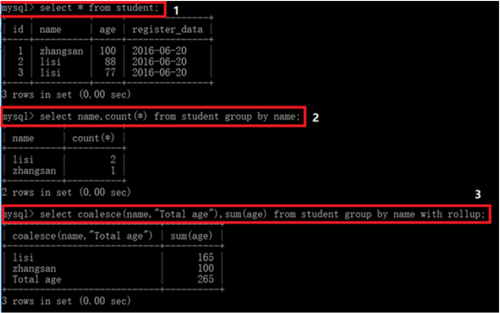
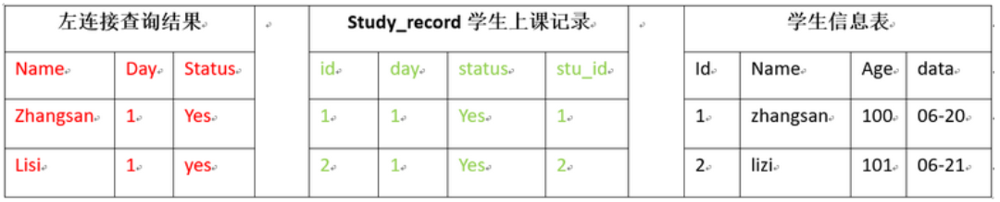
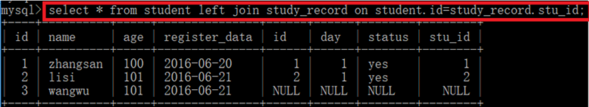
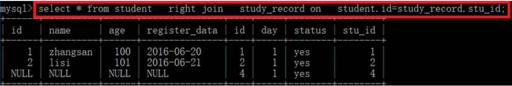
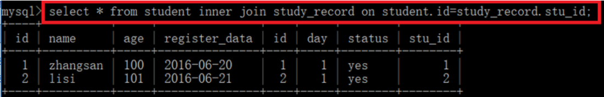
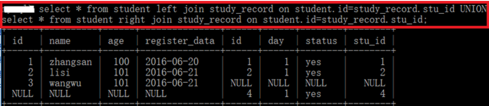

## 01.增删改查命令

### 1.1 最基本查询语句

```mysql
mysql> select * from student limit 2;             #仅查看student表中前两行数据
mysql> select * from student limit 5 offset 3;       #从第三行开始查询，并且只显示5行数据
```

### 1.2 where; like; order by

```mysql
mysql> select * from student where id >3 and age >103;
mysql> select * from student where register_data like "2016-06%";   #查询所有在2016-06这一条新建的条目
mysql> select * from student order by id desc;                #按主键降续
mysql> select * from student order by id asc;            #按主键升续排序（默认升sql> 
mysql> select * from student where name like binary "%si" order by id desc;         #查找名字以“si”结尾的所有条目，并且按照id降续排列
```

### 1.3 GROUP BY

- 指定以什么分组（比如可以统计出有多少同名数据）

```mysql
mysql> select name,count(*) from student group by name;
mysql> select coalesce(name,"Total age"),sum(age) from student group by name with rollup;
```

 </img>

### 1.4 修改（update）

```mysql
mysql> update student set name="lisi",age=22 where id=1;   #将表中id=1的条目改成name=lisi,age=22
mysql> update student set name="lisi",age=22 where id>4;   #上面仅仅修改一条，这里修改id>4的所有
```

#### 1.5 删除（delete）

```mysql
mysql> delete from student where name="zhangsan";        #删除student表中所有name=“zhangsan”
```

## 02.一对多

### 2.1 学生表&上课记录

 </img>

```mysql
#1、student表
create table student(
id int auto_increment,
name char(32) not null,
age int not null,
register_data date not null,
primary key (id)) 
engine=InnoDB;

#2、student_record表
create table study_record (
  id int(11) auto_increment,
  day int NOT NULL,
  status char(32) NOT NULL,
  stu_id int(11) NOT NULL,
  primary key (id),
  CONSTRAINT fk_student_key FOREIGN KEY (stu_id) REFERENCES student (id)
)
engine=InnoDB;
```

### 2.2 在student表中创建记录

- 在student表中创建两条记录

```mysql
mysql> insert into student(name,age,register_data) values("zhangsan",100,"2016-06-20");
mysql> insert into student(name,age,register_data) values("lisi",101,"2016-06-21");
```

### 2.3 student_record表添加关联

- 在student_record表中创建与student表的关联记录（day,status,stu_id）

```mysql
mysql> insert into study_record (day,status,stu_id) values(1,"yes",1);      # student表id=1第一天到了
mysql> insert into study_record (day,status,stu_id) values(1,"yes",2);      # student表id=2第一天到了
mysql> insert into study_record (day,status,stu_id) values(1,"yes",3);      # 会报错，因为student没id=3
```

### 2.4 关联数据不能删除

- 如果有student表中有student_record表关联的数据，你是不能删除student表中的记录（报错）

```mysql
mysql> delete from student where name='lisi';
```

### 2.5 查看创建记录

- 查看刚刚创建study_record表结构创建记录

```mysql
mysql> show create table study_record;
```

### 2.6 left join(`左连接`)

-  `左连接：两个表的差集（左表有就显示）`
- 1、左连接where只影向右表,所以左表(student)中数据全部显示，右表study_record表中不符合where条件的数据不会显示

```mysql
mysql> select name,day,status from student left join study_record on student.id=study_record.stu_id;
```

 </img>

 </img>

### 2.7 right join(`右连接`)

-  `右连接：两个表的差集（右表有才显示）`
- 1、右连接where只影向左表,所以左表(student)中不符合where条件的数据不会显示，右表study_record表内容全部显示

- ```mysql
     select * from student   right join    study_record  on  student.id=study_record.stu_id;
     ```

 </img>

### 2.8 inner join(`内连接`)

- 内连接：两个表的交集

- inner join：理解为“有效连接”，`两张表中都有的数据才会显示left join`

```python
select * from student  inner join  study_record  on  student.id=study_record.stu_id;      # 等价于面这条语句
select * from student,study_record where study_record.stu_id = student.id;
```

 </img>

### 2.9 full join(`全连接`)

```mysql
select * from a FULL JOIN b on a.a = b.b;  # MySQL不支持这个命令（可以使用下面语句代替，两行是一个语句）
select * from student left join study_record on student.id=study_record.stu_id UNION
select * from student right join study_record on student.id=study_record.stu_id;
```

 </img>