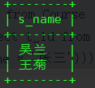

## 01.创建表

### 1.1 表MUL

 </img>

### 1.2 创建表

```mysql
# --学生表
CREATE TABLE `Student`(
	`s_id` VARCHAR(20),
	`s_name` VARCHAR(20) NOT NULL DEFAULT '',
	`s_birth` VARCHAR(20) NOT NULL DEFAULT '',
	`s_sex` VARCHAR(10) NOT NULL DEFAULT '',
	PRIMARY KEY(`s_id`)
);
# --课程表
CREATE TABLE `Course`(
	`c_id`  VARCHAR(20),
	`c_name` VARCHAR(20) NOT NULL DEFAULT '',
	`t_id` VARCHAR(20) NOT NULL,
	PRIMARY KEY(`c_id`)
);
# --教师表
CREATE TABLE `Teacher`(
	`t_id` VARCHAR(20),
	`t_name` VARCHAR(20) NOT NULL DEFAULT '',
	PRIMARY KEY(`t_id`)
);
# --成绩表
CREATE TABLE `Score`(
	`s_id` VARCHAR(20),
	`c_id`  VARCHAR(20),
	`s_score` INT(3),
	PRIMARY KEY(`s_id`,`c_id`)
);
```


## 02.创建表

### 2.0 创建数据展示

 </img>

### 2.1 `学生表`

```mysql
--插入学生表测试数据
insert into Student values('01' , '赵雷' , '1990-01-01' , '男');
insert into Student values('02' , '钱电' , '1990-12-21' , '男');
insert into Student values('03' , '孙风' , '1990-05-20' , '男');
insert into Student values('04' , '李云' , '1990-08-06' , '男');
insert into Student values('05' , '周梅' , '1991-12-01' , '女');
insert into Student values('06' , '吴兰' , '1992-03-01' , '女');
insert into Student values('07' , '郑竹' , '1989-07-01' , '女');
insert into Student values('08' , '王菊' , '1990-01-20' , '女');
```

### 2.2 `课程表`

```mysql
--课程表测试数据
insert into Course values('01' , '语文' , '02');
insert into Course values('02' , '数学' , '01');
insert into Course values('03' , '英语' , '03');
```

### 2.3 `教师表`

```mysql
--教师表测试数据
insert into Teacher values('01' , '张三');
insert into Teacher values('02' , '李四');
insert into Teacher values('03' , '王五');
```

### 2.4 `成绩表`

```mysql
--成绩表测试数据
insert into Score values('01' , '01' , 80);
insert into Score values('01' , '02' , 90);
insert into Score values('01' , '03' , 99);
insert into Score values('02' , '01' , 70);
insert into Score values('02' , '02' , 60);
insert into Score values('02' , '03' , 80);
insert into Score values('03' , '01' , 80);
insert into Score values('03' , '02' , 80);
insert into Score values('03' , '03' , 80);
insert into Score values('04' , '01' , 50);
insert into Score values('04' , '02' , 30);
insert into Score values('04' , '03' , 20);
insert into Score values('05' , '01' , 76);
insert into Score values('05' , '02' , 87);
insert into Score values('06' , '01' , 31);
insert into Score values('06' , '03' , 34);
insert into Score values('07' , '02' , 89);
insert into Score values('07' , '03' , 98);
```

## 03.常见查询

### 3.1 查询"01"课程比"02"课程成绩高的学生的信息及课程分数

 </img>

```mysql
-- [分析] 筛选出课程号01这门课的成绩比02这门课成绩高的学生，输出这些学生的信息及课程分（表：Student，Score)——表联结
select a.*, b.s_score as 01_score, c.s_score as 02_score
from Student as a inner join Score as b on a.s_id = b.s_id and b.c_id = '01'
inner join Score as c on a.s_id = c.s_id and c.c_id = '02' 
where b.s_score > c.s_score;
```

### 3.2 查询平均成绩大于等于60分的同学的学生编号和学生姓名和平均成绩

 </img>

```mysql
-- [分析] 要求平均成绩，就需要用group by对学生分组，然后利用聚合函数avg求出平均成绩，由于where语句中不能包含聚合函数，故再利用having语句和60分比较。
-- 输出的结果学生编号和学生姓名在student表中，成绩在score表中，故需要用到内联结。
select a.s_id, a.s_name, avg(s_score) as avg_score
from Student as a inner join Score as b on a.s_id = b.s_id
group by a.s_id,a.s_name
having avg(b.s_score) >= 60;
```

### 3.3 查询所有同学的学生编号、学生姓名、选课总数、所有课程的总成绩

 </img>

```mysql
-- [分析]学生编号、学生姓名在表student中；选课数可通过在表score中通过group by 学生编号后利用count(c_id)算出；所有课程的总成绩则用sum可以算出。
-- 因为要用到表student和表score，故需要对表进行联结。
select a.s_id, a.s_name, count(b.c_id), sum(b.s_score)
from Student as a inner join Score as b on a.s_id = b.s_id
group by a.s_id,a.s_name;
```

### 3.4 查询"李"姓老师的数量

 </img>

```mysql
-- [分析] 这里用到知识点字符串模糊查询，如：where 姓名 like '猴%' 即可查到猴什么什么。
-- 关于字符串模糊查询的知识点可查看我的另一篇文章《SQL学习笔记——汇总分析》
select count(t_name) as number
from Teacher
where t_name like '李%';
```

### 3.5 学过"张三"老师授课的同学

 </img>

```mysql
-- [分析] 老师的信息在表teacher中，可通过teacher.t_id与表course联结，
-- 再通过course.c_id与表score联结，
-- 再再通过score.s_id与表student联结，查找出上过张三老师课的同学的信息。
select s.*
from Teacher as a inner join Course as b on a.t_id = b.t_id
inner join Score as c on b.c_id = c.c_id
inner join Student as s on c.s_id = s.s_id
where a.t_name = '张三';
```

### 3.6 学过编号为"01"并且也学过编号为"02"的课程的同学的信息

 </img>

```mysql
-- [分析]由于既要学过01课程的，又要学过02课程的，所以共需要联结两次才能达到筛选效果
select *
from Student
where s_id in (select a.s_id from Student as a inner join Score as b on a.s_id = b.s_id and b.c_id = '01' 
                      inner join Score as c on b.s_id = c.s_id and c.c_id = '02');
```

### 3.7 学过编号为"01"但是没有学过编号为"02"的课程的同学的信息

 </img>

```mysql
-- [分析] 在上述语句中用and联结，注意不能直接将“=”换成“<>”
select *
from Student 
where s_id in (select a.s_id from Student as a inner join Score as b on a.s_id = b.s_id and b.c_id = '01')
and s_id not in (select a.s_id from Student as a inner join Score as c on a.s_id = c.s_id and c.c_id = '02');
```

### 3.8 查询没有学全所有课程的同学的信息

 </img>

```mysql
-- [分析]没学全所有课程的情况很多，如学0门，学1门，学2门。所以这里先筛选出学全所有课程的同学再取反，即没有学全所有课程的同学。
select *
from Student
where s_id not in (select s_id 
                   from Score 
                   group by s_id 
                   having count(c_id) = (select count(distinct c_id) from Course));
```

### 3.9 查询没学过"张三"老师讲授的任一门课程的学生姓名

 </img>

```mysql
select s_name
from Student
where s_id not in (select s_id from Score 
                 where c_id = (select c_id from Course
                      where t_id = (select t_id from Teacher 
                           where t_name = '张三'))); 
```

### 3.10 查询两门及其以上不及格课程的同学的学号，姓名及其平均成绩

 </img>

```mysql
select a.s_id,a.s_name,avg(b.s_score)
from Student as a inner join Score as b on a.s_id = b.s_id and b.s_score < 60
group by a.s_id,a.s_name
having count(b.s_score) >= 2;
```

### 3.11 检索"01"课程分数小于60，按分数降序排列的学生信息

 </img>

```mysql
-- [分析] 内联结+子查询筛选+排序
select a.*,b.c_id,b.s_score
from Student as a inner join Score as b on a.s_id = b.s_id and b.c_id = 01
where a.s_id in (select s_id from Score where s_score < 60  order by s_score desc);
```

### 3.12 按平均成绩从高到低显示所有学生的所有课程的成绩以及平均成绩（重要！）

 </img>

```mysql
select a.s_id,(select s_score from Score where s_id = a.s_id and c_id = '01') as 语文,
              (select s_score from Score where s_id = a.s_id and c_id = '02') as 数学,
              (select s_score from Score where s_id = a.s_id and c_id = '03') as 英语,
              round(avg(s_score),2) as 平均分 
from Score as a 
group by a.s_id 
order by 平均分 desc;
```

### 3.13 查询各科成绩最高分、最低分和平均分：以如下形式显示：课程ID，课程name，最高分，最低分，平均分，及格率，中等率，优良率，优秀率--及格为>=60，中等为：70-80，优良为：80-90，优秀为：>=90（重要！）

 </img>

```mysql
-- [分析] 用到case语句，后面记得按课程号分组来显示全部结果
select a.c_id,a.c_name,max(b.s_score),min(b.s_score),avg(b.s_score),
       round(100*(sum(case when b.s_score >= 60 then 1 else 0 end)/sum(case when b.s_score then 1 else 0 end)),2) as 及格率,
       round(100*(sum(case when b.s_score between 70 and 80 then 1 else 0 end)/sum(case when b.s_score then 1 end)),2) as 中等率,
		   round(100*(sum(case when b.s_score between 80 and 90 then 1 else 0 end)/sum(case when b.s_score then 1 end)),2) as 优良率,
       round(100*(sum(case when b.s_score >= 90 then 1 else 0 end)/sum(case when b.s_score then 1 end)),2) as 优秀率
from Course as a inner join Score as b on a.c_id = b.c_id
group by a.c_id,a.c_name;
```

### 3.14 查询学生的总成绩并进行排名

```mysql
select s_id,sum(s_score)
from Score
group by s_id
order by sum(s_score) desc;
```

 </img>

### 3.15 查询不同老师所教不同课程平均分从高到低显示

```mysql
select a.t_id,avg(b.s_score)
from Course as a inner join Score as b on a.c_id = b.c_id
group by a.t_id
order by avg(b.s_score) desc;
```

 </img>

### 3.16 查询所有课程的成绩第2名到第3名的学生信息及该课程成绩

```mysql
select a.*,sum(b.s_score)
from Student as a inner join Score as b on a.s_id = b.s_id
group by s_id
order by sum(b.s_score) desc
limit 1,2;
```

 </img>

### 3.17 查询学生平均成绩及其名次

```mysql
select s_id,avg(s_score),rank() over (order by avg(s_score) desc) as rank_score
from Score
group by s_id;
```

